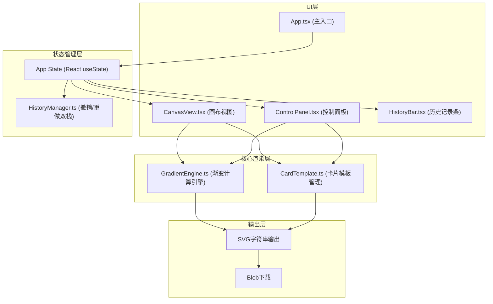

## 1. 架构设计



## 2. 技术栈说明

- **前端框架**：React 18 + TypeScript（严格模式）
- **构建工具**：Vite 5 + @vitejs/plugin-react
- **颜色处理**：tinycolor2（颜色插值、Hex/RGB转换）
- **UI样式**：原生CSS（CSS Modules）+ CSS变量
- **状态管理**：React Hooks + 自定义HistoryManager类
- **SVG渲染**：原生SVG元素 + dangerouslySetInnerHTML（渐变字符串注入）

## 3. 文件结构

```
├── package.json
├── vite.config.js
├── tsconfig.json
├── index.html
└── src/
    ├── core/
    │   ├── GradientEngine.ts    # 渐变计算与SVG生成
    │   └── CardTemplate.ts      # 卡片模板管理
    ├── ui/
    │   ├── App.tsx              # 主应用组件
    │   ├── ControlPanel.tsx     # 右侧属性面板
    │   ├── CanvasView.tsx       # 主画布组件
    │   └── styles/
    │       ├── App.css
    │       ├── ControlPanel.css
    │       └── CanvasView.css
    └── state/
        └── HistoryManager.ts    # 撤销/重做管理器
```

## 4. 数据模型

### 4.1 核心类型定义

```typescript
// 色彩锚点
interface ColorStop {
  id: string;
  color: string;      // Hex格式
  position: number;   // 0-100 百分比
}

// 渐变类型
type GradientType = 'linear' | 'radial' | 'conic';

// 渐变参数
interface GradientConfig {
  type: GradientType;
  angle: number;           // 线性渐变角度 0-360
  centerX: number;         // 径向渐变圆心X 0-100
  centerY: number;         // 径向渐变圆心Y 0-100
}

// 文本样式
interface TextStyle {
  content: string;
  fontSize: number;
  color: string;
  fontFamily: string;
  fontWeight: number;
}

// 卡片模板
interface CardTemplate {
  id: string;
  name: string;
  width: number;
  height: number;
  previewRatio: string;
  title: TextStyle;
  subtitle: TextStyle;
  hasDecoration: boolean;
}

// 卡片布局
interface CardLayout {
  templateId: string;
  title: TextStyle;
  subtitle: TextStyle;
}

// 全局应用状态（快照）
interface AppState {
  stops: ColorStop[];
  gradient: GradientConfig;
  layout: CardLayout;
}
```

### 4.2 HistoryManager 接口

```typescript
class HistoryManager<T> {
  constructor(maxSize?: number);  // 默认20
  push(state: T): void;           // 压入新状态，清空重做栈
  undo(): T | null;               // 撤销，返回上一状态
  redo(): T | null;               // 重做，返回下一状态
  canUndo(): boolean;
  canRedo(): boolean;
  getHistory(): T[];              // 获取全部历史快照
  getCurrentIndex(): number;
  jumpTo(index: number): T | null;// 跳转到指定索引
}
```

## 5. GradientEngine 核心算法

### 5.1 线性渐变 SVG 生成

```
输入：stops[], angle
输出：<linearGradient> SVG字符串
- x1/y1/x2/y2 由 angle 通过三角函数计算得出
- 每个 ColorStop 转为 <stop offset="X%" stop-color="XXX" />
```

### 5.2 径向渐变 SVG 生成

```
输入：stops[], centerX, centerY
输出：<radialGradient> SVG字符串
- cx = centerX%, cy = centerY%
- r = 70%（默认），fx/fy 与 cx/cy 相同
```

### 5.3 角向渐变 SVG 生成

```
输入：stops[]
输出：conic-gradient via SVG <foreignObject> 或 CSS background
- 使用 CSS conic-gradient，通过 style 属性注入
```

### 5.4 颜色插值

锚点之间的平滑过渡通过 tinycolor2 的中间色计算：
- 对每对相邻锚点使用 HSL 空间插值，得到更自然的彩虹过渡

## 6. 性能优化策略

1. **防抖处理**：锚点位置滑块使用 requestAnimationFrame 节流，确保 100ms 内重绘
2. **React.memo**：CanvasView 和 ControlPanel 使用 memo 包裹，避免无效重渲染
3. **useMemo 缓存**：GradientEngine 输出的 SVG 字符串缓存，stops/gradient 不变时跳过计算
4. **CSS transform**：锚点拖拽使用 transform 而非 top/left，触发 GPU 合成
5. **历史缩略图**：使用离屏 canvas 生成 80x60 缩略图，存为 dataURL，不阻塞主线程

## 7. SVG 导出规范

导出的 SVG 文件包含：
- `<defs>` 中定义渐变（linearGradient/radialGradient）
- `<rect>` 使用渐变填充作为背景
- `<text>` 元素保留标题与副标题，附带 font-size、fill、font-family
- 可选 `<line>` 装饰元素
- `viewBox` 属性确保缩放正确
- `xmlns="http://www.w3.org/2000/svg"` 命名空间
