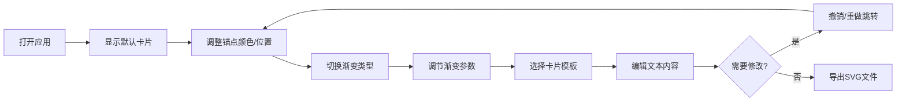

## 1. 产品概述

渐变卡片设计工具是一款在线可视化渐变配色与卡片构图工具，帮助设计师和非专业用户快速创建带有精美渐变背景的设计卡片并导出为 SVG。用户无需打开专业设计软件即可完成从配色到构图的全流程设计，极大降低了简单视觉设计的门槛。

- 目标用户：UI设计师、新媒体运营、产品经理、普通创意用户
- 核心价值：轻量、交互、即时预览、一键导出

## 2. 核心功能

### 2.1 功能模块

1. **主画布区**：SVG实时渲染、锚点拖拽交互、渐变预览
2. **渐变控制面板**：锚点管理（添加/删除/编辑颜色/调整位置）、渐变类型切换、角度与圆心调节
3. **模板选择面板**：8种预设卡片模板、尺寸比例适配
4. **文字编辑面板**：标题副标题编辑、字体大小颜色调节
5. **历史记录条**：缩略图预览、撤销/重做跳转
6. **导出功能**：SVG格式导出，保留渐变与文字信息

### 2.2 功能详情

| 页面/模块 | 子模块 | 功能描述 |
|-----------|--------|----------|
| 主画布区 | SVG预览 | 实时渲染渐变背景与卡片布局，支持响应式缩放 |
| 主画布区 | 锚点交互 | 自由拖拽色彩锚点（≥6个），0.2s弹性动画，独立颜色和位置设置 |
| 渐变控制 | 类型切换 | 线性/径向/角向三种渐变，0.4s ease-in-out过渡动画 |
| 渐变控制 | 线性渐变 | 圆形旋钮角度调节（0-360°），数字实时更新 |
| 渐变控制 | 径向渐变 | 圆心X/Y偏移滑块（0%-100%） |
| 模板面板 | 预设模板 | 8种模板：方形名片、宽屏海报、手机壁纸、社交媒体封面等 |
| 模板面板 | 文本编辑 | 标题/副标题内容、字体大小、颜色自定义 |
| 历史记录 | 撤销重做 | 双栈管理，最多20步历史，缩略图80x60px圆角4px预览 |
| 导出功能 | SVG导出 | 完整保留渐变定义、文字样式、卡片尺寸信息 |

## 3. 核心流程

### 3.1 主用户流程

用户打开应用 → 默认显示初始渐变卡片 → 添加/拖拽锚点调整配色 → 切换渐变类型并调节参数 → 选择模板并编辑文字 → 如需修改可随时撤销/重做 → 满意后导出SVG

## 4. 用户界面设计

### 4.1 设计风格

- **整体风格**：极简毛玻璃（Glassmorphism），现代简约
- **主色调**：紫蓝渐变 `#7c4dff` → `#448aff`
- **画布背景**：浅灰 `#f0f0f0`
- **卡片区域**：白色背景 + 阴影 `0 8px 32px rgba(0,0,0,0.12)`
- **面板样式**：半透明毛玻璃（`backdrop-filter: blur(20px)`）
- **控件圆角**：统一 `12px`
- **交互反馈**：0.2s ease-out 过渡（悬停、点击、激活状态）
- **字体选择**：主字体使用 Poppins 或 Noto Sans SC，标题采用 SemiBold，正文 Regular

### 4.2 页面布局概览

| 区域 | 位置 | UI元素 |
|------|------|--------|
| 顶部工具栏 | 顶部全宽 | Logo、撤销按钮、重做按钮、导出按钮 |
| 左侧工具栏 | 左侧固定 | 添加锚点按钮、渐变类型图标切换 |
| 主画布区 | 中央区域 | SVG卡片预览、可拖拽锚点、缩放适配 |
| 右侧属性面板 | 右侧固定 | 锚点属性编辑、渐变参数、模板选择、文字编辑 |
| 底部历史条 | 底部全宽 | 缩略图滚动列表、当前状态高亮 |

### 4.3 响应式设计

- **桌面优先**：最小支持 300px 宽度设备
- **≥1024px**：三栏布局（左工具栏 + 中央画布 + 右面板）
- **768px-1023px**：左右面板可折叠收起，画布居中
- **<768px**：面板改为底部抽屉式，画布占满宽度

### 4.4 动画与微交互

- 锚点拖拽：0.2s 弹性缓动（cubic-bezier(0.34, 1.56, 0.64, 1)）
- 渐变切换：0.4s ease-in-out 背景过渡
- 按钮悬停：轻微上浮 + 阴影加深
- 历史缩略图：悬停放大 1.05 倍，当前状态带紫蓝渐变边框
- 控件激活：主色描边 + 轻微外发光
