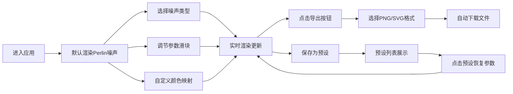

## 1. 产品概述

色噪沙盒是一款面向游戏开发者和数字艺术创作者的交互式彩色噪声纹理生成工具。用户可以通过调节多种噪声算法参数实时预览彩色噪声纹理，并支持导出为PNG或SVG格式，同时可保存和加载预设参数配置。

- 核心用途：快速生成具有随机性和自然感的生物纹理、地形贴图等数字艺术素材
- 目标用户：游戏开发者、数字艺术家、视觉设计师
- 市场价值：填补噪声生成工具缺乏彩色化、高交互性预览和预设管理的空白

## 2. 核心功能

### 2.1 功能模块
1. **噪声算法选择模块**：Perlin噪声、Simplex噪声、Worley噪声三种算法切换
2. **参数调节模块**：频率、八度、种子三个核心参数的实时滑块调节
3. **颜色映射模块**：3x3色环调色板，支持三个关键颜色点（起点、中点、终点）自定义与拖拽
4. **纹理渲染模块**：Canvas实时渲染彩色噪声纹理，支持淡入过渡动画
5. **导出模块**：PNG和SVG格式导出，模态框交互
6. **预设管理模块**：参数预设保存、加载、列表展示

### 2.2 页面详情
| 页面名称 | 模块名称 | 功能描述 |
|---------|---------|---------|
| 主界面 | 左侧控制面板 | 噪声类型下拉框、参数滑块区域、颜色映射区域、预设列表 |
| 主界面 | 右侧渲染画布 | 800x600 Canvas实时渲染区域，支持十字准星光标 |
| 主界面 | 导出模态框 | 格式选择、导出下载、0.3s淡出关闭 |

## 3. 核心流程

用户进入应用后，默认显示Perlin噪声纹理。用户可选择不同噪声算法、调节参数滑块、自定义颜色映射，所有操作实时反映在右侧画布上。满意后可点击导出按钮选择PNG或SVG格式下载，或将当前参数保存为预设供后续使用。

## 4. 用户界面设计

### 4.1 设计风格
- **主题风格**：深色工业风格，强调科技感与专业工具属性
- **主色调**：主背景#111827，控制面板#1F2937，画布#000000
- **强调色**：主交互#3B82F6（蓝），导出#10B981（绿），保存#6366F1（紫）
- **字体**：使用现代无衬线字体，支持清晰的工具界面显示
- **按钮风格**：圆角8px，悬停平滑过渡0.2s，轻微缩放反馈
- **滑块风格**：高12px圆角6px背景#374151，把手直径20px颜色#3B82F6
- **布局风格**：Flex水平布局，左侧固定320px控制面板，右侧自适应画布

### 4.2 页面设计概述
| 页面名称 | 模块名称 | UI元素 |
|---------|---------|--------|
| 主界面 | 控制面板 | 下拉框、滑块、色板、按钮、预设列表 |
| 主界面 | 画布区域 | 800x600 Canvas、2px #4B5563边框、十字光标 |
| 主界面 | 导出模态框 | #1F2937背景、16px圆角、半透明遮罩、格式选择按钮 |

### 4.3 响应式
- 桌面端优先设计
- 左侧控制面板固定宽度320px，垂直滚动仅限面板内部
- 右侧画布区域自适应剩余宽度，最小高度600px
- 整体无水平滚动
