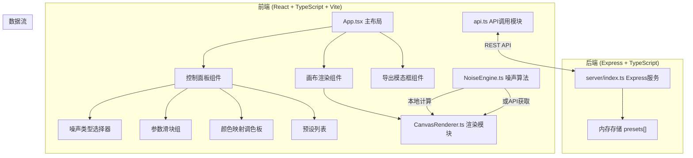
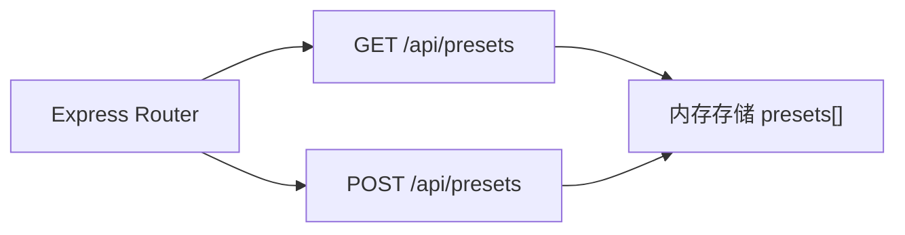

## 1. 架构设计



## 2. 技术描述

- **前端框架**：React@18 + TypeScript@5 + Vite@5
- **构建工具**：Vite，使用@vitejs/plugin-react
- **状态管理**：React useState/useRef（局部状态）
- **HTTP客户端**：axios
- **后端框架**：Express@4 + TypeScript
- **跨域处理**：cors
- **ID生成**：uuid
- **渲染方式**：HTML5 Canvas 2D API
- **数据存储**：后端内存存储（开发阶段）

## 3. 文件结构

```
auto113/
├── package.json
├── vite.config.js
├── tsconfig.json
├── index.html
├── src/
│   ├── main.tsx
│   ├── App.tsx
│   ├── NoiseEngine.ts
│   ├── CanvasRenderer.ts
│   └── api.ts
└── server/
    └── index.ts
```

## 4. API 定义

### 类型定义

```typescript
interface ColorStop {
  position: number; // 0.0 - 1.0
  color: string;    // hex color
}

interface Preset {
  id: string;
  name: string;
  noiseType: 'perlin' | 'simplex' | 'worley';
  frequency: number;
  octaves: number;
  seed: number;
  colorStops: ColorStop[];
  createdAt: number;
}
```

### API 端点

| 方法 | 路径 | 描述 |
|------|------|------|
| GET | /api/presets | 获取所有预设列表 |
| POST | /api/presets | 保存新的预设配置 |

### 请求/响应模式

**GET /api/presets**
- 响应: `{ presets: Preset[] }`

**POST /api/presets**
- 请求体: `{ name: string, noiseType, frequency, octaves, seed, colorStops }`
- 响应: `{ success: true, preset: Preset }`

## 5. 服务器架构



## 6. 核心模块说明

### 6.1 NoiseEngine.ts
- `generateNoise(type, width, height, seed, frequency, octaves): Float32Array`
- 实现 Perlin、Simplex、Worley 三种噪声算法
- 输出归一化的噪声值矩阵 (0.0 - 1.0)

### 6.2 CanvasRenderer.ts
- `render(canvas, noiseData, colorStops, fadeInProgress?): void`
- 将噪声数据映射到颜色渐变
- 支持淡入过渡动画

### 6.3 性能优化
- 使用 requestAnimationFrame 节流渲染
- 参数调节使用 debounce 避免过度计算
- Canvas 直接操作 ImageData 提升性能
