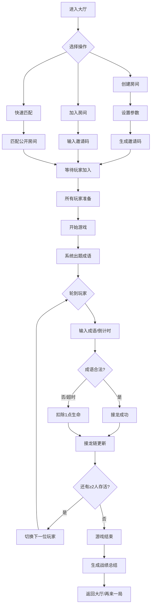

## 1. 产品概述

成语接龙在线对战平台，支持1-4名玩家（含AI智能对手）实时竞技，解决玩家缺少真人对手时无法随时进行成语对战、现有单机游戏缺乏动态难度和视觉反馈的问题。

- 目标用户：成语爱好者、休闲游戏玩家、教育场景用户
- 产品价值：提供高质量的沉浸式成语对战体验，结合AI策略和精美视觉呈现

## 2. 核心功能

### 2.1 用户角色

| 角色 | 注册方式 | 核心权限 |
|------|----------|----------|
| 玩家 | 无需注册，直接进入 | 创建/加入房间、参与游戏、查看战绩 |
| 房主 | 创建房间自动成为 | 设置游戏参数、邀请玩家、开始游戏 |

### 2.2 功能模块

1. **房间大厅**：房间列表、创建房间、加入房间（邀请码）
2. **对战房间**：玩家列表、参数设置、准备/开始游戏
3. **游戏主界面**：接龙链图、玩家状态、输入区域、倒计时
4. **战绩总结**：统计图表、时间线回放、成语分组

### 2.3 页面详情

| 页面名称 | 模块名称 | 功能描述 |
|----------|----------|----------|
| 房间大厅 | 房间列表 | 展示所有公开房间，可点击加入 |
| 房间大厅 | 创建房间弹窗 | 输入房间名、密码，设置回合时长、AI难度、玩家人数 |
| 房间大厅 | 加入房间弹窗 | 输入6位邀请码加入私密房间 |
| 对战房间 | 玩家信息栏 | 展示玩家昵称、头像、生命值、准备状态 |
| 对战房间 | 参数设置区 | 房主可调整回合时长、AI难度等参数 |
| 对战房间 | 邀请码区域 | 显示6位邀请码，可复制分享 |
| 游戏主界面 | 接龙链图 | 彩色卡片横向/纵向滚动排列，当前玩家卡片金色发光 |
| 游戏主界面 | 输入区域 | 高40px圆角输入框，倒计时30→0渐变红色 |
| 游戏主界面 | 玩家状态栏 | 展示所有玩家生命值和当前回合 |
| 游戏主界面 | AI提示特效 | AI出招时顶部紫色光效闪烁0.5s |
| 游戏主界面 | 成语详情弹窗 | 点击历史卡片显示拼音、出处、释义 |
| 战绩总结 | 统计概览 | 平均反应时间、接龙成功率 |
| 战绩总结 | 成语分组柱状图 | 按首字母分组，绿黄渐变，悬停显示数量 |
| 战绩总结 | 时间线回放 | 每回合动作和时间点展示 |

## 3. 核心流程

## 4. 用户界面设计

### 4.1 设计风格

- **主色调**：#0F172A（深空蓝黑）
- **辅色**：#1E293B（深蓝灰）、#334155（石板灰）
- **强调色**：#3B82F6（科技蓝）、#8B5CF6（神秘紫）、#10B981（翡翠绿）、#F59E0B（琥珀金）、#EF4444（警示红）
- **圆角规范**：卡片12px、按钮12px、输入框8px、弹窗16px
- **字体**：主标题使用思源宋体（显示字体），正文使用思源黑体（易读）
- **布局**：卡片式布局，分层阴影，玻璃拟态效果

### 4.2 页面设计概览

| 页面名称 | 模块名称 | UI元素 |
|----------|----------|--------|
| 房间大厅 | Hero标题区 | 渐变大标题，流动网格粒子背景 |
| 房间大厅 | 操作按钮组 | 蓝紫渐变按钮，按下缩放0.95 |
| 对战房间 | 玩家卡片 | 圆角12px，生命条渐变显示 |
| 对战房间 | 设置面板 | 滑块选择器，下拉菜单 |
| 游戏主界面 | 接龙链容器 | 横向滚动区，卡片蓝紫渐变背景 |
| 游戏主界面 | 当前回合指示器 | 金色3px发光描边 |
| 游戏主界面 | 倒计时数字 | 大号数字，30→0颜色渐变为红色 |
| 战绩总结 | 柱状图 | 绿黄渐变柱体，悬停放大效果 |
| 战绩总结 | 时间线 | 垂直时间轴，节点动画 |

### 4.3 响应式

- 桌面端（≥1024px）：接龙链横向滚动，卡片120×80px
- 平板（768-1023px）：接龙链横向滚动，卡片100×70px
- 移动端（<768px）：接龙链垂直滚动，卡片90×65px，布局单列

### 4.4 视觉特效

- 背景：50个粒子，2px大小，#3B82F6，透明度0.15，速度0.5px/s，缓慢流动网格
- AI出招：顶部紫色#8B5CF6光效条，闪烁0.5s
- 按钮：hover上浮2px，按下scale(0.95)
- 卡片入场：从左侧滑入+淡入动画
- 弹窗：backdrop-blur-md，背景#1E293B，圆角16px
