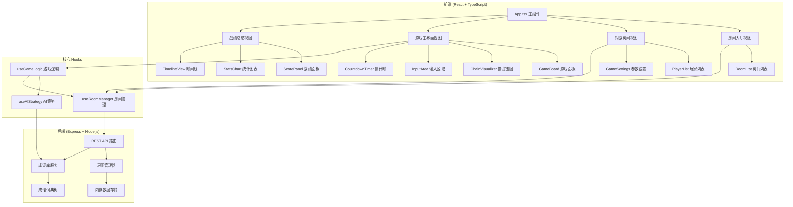
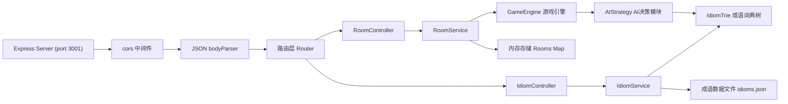
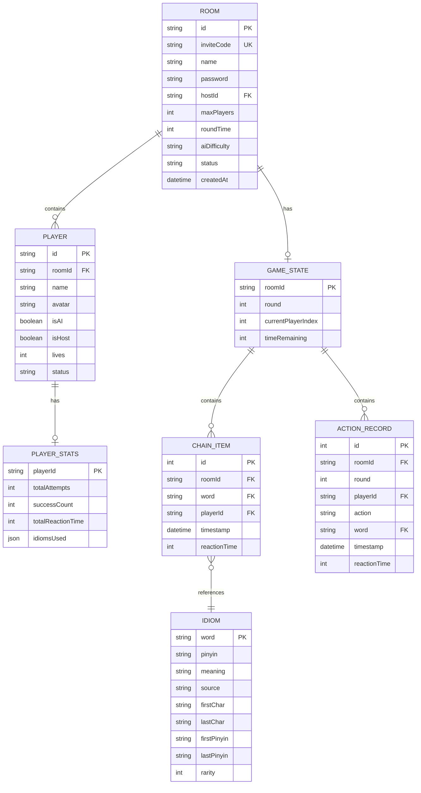

## 1. 架构设计



## 2. 技术栈说明

- **前端框架**：React 18 + TypeScript 5
- **构建工具**：Vite 5 + @vitejs/plugin-react
- **状态管理**：React Hooks (useState, useReducer, useCallback, useMemo)
- **样式方案**：原生 CSS + CSS 变量（全局样式 globals.css）
- **图标方案**：lucide-react
- **后端框架**：Express 4（Node.js）
- **跨域处理**：cors 中间件
- **唯一ID生成**：uuid
- **数据存储**：内存 Map（开发阶段）
- **AI引擎**：四字成语词典树 + 频度分析 + 路径封锁策略

## 3. 路由定义

| 路径 | 用途 |
|------|------|
| / | 房间大厅（首页） |
| /room/:id | 对战房间（等待阶段） |
| /game/:id | 游戏对战界面 |
| /result/:id | 战绩总结页面 |

## 4. API 定义

```typescript
// === 类型定义 ===
interface Idiom {
  word: string;           // 成语文本（4字）
  pinyin: string;         // 拼音
  meaning: string;        // 释义
  source: string;         // 出处
  firstChar: string;      // 首字
  lastChar: string;       // 末字
  firstPinyin: string;    // 首字拼音（不含声调）
  lastPinyin: string;     // 末字拼音（不含声调）
  rarity: number;         // 冷僻度 0-100
}

interface Player {
  id: string;
  name: string;
  avatar: string;
  isAI: boolean;
  isHost: boolean;
  lives: number;          // 剩余生命
  status: 'idle' | 'ready' | 'playing' | 'eliminated' | 'winner';
  stats: PlayerStats;
}

interface PlayerStats {
  totalAttempts: number;
  successCount: number;
  totalReactionTime: number; // 累计反应时间(ms)
  idiomsUsed: string[];      // 使用过的成语
}

interface Room {
  id: string;
  inviteCode: string;        // 6位邀请码
  name: string;
  password: string;
  hostId: string;
  players: Player[];
  maxPlayers: 2 | 3 | 4;
  roundTime: 20 | 30 | 40;
  aiDifficulty: 'easy' | 'medium' | 'hard';
  status: 'waiting' | 'playing' | 'finished';
  gameState?: GameState;
  createdAt: number;
}

interface GameState {
  round: number;
  currentPlayerIndex: number;
  chain: ChainItem[];        // 接龙链
  currentWord: Idiom;        // 当前成语
  timeRemaining: number;     // 剩余秒数
  actionHistory: ActionRecord[];
}

interface ChainItem {
  idiom: Idiom;
  playerId: string;
  timestamp: number;
  reactionTime: number;
}

interface ActionRecord {
  round: number;
  playerId: string;
  action: 'success' | 'fail' | 'timeout' | 'skip';
  idiom?: string;
  timestamp: number;
  reactionTime?: number;
}

// === API 端点 ===
// GET  /api/idioms               获取所有成语列表
// GET  /api/idioms/random        随机获取一个成语
// GET  /api/idioms/validate?word=xxx  验证成语合法性
// GET  /api/idioms/match?char=xxx     获取以某字开头的成语列表
// GET  /api/idioms/match-pinyin?pinyin=xxx  获取同音字开头的成语
// POST /api/rooms                创建房间 { name, password, maxPlayers, roundTime, aiDifficulty, playerName }
// GET  /api/rooms                获取公开房间列表
// GET  /api/rooms/:id            获取房间详情
// POST /api/rooms/:id/join       加入房间 { inviteCode, password?, playerName }
// POST /api/rooms/:id/leave      离开房间 { playerId }
// POST /api/rooms/:id/ready      切换准备状态 { playerId, ready }
// POST /api/rooms/:id/add-ai     房主添加AI对手
// POST /api/rooms/:id/start      房主开始游戏
// POST /api/rooms/:id/submit     提交成语 { playerId, word, reactionTime }
// POST /api/rooms/:id/ai-move    请求AI出招（服务端AI策略）
// GET  /api/rooms/:id/result     获取游戏结果统计
```

## 5. 服务端架构



## 6. 数据模型

### 6.1 数据模型 ER 图



### 6.2 内存存储结构

```javascript
// server.js 中的数据结构
const rooms = new Map(); // roomId -> Room 对象
const inviteCodeIndex = new Map(); // inviteCode -> roomId
const idiomsDatabase = {
  all: Idiom[],                     // 全量成语数组
  trie: TrieNode,                   // 词典树根节点
  byFirstChar: Map<string, Idiom[]>, // 按首字分组
  byLastChar: Map<string, Idiom[]>,  // 按末字分组
  byFirstPinyin: Map<string, Idiom[]>, // 按首字拼音分组
  byLastPinyin: Map<string, Idiom[]>   // 按末字拼音分组
};
```

### 6.3 成语词典树 (Trie) 结构

```typescript
interface TrieNode {
  children: Map<string, TrieNode>;
  isEndOfWord: boolean;
  idiom?: Idiom;
  count: number; // 经过此节点的成语数量（用于频度分析）
}
```

## 7. 前端文件结构

```
d:\Pro\tasks\auto115\
├── package.json
├── index.html
├── vite.config.js
├── tsconfig.json
├── server.js
├── src/
│   ├── App.tsx
│   ├── main.tsx
│   ├── types/
│   │   └── index.ts
│   ├── data/
│   │   └── idioms.ts
│   ├── hooks/
│   │   ├── useGameLogic.ts
│   │   ├── useAIStrategy.ts
│   │   └── useRoomManager.ts
│   ├── components/
│   │   ├── GameBoard.tsx
│   │   ├── ScorePanel.tsx
│   │   ├── RoomList.tsx
│   │   ├── CreateRoomModal.tsx
│   │   ├── JoinRoomModal.tsx
│   │   ├── PlayerCard.tsx
│   │   ├── ChainCard.tsx
│   │   ├── IdiomModal.tsx
│   │   ├── CountdownTimer.tsx
│   │   ├── InputArea.tsx
│   │   ├── StatsChart.tsx
│   │   └── TimelineView.tsx
│   ├── utils/
│   │   ├── api.ts
│   │   ├── pinyin.ts
│   │   └── trie.ts
│   └── styles/
│       └── globals.css
```
