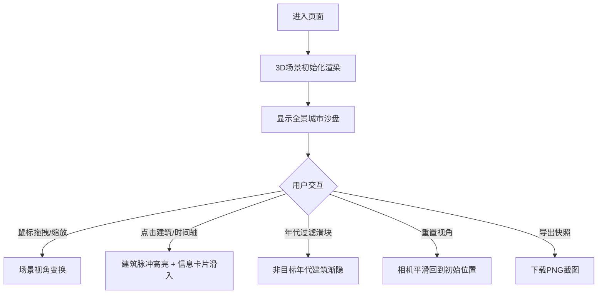

## 1. 产品概述
光之编年史是一个3D城市历史可视化工具，让城市设计者和历史爱好者以沉浸式交互方式直观探索城市地标建筑在不同历史阶段的建造年代与风格演变。
- 解决现有时间轴工具平面化、缺乏交互感的痛点，通过三维沙盘与时间轴联动呈现城市建筑历史脉络
- 目标用户：城市规划者、建筑历史研究者、文化旅游爱好者、学生群体

## 2. 核心功能

### 2.1 功能模块
1. **三维城市沙盘场景**：可自由旋转缩放的3D城市模型，包含10-15座不同年代风格的地标建筑
2. **交互式时间轴**：底部横跨视口的年代时间轴，支持滑块拖拽和年代点选
3. **建筑信息卡片**：右侧弹出式建筑详情面板，展示建筑名称、年份、风格及简介
4. **控制面板**：左上角年代过滤滑块、重置视角按钮、导出快照按钮

### 2.2 页面详情
| 页面名称 | 模块名称 | 功能描述 |
|-----------|-------------|---------------------|
| 主页面 | 三维城市沙盘 | Three.js渲染的3D场景，鼠标拖拽旋转、滚轮缩放，深蓝灰渐变背景，建筑按年代着色，点击高亮 |
| 主页面 | 时间轴 | 1800-2024年时间轴，年代圆点标记，金色滑块拖拽交互，与3D场景联动 |
| 主页面 | 信息卡片 | 右侧滑入式毛玻璃卡片，展示选中建筑的详细信息 |
| 主页面 | 控制面板 | 年代范围过滤（双滑块）、重置视角、导出PNG快照 |

## 3. 核心流程
用户进入页面 → 看到初始3D城市沙盘全景 → 通过鼠标拖拽/缩放探索城市 → 点击建筑或时间轴圆点 → 建筑脉冲高亮动画 + 信息卡片从右侧滑入 → 可通过控制面板过滤年代范围查看特定时期建筑 → 可重置视角回到初始状态 → 可导出当前场景快照保存

## 4. 用户界面设计

### 4.1 设计风格
- 主色调：深蓝灰渐变背景（#1A1A2E → #16213E），科技感深色主题
- 建筑年代色彩映射：19世纪及以前琥珀色#FFB300，20世纪橙色#FF5722，21世纪紫色#8E24AA
- 交互强调色：金色#FFD700（滑块、光晕、高亮）
- 字体颜色：浅灰#E0E0E0（正文）
- 材质风格：建筑半透明带光泽，信息卡片毛玻璃backdrop-filter效果
- 按钮与控件：圆角设计，控制面板半透明黑色背景

### 4.2 页面设计概述
| 页面名称 | 模块名称 | UI元素 |
|-----------|-------------|-------------|
| 主页面 | 三维场景 | 渐变背景、半透明光泽建筑立方体、金色点高光晕、鼠标拖拽旋转缩放 |
| 主页面 | 时间轴 | 底部横跨视口、6px彩色年代圆点、20px金色圆形滑块带白色内圈、拖拽交互 |
| 主页面 | 信息卡片 | 宽280px、毛玻璃半透明白色、圆角12px、右侧滑入动画、14px行高1.6文字 |
| 主页面 | 控制面板 | 左上角半透明黑色rgba(0,0,0,0.6)、圆角12px、内边距16px、双滑块范围选择、功能按钮 |

### 4.3 响应式
- 桌面端优先设计，最小宽度1024px
- 时间轴、控制面板、信息卡在宽屏下布局稳定
- 3D画布自适应视口尺寸

### 4.4 3D场景指导
- **环境**：深蓝灰渐变背景（#1A1A2E到#16213E），营造夜晚科技感
- **光照**：环境光提供基础照明，方向光模拟主光源，带柔和阴影
- **相机**：透视相机，初始角度俯瞰城市沙盘，支持OrbitControls自由旋转缩放
- **构图**：城市建筑散布在平面区域，建筑高度2-5单位根据重要性变化，基座0.5单位
- **交互**：点击建筑触发脉冲缩放动画（1→1.3→1，0.6秒），金色光晕高亮（0.5秒ease-out）
- **性能**：目标帧率45fps以上，控制建筑和粒子数量
