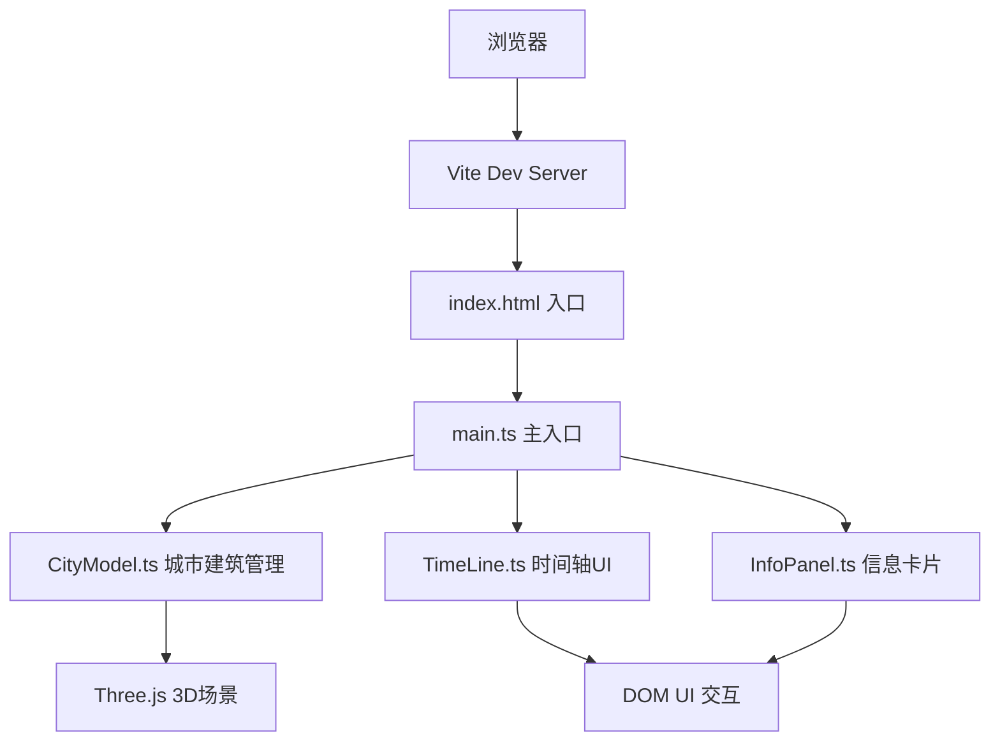

## 1. 架构设计


## 2. 技术说明
- 前端框架：TypeScript + Three.js
- 构建工具：Vite
- 渲染引擎：Three.js r160+
- 样式：原生CSS，CSS变量管理主题色
- 无后端，所有数据为前端内置Mock数据

## 3. 项目结构
```
.
├── index.html              # 全屏入口HTML
├── package.json            # 依赖配置（three, typescript, vite）
├── tsconfig.json           # TypeScript严格模式配置（module: nodenext）
├── vite.config.js          # Vite基础配置
└── src/
    ├── main.ts             # 场景初始化，相机、灯光、渲染器，文件调度
    ├── CityModel.ts        # 管理地标建筑数据和三维对象，过滤/高亮方法
    ├── TimeLine.ts         # 底部时间轴UI创建与交互事件逻辑
    └── InfoPanel.ts        # 信息卡片创建、内容填充与动画控制
```

## 4. 核心模块职责

### 4.1 main.ts
- 初始化Three.js场景、相机（PerspectiveCamera）、渲染器（WebGLRenderer）
- 设置OrbitControls实现鼠标拖拽旋转、滚轮缩放
- 配置环境光、方向光
- 实例化CityModel、TimeLine、InfoPanel并建立事件通信
- 实现渲染循环（requestAnimationFrame），目标帧率45fps+
- 响应窗口resize事件

### 4.2 CityModel.ts
- 内置10-15座地标建筑Mock数据（名称、年份、风格、简介、坐标、高度）
- 根据年代映射颜色：≤1900 → #FFB300，1901-2000 → #FF5722，≥2001 → #8E24AA
- 创建建筑Mesh：BoxGeometry（基座+主体），MeshPhysicalMaterial半透明带光泽
- 提供方法：
  - `filterByYearRange(start, end)`：年代过滤，非范围建筑opacity→0.3，0.4s过渡
  - `highlightBuilding(id)`：脉冲缩放动画（1→1.3→1，0.6s），金色光晕
  - `getBuildingByYear(year)`：根据年份查找建筑

### 4.3 TimeLine.ts
- 创建底部时间轴DOM：1800-2024年刻度、年代圆点（6px直径）、金色滑块（20px带白色内圈）
- 事件监听：
  - 滑块拖拽（mousedown/mousemove/mouseup）
  - 圆点点击
- 回调接口：`onYearChange(year)`、`onBuildingSelect(buildingId)`
- 与CityModel联动高亮对应建筑

### 4.4 InfoPanel.ts
- 创建右侧信息卡片DOM：280px宽，毛玻璃效果
- 方法：
  - `show(buildingData)`：填充内容，从右侧translateX(100px)→0滑入（0.3s ease-out）
  - `hide()`：滑出隐藏
- 内容字段：建筑名称、建造年份、建筑风格、简介（≤50字）
- 样式：14px字号，行高1.6，颜色#E0E0E0

## 5. 关键数据结构

```typescript
interface Building {
  id: string;
  name: string;
  year: number;
  style: string;      // 哥特式、新古典、现代主义等
  description: string; // ≤50字
  position: { x: number; z: number };
  height: number;     // 2-5单位
  color: string;      // 由year计算得出
}
```

## 6. 性能优化
- 建筑使用共享Geometry和Material减少Draw Call
- 动画使用requestAnimationFrame，避免setTimeout/setInterval
- 光晕使用CSS实现而非额外3D对象
- DOM操作最小化，使用transform而非top/left触发GPU加速
- 避免每帧更新DOM，时间轴节流处理
