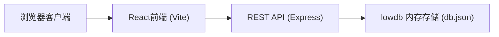
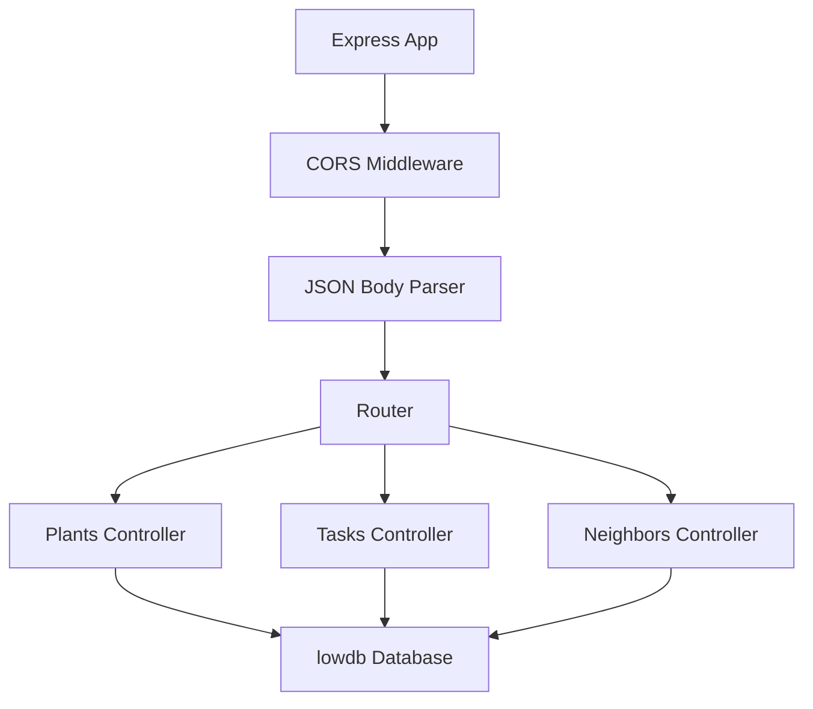
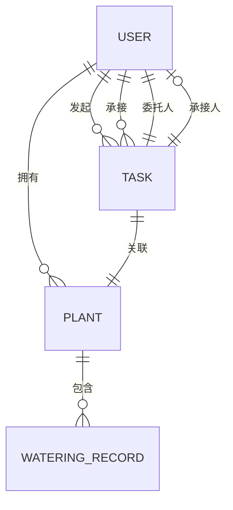

## 1. 架构设计



## 2. 技术选型

- **前端框架**：React 18 + TypeScript
- **构建工具**：Vite 5
- **路由管理**：React Router v6
- **样式方案**：SCSS Modules + 全局样式变量
- **后端服务**：Express 4
- **数据存储**：lowdb（基于JSON文件）
- **唯一ID**：uuid
- **跨域处理**：cors

## 3. 路由定义

| 路由路径 | 页面组件 | 用途 |
|----------|----------|------|
| / | Home.tsx | 首页植物墙 |
| /trust | Trust.tsx | 托管请求中心 |
| /calendar | Calendar.tsx | 养护日历 |

## 4. API 接口定义

### 4.1 植物 CRUD

| 方法 | 路径 | 描述 | 请求体 | 响应 |
|------|------|------|--------|------|
| GET | /api/plants | 获取所有植物列表 | - | Plant[] |
| POST | /api/plants | 添加新植物 | PlantCreate | Plant |
| PUT | /api/plants/:id | 更新植物信息 | PlantUpdate | Plant |
| DELETE | /api/plants/:id | 删除植物 | - | { success: boolean } |

### 4.2 托管任务 CRUD

| 方法 | 路径 | 描述 | 请求体 | 响应 |
|------|------|------|--------|------|
| GET | /api/tasks | 获取所有托管任务 | - | Task[] |
| POST | /api/tasks | 创建托管任务 | TaskCreate | Task |
| PUT | /api/tasks/:id | 更新任务状态（接单/完成） | TaskUpdate | Task |
| DELETE | /api/tasks/:id | 取消托管任务 | - | { success: boolean } |

### 4.3 邻居匹配

| 方法 | 路径 | 描述 | 请求体 | 响应 |
|------|------|------|--------|------|
| GET | /api/neighbors | 获取匹配邻居列表（按距离+信用排序） | ?location=&plantId= | Neighbor[] |

### 4.4 浇水记录

| 方法 | 路径 | 描述 | 请求体 | 响应 |
|------|------|------|--------|------|
| GET | /api/plants/:id/watering | 获取植物浇水记录 | - | WateringRecord[] |
| POST | /api/plants/:id/watering | 添加浇水记录 | WateringRecordCreate | WateringRecord |

## 5. 服务端架构图



## 6. 数据模型

### 6.1 实体关系图



### 6.2 类型定义

```typescript
// 用户
interface User {
  id: string;
  name: string;
  avatar: string;
  creditScore: number;
  distance: number;
}

// 植物
interface Plant {
  id: string;
  name: string;
  species: string;
  icon: string;
  image: string;
  status: 'needs_water' | 'watered';
  addedAt: string;
  lastWateredAt: string | null;
}

// 托管任务
interface Task {
  id: string;
  plantId: string;
  requesterId: string;
  accepterId: string | null;
  startDate: string;
  endDate: string;
  status: 'pending' | 'accepted' | 'completed' | 'cancelled';
  createdAt: string;
}

// 浇水记录
interface WateringRecord {
  id: string;
  plantId: string;
  type: 'water' | 'fertilize' | 'repot';
  operatorName: string;
  photos: string[];
  note: string;
  timestamp: string;
}
```
