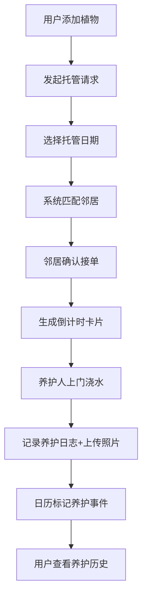

## 1. 产品概述

绿植社交浇水托管系统是一个面向植物爱好者的邻里互助平台，解决用户出差或旅游时家中植物无人照料的痛点。通过建立邻里信任网络，用户可委托邻居帮忙浇水养护，并记录植物生长状态与养护历史。

- 核心目标：打造温暖友好的植物养护社区，让每一株植物都得到悉心照料
- 目标用户：家中养有植物、经常出差或旅游的城市居民

## 2. 核心功能

### 2.1 用户角色
| 角色 | 注册方式 | 核心权限 |
|------|----------|----------|
| 普通用户 | 模拟登录 | 添加管理植物、发起托管请求、接单浇水、查看养护日历 |

### 2.2 功能模块
1. **首页植物墙**：展示用户所有植物卡片，支持3D翻转查看浇水记录，状态实时标识
2. **托管中心**：发起托管请求，选择日期，智能匹配邻居，倒计时提醒
3. **养护日历**：可视化日历视图，养护事件标记，详情浮层展示

### 2.3 页面详情
| 页面名称 | 模块名称 | 功能描述 |
|----------|----------|----------|
| 首页 | 植物卡片墙 | 浅绿色背景，卡片200×280px，圆角16px，hover上浮动画，延迟200ms依次出现 |
| 首页 | 状态标识 | 需要浇水：蓝色水滴脉动动画；已浇水：绿色勾号；卡片翻转0.6s rotateY |
| 首页 | 翻转背面 | 展示最近3次浇水记录，含时间、操作人、备注 |
| 托管中心 | 日期选择器 | Material-UI风格，聚焦时下划波纹动画 |
| 托管中心 | 邻居匹配 | 按距离和信用评分排序，展示候选人列表 |
| 托管中心 | 倒计时卡片 | 接单人接受后生成，结束前1小时红点闪烁提醒 |
| 养护日历 | 月视图日历 | 彩色圆点标记：蓝色浇水、紫色施肥、橙色换盆 |
| 养护日历 | 详情浮层 | 毛玻璃效果（8px模糊），最多3张现场照片走马灯轮播，文字备注 |

## 3. 核心流程

用户添加植物卡片 → 出差前发起托管请求（选择起止日期）→ 系统智能匹配附近邻居 → 邻居确认接单 → 生成倒计时卡片 → 养护人按约浇水并记录（可上传照片）→ 日历自动标记养护事件 → 用户返回后查看完整养护历史

## 4. 用户界面设计

### 4.1 设计风格
- **主色调**：植物绿 #4caf50，大地棕 #795548
- **背景色**：浅绿色 #e8f5e9（首页植物墙）
- **按钮风格**：绿到青渐变，点击缩放1.05（0.15s），hover上浮加深投影
- **字体**：温暖友好的无衬线字体，标题加粗，正文适中
- **布局风格**：卡片式布局，圆角设计，舒适留白
- **图标风格**：自然植物相关图标，水滴、绿叶、花盆等元素

### 4.2 页面设计概述
| 页面名称 | 模块名称 | UI元素 |
|----------|----------|--------|
| 首页 | 植物卡片墙 | 浅绿背景，卡片网格布局，3D翻转动画，状态脉动标识，依次淡入动画 |
| 托管中心 | 表单区域 | Material风格日期选择器，波纹聚焦动效，邻居卡片列表，信用评分展示 |
| 托管中心 | 倒计时 | 大号数字显示，结束前红点闪烁，进度条渐变 |
| 养护日历 | 月历网格 | 彩色圆点事件标记，毛玻璃浮层，照片走马灯轮播 |

### 4.3 响应式设计
桌面端优先（1280px），自适应平板（768px）和手机（375px）。
- 手机端：导航栏折叠为汉堡菜单，平滑展开动画，卡片单列布局
- 平板端：卡片双列布局，导航简化
- 桌面端：多列卡片网格，完整导航栏

### 4.4 性能要求
- 页面加载时不做过多动画，卡片延迟200ms依次出现
- FPS保持在50以上
- CSS动画优先，避免重排重绘
