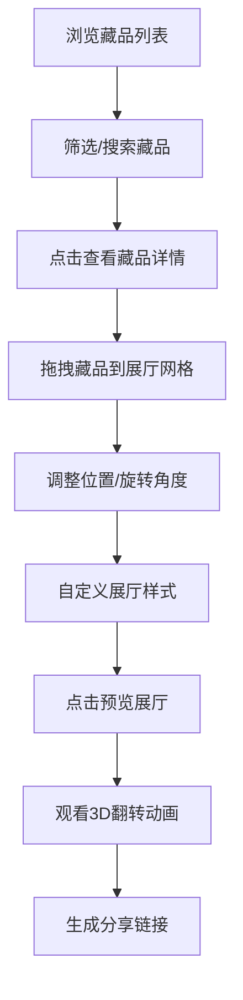

## 1. 产品概述

在线虚拟博物馆展览策展人应用，让用户能够从预设的数字藏品库中挑选展品、布置虚拟展厅并生成可分享的展览链接。为博物馆爱好者、策展人和教育工作者提供便捷的虚拟展览创建工具。

- 核心目标：降低虚拟展览制作门槛，让普通用户也能体验策展乐趣
- 市场价值：连接数字藏品与观众，为文化传播提供创新展示方式

## 2. 核心 Features

### 2.1 用户角色

| 角色 | 注册方式 | 核心权限 |
|------|----------|----------|
| 普通用户 | 无需注册 | 浏览藏品、创建展览、分享展览 |

### 2.2 Feature Module

1. **藏品管理模块**：藏品列表展示、分类筛选、关键词搜索、藏品详情查看
2. **展览编排模块**：虚拟展厅网格布局、藏品拖拽放置、旋转删除、展厅样式自定义
3. **展厅预览模块**：全屏预览、3D翻转入场动画、展览名称编辑、分享链接生成

### 2.3 页面详情

| 页面名称 | 模块名称 | Feature description |
|---------|----------|---------------------|
| 主应用页面 | 藏品列表 | 瀑布流网格展示，支持筛选搜索，点击查看详情 |
| 主应用页面 | 展览编排 | 工具面板自定义展厅样式，网格画布拖拽放置藏品 |
| 预览模式 | 展厅预览 | 全屏沉浸式展示，3D翻转动画，分享功能 |

## 3. 核心流程

用户从藏品列表中浏览和筛选感兴趣的藏品，通过拖拽将藏品放置到虚拟展厅网格中，调整藏品位置和旋转角度，自定义展厅背景色和灯光效果，完成后进入预览模式观看3D入场动画，最终生成可分享的展览链接。

## 4. 用户界面设计

### 4.1 设计风格

- **主色调**：米色#F5E6CC（背景）、深棕色#3E2723（标题栏）
- **强调色**：古典红#8B0000、宁静蓝#1565C0、自然绿#2E7D32（展厅背景预设）
- **功能色**：#8D6E63（按钮）、#E53935（删除/关闭）
- **字体**：Roboto（英文）、Noto Serif SC（中文）
- **按钮样式**：圆角矩形（圆角8px或20px），悬停有平滑过渡
- **布局风格**：卡片式布局，左右分栏，顶部导航栏
- **动画风格**：卡片悬停上浮缩放，3D翻转入场，所有过渡0.2-0.3s ease

### 4.2 页面设计总览

| 页面名称 | 模块名称 | UI 元素 |
|---------|----------|---------|
| 主应用 | 标题栏 | 深棕色背景，白色标题文字22px，右侧预览按钮和头像占位 |
| 主应用 | 藏品列表 | 瀑布流网格3-4列，卡片240x320px圆角12px阴影，悬停上浮8px缩放1.05 |
| 主应用 | 工具面板 | 宽260px背景#FFF8F0，颜色选择器、灯光选择器 |
| 主应用 | 展厅画布 | 5x4网格120x120px虚线边框，拖拽放置藏品缩略图80x80px |
| 预览模式 | 全屏预览 | 背景覆盖视口，藏品3D翻转逐个入场，顶部展览名称，底部分享按钮 |
| 通用 | 模态框 | 半透明遮罩#00000080，600x500px圆角16px，右上角圆形关闭按钮 |
| 通用 | Toast通知 | 底部居中240x50px圆角8px，背景#333白色文字，3秒自动消失 |

### 4.3 响应式设计

- **桌面端（1024px以上）**：左右分栏布局，藏品网格3-4列
- **平板端（768px-1024px）**：左右分栏布局，藏品网格2-3列
- **移动端（768px以下）**：上下堆叠布局，藏品网格2列，预览按钮固定在顶部

### 4.4 性能要求

- 藏品列表初始加载 ≤ 2秒
- 拖拽操作帧率 ≥ 40fps
- 预览动画流畅无卡顿
- 所有动画使用CSS transform和opacity避免重排
