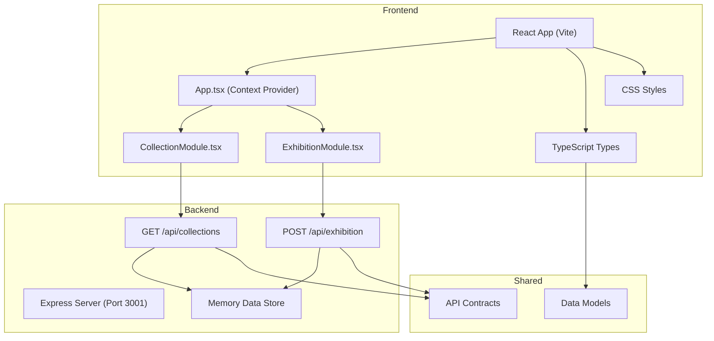

## 1. 架构设计



## 2. 技术选型

- **前端**：React 18 + TypeScript + Vite
- **状态管理**：React Context API
- **HTTP客户端**：Axios
- **后端**：Express 4 + TypeScript
- **唯一ID**：uuid
- **跨域**：cors
- **构建工具**：Vite 5
- **启动方式**：npm run dev（同时启动前端Vite和后端Express）

## 3. 项目结构

```
auto120/
├── package.json
├── index.html
├── vite.config.js
├── tsconfig.json
├── src/
│   ├── App.tsx
│   ├── App.css
│   ├── CollectionModule.tsx
│   ├── ExhibitionModule.tsx
│   └── types/
│       └── index.ts
├── server/
│   ├── index.ts
│   ├── data/
│   │   └── collections.ts
│   └── types/
│       └── index.ts
└── .trae/
    └── documents/
        ├── PRD.md
        └── Technical_Architecture.md
```

## 4. 数据模型

### 4.1 藏品数据模型

```typescript
interface CollectionItem {
  id: string;
  name: string;
  era: string;
  material: string;
  thumbnail: string;
  modelPath: string;
  category: string;
  description: string;
}
```

### 4.2 展览数据模型

```typescript
interface PlacedItem {
  collectionId: string;
  gridX: number;
  gridY: number;
  rotation: number;
}

interface Exhibition {
  id: string;
  name: string;
  backgroundColor: string;
  lightingType: 'warm' | 'cool' | 'mixed';
  standStyle: string;
  items: PlacedItem[];
  shareUrl: string;
  createdAt: Date;
}
```

### 4.3 Context 状态

```typescript
interface ExhibitionContextType {
  selectedItems: CollectionItem[];
  placedItems: PlacedItem[];
  backgroundColor: string;
  lightingType: 'warm' | 'cool' | 'mixed';
  exhibitionName: string;
  addItem: (item: CollectionItem) => void;
  removeItem: (id: string) => void;
  placeItem: (item: PlacedItem) => void;
  updatePlacedItem: (gridX: number, gridY: number, updates: Partial<PlacedItem>) => void;
  setBackgroundColor: (color: string) => void;
  setLightingType: (type: 'warm' | 'cool' | 'mixed') => void;
  setExhibitionName: (name: string) => void;
  resetExhibition: () => void;
}
```

## 5. API 定义

### 5.1 获取藏品列表

```typescript
// GET /api/collections?category=xxx&search=xxx
// Request:
interface GetCollectionsRequest {
  category?: string;
  search?: string;
}

// Response:
type GetCollectionsResponse = CollectionItem[];
```

### 5.2 创建展览

```typescript
// POST /api/exhibition
// Request:
interface CreateExhibitionRequest {
  name: string;
  backgroundColor: string;
  lightingType: 'warm' | 'cool' | 'mixed';
  standStyle: string;
  items: PlacedItem[];
}

// Response:
interface CreateExhibitionResponse {
  id: string;
  shareUrl: string;
}
```

## 6. 路由定义

| 路由 | 用途 |
|------|------|
| / | 主应用页面，包含藏品列表和展览编排 |
| /exhibition/:uuid | 展览分享页面，查看已创建的展览 |
| /api/collections | 后端API，获取藏品列表 |
| /api/exhibition | 后端API，创建展览并生成分享链接 |

## 7. 核心功能实现要点

### 7.1 拖拽功能
- 使用HTML5原生Drag and Drop API
- 藏品卡片设置draggable="true"
- 网格单元格监听drop事件获取藏品ID
- 使用dataTransfer传递藏品数据

### 7.2 3D翻转动画
- CSS transform: rotateY(180deg)
- transform-style: preserve-3d
- backface-visibility: hidden
- animation-delay实现逐个入场效果

### 7.3 响应式布局
- CSS Grid + Flexbox
- Media Queries断点：768px, 1024px
- 网格列数使用auto-fill + minmax

### 7.4 性能优化
- 藏品列表使用虚拟滚动或懒加载
- 动画使用transform和opacity属性
- 防抖处理搜索输入
- 事件委托处理网格交互
