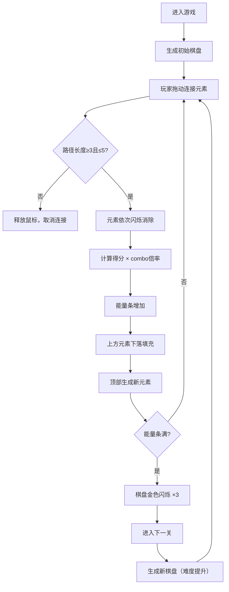

## 1. 产品概述

「元素回响」是一款魔法主题的消除类益智游戏，玩家扮演魔法学徒，在随机生成的元素棋盘上连接相邻的元素符号施放组合法术，消除棋子积累能量，挑战不断升级的谜题。

- 核心玩法：点击拖动连接相邻相同元素，形成3-5长度路径即可消除
- 目标用户：休闲益智游戏爱好者
- 产品价值：提供具有策略性和爽快感的消除体验，结合魔法主题营造沉浸式氛围

## 2. 核心特性

### 2.1 用户角色
| 角色 | 注册方式 | 核心权限 |
|------|----------|----------|
| 玩家 | 无需注册 | 直接进入游戏，体验全部关卡 |

### 2.2 功能模块
1. **游戏主界面**：8x8元素棋盘、分数显示、能量条、关数显示
2. **棋盘交互系统**：元素连接路径检测、消除动画、下落填充
3. **分数倍率系统**：基础得分、combo连击倍率（最高x5）
4. **关卡进度系统**：能量条累积、过关机制、难度递增
5. **特殊元素系统**：月光元素稀有掉落，3x3范围消除
6. **UI界面组件**：侧边栏、暂停/重开按钮、响应式布局

### 2.3 页面详情
| 页面名称 | 模块名称 | 功能描述 |
|----------|----------|----------|
| 游戏主界面 | 元素棋盘 | 8x8网格，四种基础元素 + 月光特殊元素，支持鼠标拖动连接 |
| 游戏主界面 | 分数面板 | 右上角显示当前分数，combo时数字跳动动画 |
| 游戏主界面 | 能量条 | 底部能量条，消除积累能量，满后进入下一关 |
| 游戏主界面 | 关数显示 | 顶部中央金色文字显示当前关卡 |
| 游戏主界面 | 左侧边栏 | 游戏说明和操作指引（WASD/点击滑动） |
| 游戏主界面 | 右侧边栏 | 当前关数和特殊元素剩余数量 |
| 游戏主界面 | 控制按钮 | 重新开始和暂停按钮，圆角悬停效果 |

## 3. 核心流程

玩家进入游戏后，在8x8的元素棋盘上通过点击并拖动鼠标连接相邻的相同元素符号。当路径长度达到3到5时，路径上的元素依次闪烁并消除，获得分数和能量。消除后上方元素下落填充空位，顶部随机生成新元素补位。连续消除会累积combo倍率，提高得分。能量条满后进入下一关，关卡越高，特殊元素出现概率越大。

## 4. 界面设计

### 4.1 设计风格

- **主色调**：深蓝色魔法主题，背景从 #0F172A 渐变到 #1E293B
- **元素配色**：
  - 火焰：红色 #EF4444（三角形）
  - 水流：蓝色 #3B82F6（波浪线）
  - 风：绿色 #22C55E（螺旋线）
  - 大地：橙色 #F59E0B（菱形）
  - 月光：银色 #C0C0C0（月亮）
- **强调色**：靛蓝 #6366F1（悬停边框）、金色 #FFD700（关卡文字、过关闪烁）
- **按钮风格**：圆角 10px，背景 #475569，悬停 #64748B，上浮动效 + 阴影
- **字体**：sans-serif 为主，分数使用 monospace 粗体
- **布局**：桌面端棋盘居中，左右各 120px 边栏；移动端边栏折叠到上下方
- **图标风格**：几何形状（三角形、波浪线、螺旋线、菱形、月亮）

### 4.2 页面设计概览
| 页面名称 | 模块名称 | UI元素 |
|----------|----------|--------|
| 游戏主界面 | 元素棋盘 | 8×8网格、60px格子、2px间距、悬停边框高亮、消除闪烁动画、下落动画 |
| 游戏主界面 | 分数面板 | monospace粗体白色、20px字号、数字跳动缩放动画 |
| 游戏主界面 | 能量条 | 400×20px、青紫渐变填充、背景深色 |
| 游戏主界面 | Combo火焰 | 橙红渐变、大小随倍率脉动、1s循环动画 |
| 游戏主界面 | 侧边栏 | 120px宽、浅白文字、游戏说明/状态信息 |
| 游戏主界面 | 控制按钮 | 圆角10px、深色背景、悬停上浮阴影 |

### 4.3 响应式

- 采用桌面优先设计，移动端自适应
- 断点：768px
  - 桌面端（≥768px）：棋盘居中，左右各120px边栏
  - 移动端（<768px）：边栏折叠到棋盘上下方，能量条和分数面板移至棋盘正上方
- 触摸优化：支持触摸滑动连接元素

### 4.4 性能要求
- 目标帧率：60FPS
- 消除和下落动画流畅无卡顿
- 使用 CSS transform 和 opacity 属性实现动画以启用 GPU 加速
