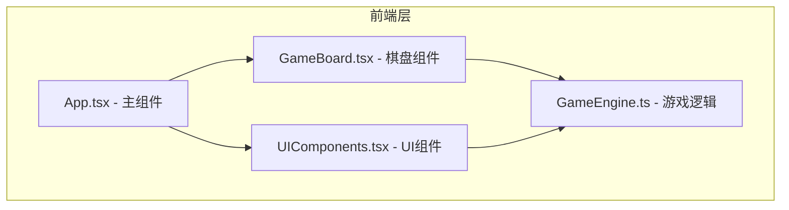

## 1. 架构设计



项目采用纯前端架构，React 组件负责渲染和交互，GameEngine 纯逻辑模块负责棋盘生成、路径检测、消除计算等核心游戏逻辑。

## 2. 技术选型

- **前端框架**：React 18 + TypeScript
- **构建工具**：Vite 5
- **Vite 插件**：@vitejs/plugin-react
- **状态管理**：React useState/useReducer（轻量状态，无需额外状态库）
- **样式方案**：原生 CSS + CSS 变量（无 Tailwind，按用户要求的文件结构实现）
- **动画方案**：CSS transitions/animations + requestAnimationFrame

## 3. 目录结构

```
auto122/
├── package.json
├── index.html
├── vite.config.js
├── tsconfig.json
└── src/
    ├── App.tsx           # 主组件，管理游戏状态和整体布局
    ├── GameBoard.tsx     # 棋盘渲染与交互逻辑
    ├── GameEngine.ts     # 纯逻辑模块，生成棋盘、检测路径、消除和下落
    └── UIComponents.tsx  # 分数、能量条、关数、侧边栏等界面元素
```

## 4. 核心模块说明

### 4.1 GameEngine.ts - 游戏引擎

**类型定义：**
```typescript
type ElementType = 'fire' | 'water' | 'wind' | 'earth' | 'moon';
interface Cell {
  id: string;
  element: ElementType;
  row: number;
  col: number;
  isEliminating?: boolean;
  isFalling?: boolean;
}
interface GameState {
  board: Cell[][];
  score: number;
  combo: number;
  energy: number;
  level: number;
  selectedPath: Cell[];
  isAnimating: boolean;
}
```

**核心函数：**
- `generateBoard(level: number): Cell[][]` - 生成初始棋盘，根据关卡决定特殊元素概率
- `isAdjacent(cell1: Cell, cell2: Cell): boolean` - 判断两个格子是否相邻
- `validatePath(path: Cell[]): boolean` - 验证路径是否有效（相同元素、长度3-5）
- `getEliminationCells(path: Cell[]): Cell[]` - 获取需要消除的格子（含月光3x3效果）
- `applyGravity(board: Cell[][]): Cell[][]` - 应用重力，元素下落
- `fillEmptyCells(board: Cell[][], level: number): Cell[][]` - 填充空位，生成新元素
- `calculateScore(eliminatedCount: number, combo: number): number` - 计算得分
- `calculateEnergy(eliminatedCount: number): number` - 计算能量增量
- `getMoonProbability(level: number): number` - 获取当前关卡月光元素出现概率

### 4.2 GameBoard.tsx - 棋盘组件

**职责：**
- 渲染8x8网格棋盘
- 处理鼠标/触摸拖动交互
- 绘制连接路径
- 管理消除和下落动画状态

**核心交互：**
- mousedown/touchstart：开始连接
- mousemove/touchmove：更新路径
- mouseup/touchend：验证并执行消除

### 4.3 UIComponents.tsx - UI组件

**组件列表：**
- `ScoreDisplay` - 分数显示组件
- `EnergyBar` - 能量条组件
- `LevelDisplay` - 关卡显示组件
- `ComboIndicator` - Combo火焰指示器
- `Sidebar` - 侧边栏组件
- `ControlButton` - 控制按钮组件

### 4.4 App.tsx - 主组件

**职责：**
- 管理全局游戏状态（分数、关卡、能量、combo）
- 布局组合（棋盘 + 侧边栏 + 顶部/底部UI）
- 响应式布局处理
- 游戏控制（开始、暂停、重开）

## 5. 性能优化策略

1. **DOM 优化**：使用 CSS transform 实现下落动画，避免重排
2. **动画优化**：消除闪烁使用 CSS animation，GPU 加速
3. **重渲染优化**：使用 React.memo 包裹 Cell 组件，避免不必要重渲染
4. **事件优化**：使用 useRef 存储拖动状态，避免频繁 setState
5. **路径检测优化**：只在鼠标移动到新格子时更新路径

## 6. 响应式实现

- 使用 CSS media queries 处理 768px 断点
- 桌面端：flex 横向布局，棋盘居中，左右边栏
- 移动端：flex 纵向布局，边栏移至上下方
- 棋盘尺寸根据视口自适应缩放
