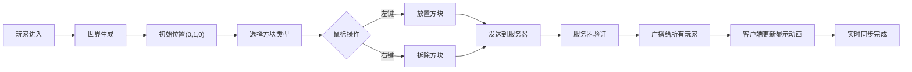

## 1. 产品概述

积木小镇是一款轻量联机沙盒建造应用，让玩家在三维方块世界中自由搭建，实时与其他在线玩家互动。解决了现有沙盒游戏过于复杂或缺乏轻量联机方案的痛点，面向碎片时间寻求沉浸式搭建乐趣的城市玩家。

- 核心价值：轻量、实时、多人协作的3D方块搭建体验
- 目标用户：喜欢在碎片时间体验建造乐趣的年轻玩家群体
- 市场价值：填补移动端/网页端轻量联机沙盒建造的市场空白

## 2. 核心功能

### 2.1 用户角色
| 角色 | 注册方式 | 核心权限 |
|------|----------|----------|
| 玩家 | 自动分配昵称进入 | 放置/拆除方块、视角控制、实时同步、查看在线玩家 |

### 2.2 功能模块
1. **3D世界渲染**：Three.js + React Three Fiber 渲染方块世界，100x100草地平面
2. **方块交互**：左键放置（落下动画）、右键拆除（碎裂粒子动画）
3. **实时多人同步**：WebSocket实时广播所有玩家操作，0.5秒内同步
4. **方块工具栏**：6种方块类型选择，底部横向工具栏
5. **视角控制**：拖拽旋转、滚轮缩放、中键平移
6. **在线玩家列表**：右下角显示在线玩家头像和昵称

### 2.3 页面详情
| 页面名称 | 模块名称 | 功能描述 |
|---------|----------|----------|
| 主游戏界面 | 3D场景模块 | 渲染三维方块世界，处理鼠标射线检测 |
| 主游戏界面 | 工具栏模块 | 底部中央方块选择，切换当前方块类型 |
| 主游戏界面 | 玩家信息模块 | 左上角显示昵称和在线人数 |
| 主游戏界面 | 在线列表模块 | 右下角显示在线玩家卡片列表 |
| 主游戏界面 | 视角控制模块 | 处理鼠标/触摸交互控制相机视角 |

## 3. 核心流程

玩家进入游戏 → 自动生成世界（草地+树木+花朵）→ 玩家出现在(0,1,0)位置 → 选择方块类型 → 左键点击放置方块（发送到服务器 → 服务器广播 → 所有客户端显示落下动画）→ 右键点击拆除方块（发送到服务器 → 服务器广播 → 所有客户端显示碎裂动画）→ 实时同步所有玩家操作。

## 4. 用户界面设计

### 4.1 设计风格
- **主色调**：深蓝色渐变背景 (#0F172A → #1E293B)，深空科技感
- **强调色**：亮黄色选中边框 (#FFEB3B)，草绿色方块 (#4CAF50)
- **文字颜色**：浅灰色 (#E0E0E0)
- **字体**：Inter 或系统默认无衬线字体
- **卡片风格**：半透明深色背景 (rgba(30, 41, 59, 0.85-0.9))，圆角8-12px

### 4.2 页面设计概述
| 页面名称 | 模块名称 | UI 元素 |
|---------|----------|----------|
| 主游戏界面 | 3D场景 | 全屏Three.js渲染，深空背景，方块网格，树木/花朵装饰 |
| 主游戏界面 | 工具栏 | 480x72px半透明卡片，6个48x48px方块图标，hover上移4px，选中亮黄边框 |
| 主游戏界面 | 玩家信息 | 18px字体，3px底部内阴影，显示昵称+在线人数 |
| 主游戏界面 | 在线列表 | 半透明卡片，40x40px圆角方块头像+白色昵称 |
| 主游戏界面 | 交互反馈 | 放置时0.3s落下动画，拆除时0.2s粒子碎裂 |

### 4.3 响应式
- **桌面端**：工具栏480px宽度，方块图标固定间距
- **移动端**：工具栏宽度90%屏幕，图标间距自适应，触控区域放大
- **触控优化**：长按拆除，双击放置，双指缩放

### 4.4 3D 场景指导
- **环境**：深空蓝色背景，无HDRI，简洁干净的视觉风格
- **光照**：方向光模拟阳光 + 环境光，色温偏冷，阴影柔和
- **相机**：围绕玩家位置的轨道相机，初始距离10单位，俯视角30度
- **运动**：拖拽旋转（灵敏度0.003），滚轮缩放（3-20单位），中键平移（系数0.01）
- **交互**：鼠标射线检测方块，高亮显示选中方块
- **动画**：方块放置落下动画（0.3s），拆除粒子动画（0.2s，10个粒子）
- **性能**：方块使用InstancedMesh批量渲染，峰值2000个方块保持45FPS+

## 5. 性能指标
- 渲染帧率：稳定60FPS，2000方块时≥45FPS
- 网络延迟：服务器广播平均延迟<100ms
- 同步延迟：其他玩家操作0.5秒内可见
