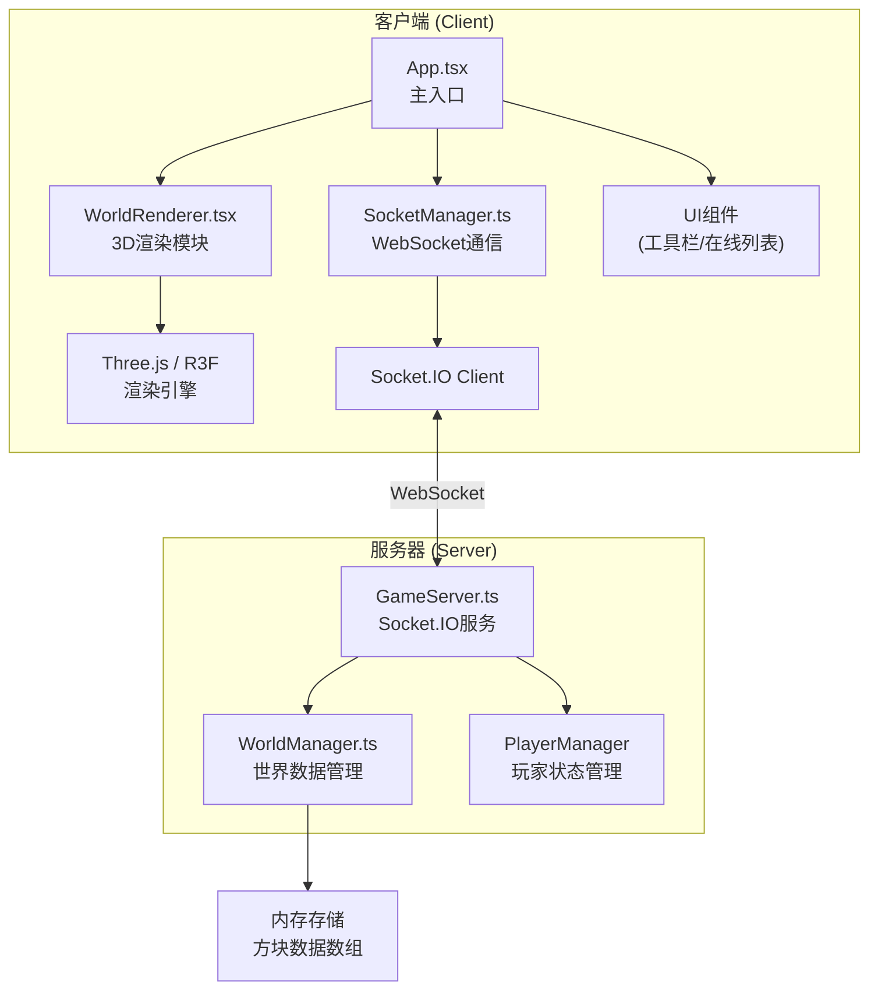
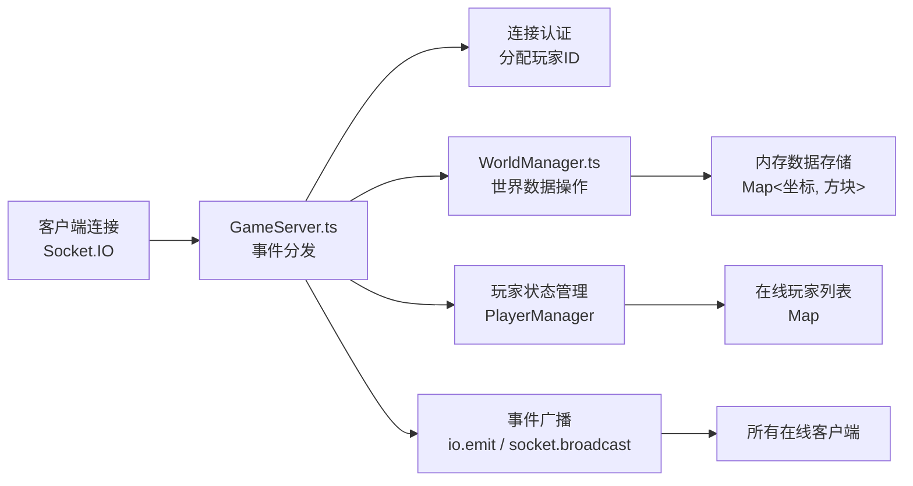

## 1. 架构设计

积木小镇采用前后端分离架构，前端负责3D渲染和用户交互，后端负责世界状态权威管理和实时同步。前后端通过WebSocket进行双向通信。



## 2. 技术描述

| 层级 | 技术栈 | 版本要求 |
|------|--------|----------|
| 前端框架 | React | ^18.2.0 |
| 前端渲染 | Three.js + @react-three/fiber | three: ^0.160.0, @react-three/fiber: ^8.15.0 |
| 构建工具 | Vite | ^5.0.0 |
| 语言 | TypeScript | ^5.3.0 |
| 实时通信 | Socket.IO Client | ^4.6.0 |
| 后端框架 | Express | ^4.18.0 |
| 后端实时通信 | Socket.IO | ^4.6.0 |
| 工具库 | uuid, cors | uuid: ^9.0.0 |
| 并发启动 | concurrently | ^8.2.0 |

## 3. 目录结构

```
auto126/
├── package.json                    # 根目录依赖和启动脚本
├── server/
│   ├── GameServer.ts               # Express + Socket.IO 服务主文件
│   └── WorldManager.ts             # 世界数据管理模块
└── client/
    ├── package.json                # 前端依赖
    ├── tsconfig.json               # TypeScript 配置（严格模式）
    ├── vite.config.js              # Vite 构建配置
    ├── index.html                  # 入口HTML
    └── src/
        ├── App.tsx                 # 主应用组件
        ├── WorldRenderer.tsx       # 3D世界渲染组件
        ├── SocketManager.ts        # Socket.IO 客户端封装
        ├── components/
        │   ├── Toolbar.tsx         # 方块选择工具栏
        │   ├── PlayerInfo.tsx      # 玩家信息显示
        │   └── OnlineList.tsx      # 在线玩家列表
        ├── hooks/
        │   ├── useCameraControl.ts # 相机控制Hook
        │   └── useBlockInteraction.ts # 方块交互Hook
        ├── utils/
        │   ├── blockTypes.ts       # 方块类型定义
        │   └── worldGenerator.ts   # 世界生成工具
        └── types/
            └── index.ts            # 共享类型定义
```

### 文件调用关系
1. **App.tsx** → 初始化 SocketManager → 渲染 WorldRenderer + UI组件
2. **WorldRenderer.tsx** → 从 App 接收世界数据 → 使用 R3F 渲染 → 调用 useBlockInteraction 处理点击
3. **SocketManager.ts** → 发送放置/拆除事件 → 监听世界更新 → 回调更新 App 状态
4. **GameServer.ts** → 接收客户端事件 → 调用 WorldManager 更新数据 → 广播给所有客户端
5. **WorldManager.ts** → 维护方块数据数组 → 提供查询/更新接口

### 数据流向
```
客户端点击 → WorldRenderer → SocketManager.emit('placeBlock')
    ↓
服务器 GameServer.on('placeBlock') → WorldManager.updateBlock()
    ↓
GameServer.broadcast('blockUpdated') → 所有客户端 SocketManager.on('blockUpdated')
    ↓
App 更新状态 → WorldRenderer 重新渲染 → 显示动画
```

## 4. WebSocket 事件定义

### 客户端 → 服务器
```typescript
// 玩家加入
interface JoinEvent {
  playerId: string;
  nickname: string;
  avatarColor: string;
}

// 放置方块
interface PlaceBlockEvent {
  x: number;
  y: number;
  z: number;
  blockType: BlockType;
  playerId: string;
}

// 拆除方块
interface RemoveBlockEvent {
  x: number;
  y: number;
  z: number;
  playerId: string;
}

// 玩家位置更新
interface PlayerMoveEvent {
  playerId: string;
  position: { x: number; y: number; z: number };
}
```

### 服务器 → 客户端
```typescript
// 初始世界数据
interface WorldDataEvent {
  blocks: BlockData[];
  players: PlayerData[];
  yourPlayerId: string;
}

// 方块更新（放置/拆除）
interface BlockUpdateEvent {
  x: number;
  y: number;
  z: number;
  blockType: BlockType | null; // null 表示拆除
  playerId: string;
}

// 玩家加入
interface PlayerJoinEvent {
  player: PlayerData;
}

// 玩家离开
interface PlayerLeaveEvent {
  playerId: string;
}

// 玩家列表更新
interface PlayerListEvent {
  players: PlayerData[];
}
```

### 数据类型定义
```typescript
enum BlockType {
  GRASS = 'grass',
  DIRT = 'dirt',
  WOOD = 'wood',
  STONE = 'stone',
  GLASS = 'glass',
  BRICK = 'brick',
  TREE_TRUNK = 'tree_trunk',
  TREE_LEAVES = 'tree_leaves',
  FLOWER = 'flower'
}

interface BlockData {
  x: number;
  y: number;
  z: number;
  type: BlockType;
  color?: string; // 花朵等特殊方块的颜色
}

interface PlayerData {
  id: string;
  nickname: string;
  avatarColor: string;
  position: { x: number; y: number; z: number };
}
```

## 5. 服务器架构



### 模块职责
- **GameServer.ts**: 
  - 启动 Express 服务（端口3001）
  - 初始化 Socket.IO 并启用 CORS
  - 监听客户端连接/断开
  - 处理 placeBlock/removeBlock 事件
  - 调用 WorldManager 验证并更新数据
  - 广播事件给所有客户端
  - 维护在线玩家列表

- **WorldManager.ts**:
  - 维护三维方块数据 Map（key: "x,y,z", value: BlockData）
  - 世界初始化生成（100x100草地 + 随机树木花朵）
  - 提供 getBlock(x,y,z) 查询接口
  - 提供 setBlock(x,y,z,type) 更新接口
  - 提供 getAllBlocks() 批量加载接口
  - 坐标边界验证（-50 ≤ x,z ≤ 50, 0 ≤ y ≤ 50）

## 6. 方块类型配置

| 类型 | 颜色 | 透明度 | 说明 |
|------|------|--------|------|
| 木头 | #8D6E63 | 1.0 | 默认选中 |
| 石头 | #78909C | 1.0 | |
| 玻璃 | #81D4FA | 0.6 | 半透明 |
| 草 | #4CAF50 | 1.0 | |
| 泥土 | #6D4C41 | 1.0 | |
| 砖块 | #B71C1C | 1.0 | |
| 树干 | #795548 | 1.0 | 世界生成用 |
| 树叶 | #388E3C | 1.0 | 世界生成用 |
| 花朵 | 随机色 | 1.0 | 世界生成用 |

## 7. 性能优化策略

1. **渲染优化**:
   - 使用 `InstancedMesh` 批量渲染相同类型方块
   - 视锥体剔除，只渲染相机可见区域
   - 方块数据按需更新，避免全量重渲染

2. **网络优化**:
   - 事件防抖，合并快速连续操作
   - 只广播必要的变化数据
   - 二进制序列化减少数据体积

3. **内存优化**:
   - 方块数据使用 Map 存储，O(1) 查找
   - 粒子对象池复用，避免频繁GC

## 8. 性能指标
- 渲染帧率：≥60FPS（2000方块时≥45FPS）
- 服务器广播延迟：<100ms
- 客户端同步延迟：<500ms
- 内存占用：<200MB（客户端）
