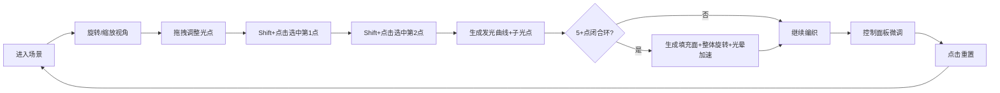

## 1. 产品概述
星轨织造者是一款基于WebGL的三维交互式抽象艺术创作工具，用户在深邃星空中通过拖拽光点、编织发光曲线来创造动态的彩色星轨图案。
- 面向抽象艺术爱好者、交互式可视化创作者，提供沉浸式的3D空间艺术创作体验
- 通过极简的交互方式（拖拽、Shift+点击）创造复杂绚丽的星轨艺术作品

## 2. 核心功能

### 2.1 功能模块
1. **三维星空场景**：深邃星空背景、可自由旋转缩放视角、50个随机散布的呼吸光点
2. **光点交互系统**：光点拖拽移动、选中高亮放大、脉冲波纹效果
3. **曲线编织系统**：Shift+点击连接光点、CatmullRom插值曲线、流动光晕、子光点摆动
4. **闭合路径效果**：5点以上闭合环检测、半透明彩色填充、整体星轨旋转加速
5. **控制面板**：光晕亮度滑块、旋转速度滑块、子光点振幅滑块、重置按钮

### 2.2 页面详情
| 页面名称 | 模块名称 | 功能描述 |
|-----------|-------------|---------------------|
| 主场景页 | 星空背景 | #0A0B1E到#1A1B3A垂直渐变，Three.js渲染全屏 |
| 主场景页 | 光点系统 | 50个半径0.2光点，初始颜色#4A5A8A，3秒呼吸周期 |
| 主场景页 | 拖拽交互 | 左键拖拽移动光点，选中时放大至0.4、颜色#FFD700、发射脉冲 |
| 主场景页 | 曲线系统 | Shift+双击两点生成CatmullRom曲线，#8B5CF6到#EC4899渐变，4秒流动周期 |
| 主场景页 | 子光点 | 每条曲线6个子光点，直径0.1，沿曲线渐变，0.3范围正弦摆动，2秒周期 |
| 主场景页 | 闭合环 | 5+点闭合时生成0.15透明度填充面，Y轴0.005rad/s旋转，光晕加速2倍 |
| 主场景页 | 控制面板 | 右下角色玻璃面板，3个参数滑块+重置按钮 |

## 3. 核心流程
用户进入场景 → 自由旋转缩放视角观察星空 → 拖拽光点调整位置 → 按住Shift依次点击两个光点连接成曲线 → 重复连接编织星轨 → 形成闭合环触发特殊效果 → 通过控制面板微调视觉参数 → 点击重置重新创作

## 4. 用户界面设计

### 4.1 设计风格
- **主色调**：深空紫蓝渐变背景 (#0A0B1E → #1A1B3A)
- **点缀色**：金色选中 (#FFD700)、紫粉曲线渐变 (#8B5CF6 → #EC4899)、红色警示 (#EF4444)
- **面板风格**：半透明毛玻璃 (backdrop-filter: blur(10px)，圆角12px)
- **按钮风格**：圆角8px重置按钮，点击缩放0.95+红色闪光0.3s
- **滑块风格**：轨道色#334155，16px圆形滑块#8B5CF6
- **字体**：现代无衬线字体，简洁数字风格
- **视觉重点**：发光曲线的流动光效、子光点摆动、闭合环整体旋转

### 4.2 页面设计概览
| 页面名称 | 模块名称 | UI元素 |
|-----------|-------------|-------------|
| 主场景页 | 3D场景 | 全屏Three.js Canvas，OrbitControls视角控制，60fps |
| 主场景页 | 控制面板 | 右下角200px宽自适应面板，内边距16px，3个垂直排列滑块组，底部重置按钮 |
| 主场景页 | 滑块组 | 标签文字+数值显示在上，滑块在下，标签色浅色白，数值高亮紫色 |

### 4.3 响应式
- 桌面端优先，全屏自适应
- 控制面板固定在右下角，距离边距20px
- 窗口resize时3D场景自动适配
- 无需移动端特别适配

### 4.4 3D场景指导
- **环境氛围**：深空神秘感，深邃渐变背景营造宇宙空间感
- **光照设置**：AmbientLight基础照明 + PointLight跟随增强立体感
- **相机设置**：PerspectiveCamera，fov 60，OrbitControls支持自由旋转/缩放/平移
- **构图焦点**：光点分布在半径10单位球体内，视觉中心聚焦
- **交互动画**：呼吸、脉冲、流动光晕、摆动、旋转等全部在requestAnimationFrame中驱动
- **后处理**：自带发光材质模拟Bloom效果，无需额外后期
- **性能预算**：50光点+N曲线+6N子光点，保持60fps，无帧率限制
