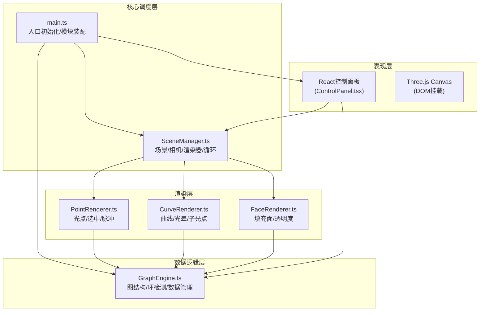

## 1. 架构设计



## 2. 技术描述
- **前端核心**：Three.js@0.160 + React@18 + TypeScript@5 + Vite@5
- **构建工具**：Vite + @vitejs/plugin-react + typescript插件
- **状态管理**：模块间通过回调函数通信，无需Redux
- **样式方案**：内联样式 + CSS-in-JS (styled-components风格)
- **DOM层**：React 18 控制面板，挂载到独立root div
- **WebGL层**：原生Three.js，通过SceneManager统一调度
- **类型工具**：uuid@9 (用于节点/边唯一标识)
- **后端**：无，纯前端项目

## 3. 目录结构定义
```
project-root/
├── package.json              # 依赖配置：three, typescript, vite, @types/three, uuid, react, react-dom
├── index.html                # 入口HTML：全屏#000背景，id=root挂载点
├── vite.config.js            # Vite配置：React+TS插件
├── tsconfig.json             # TS配置：strict:true, moduleResolution:bundler
└── src/
    ├── main.ts               # 入口：初始化所有模块、挂载React、启动循环
    ├── types/
    │   └── index.ts          # 全局类型定义
    ├── core/
    │   ├── SceneManager.ts   # 场景/相机/渲染器/OrbitControls/RAF循环
    │   └── GraphEngine.ts    # Node/Edge/Face数据结构 + 环检测算法
    ├── renderers/
    │   ├── PointRenderer.ts  # 光点Mesh创建 + 呼吸/选中/脉冲动画
    │   ├── CurveRenderer.ts  # CatmullRom曲线 + 流动光晕 + 子光点摆动
    │   └── FaceRenderer.ts   # ShapeGeometry填充面 + 光晕边
    └── ui/
        └── ControlPanel.tsx  # React组件：3滑块 + 重置按钮
```

## 4. 核心类型定义
```typescript
// 光点节点
interface StarNode {
  id: string;
  position: THREE.Vector3;
  color: THREE.Color;
  baseScale: number;
  isSelected: boolean;
  pulsePhase: number;
}

// 曲线边
interface StarEdge {
  id: string;
  from: string;  // node id
  to: string;    // node id
  curve: THREE.CatmullRomCurve3;
  flowPhase: number;
  subPoints: SubPoint[];
}

// 子光点
interface SubPoint {
  offset: number;  // 0-1 在曲线上的位置
  phase: number;   // 摆动相位
  amplitude: number;
}

// 闭合环
interface StarFace {
  id: string;
  nodeIds: string[];  // 按顺序排列
  avgColor: THREE.Color;
}

// 全局配置
interface SceneConfig {
  glowIntensity: number;     // 0.0-1.0 默认0.6
  rotationSpeed: number;     // rad/s 默认0.005
  subPointAmplitude: number; // 单位 默认0.3
}
```

## 5. 模块接口契约

### SceneManager
```typescript
class SceneManager {
  constructor(canvas: HTMLCanvasElement, config: SceneConfig)
  scene: THREE.Scene
  camera: THREE.PerspectiveCamera
  renderer: THREE.WebGLRenderer
  controls: OrbitControls
  rotationAngleY: number  // 当前累计旋转角度
  config: SceneConfig
  addObject(obj: THREE.Object3D): void
  removeObject(obj: THREE.Object3D): void
  onFrame(callback: (time: number, delta: number) => void): void
  onResize(): void
  start(): void
}
```

### GraphEngine
```typescript
class GraphEngine {
  constructor()
  nodes: Map<string, StarNode>
  edges: Map<string, StarEdge>
  faces: StarFace[]
  config: SceneConfig
  addNode(pos: Vector3, color?: Color): string
  removeNode(id: string): void
  updateNodePosition(id: string, pos: Vector3): void
  selectNode(id: string): void
  deselectNode(id: string): void
  addEdge(fromId: string, toId: string): string | null
  removeEdge(id: string): void
  reset(): void  // 清空并重新生成50个光点
  detectClosedLoops(): StarFace[]  // 检测>=5节点的闭合环
  onUpdate(callback: () => void): void
}
```

### Renderer模块
每个Renderer接受SceneManager和GraphEngine引用，在onFrame回调中：
- 从GraphEngine读取最新数据
- 更新Three.js对象的位置/颜色/材质属性
- 根据时间驱动动画参数（相位/旋转/流动）

## 6. 关键算法

### 6.1 闭合环检测
基于DFS回溯算法：
1. 以每个节点为起点，从相邻边出发深度优先搜索
2. 记录路径节点列表，遇到起点且路径长度>=5时记录为候选环
3. 去重（同一环的反向/旋转视为相同），只保留简单环（无重复中间节点）

### 6.2 填充面几何
- StarFace.nodeIds按环顺序排列
- 使用 THREE.Shape + THREE.ShapeGeometry 构造2D投影
- 所有节点投影到环所在的近似平面（最小二乘拟合或取前3点构造）
- 使用 MeshBasicMaterial，transparent: true, opacity: 0.15, side: DoubleSide

### 6.3 曲线流动光晕
- Curve对象使用TubeGeometry或Line + ShaderMaterial
- 在Shader中根据时间uniform对vUv.x做循环偏移生成流动高光
- 或使用多层半透明Line叠加模拟光带

### 6.4 子光点运动
```
curvePoint = curve.getPointAt(offset)  // 曲线上基准点
tangent = curve.getTangentAt(offset)
normal = cross(tangent, up).normalize()
swing = sin(time * PI + phase) * amplitude
finalPos = curvePoint + normal * swing
```
