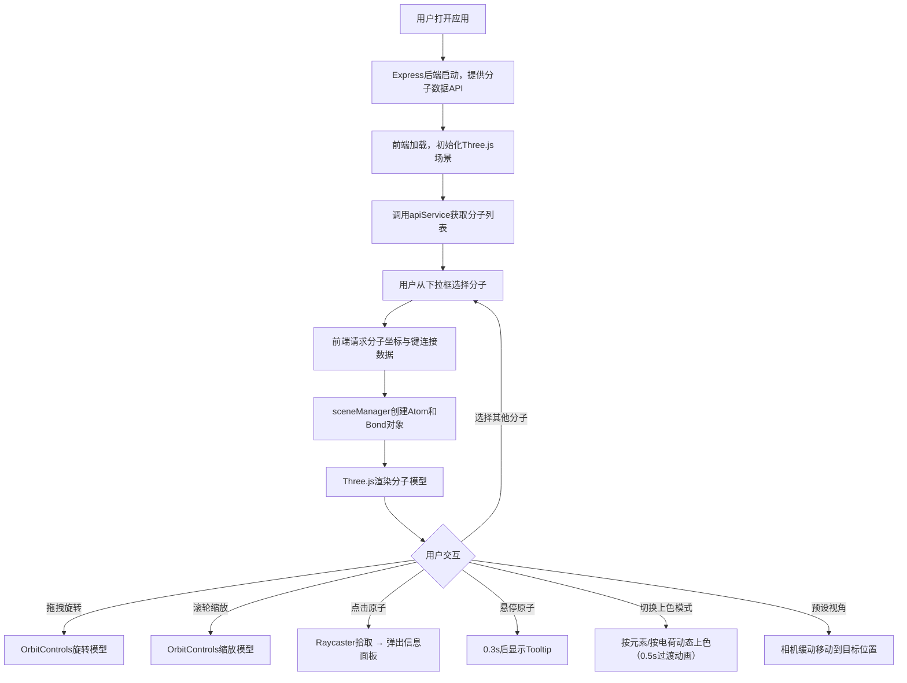
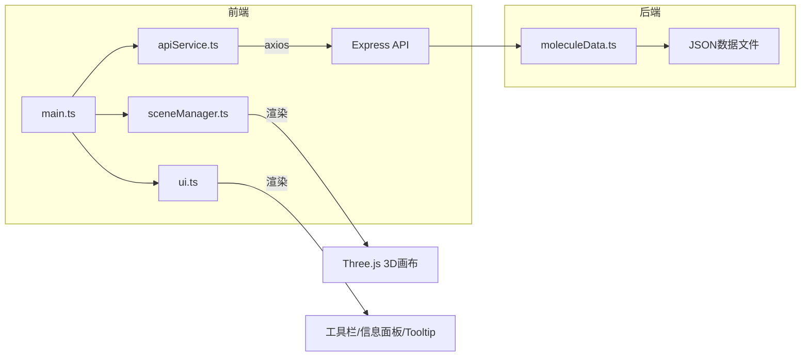

## 1. 产品概述

**分子视界**是一款轻量级Web端三维分子可视化应用，面向分子生物学和化学领域的研究人员及学生，解决现有专业工具（PyMOL、Chimera）过于复杂且需安装、而Web端方案缺乏实时交互与自定义上色功能的痛点。用户可从预设库中选择分子模型（胰岛素、DNA双螺旋、C60富勒烯），在三维空间自由旋转、缩放、平移查看，点击原子或化学键查看详细信息，并支持按元素种类或电荷分布动态上色。

## 2. 核心功能

### 2.1 用户角色

| 角色 | 注册方式 | 核心权限 |
|------|----------|----------|
| 访客用户 | 无需注册 | 浏览分子模型、交互查看、切换上色模式 |

### 2.2 功能模块

1. **三维分子可视化页面**：分子选择、3D渲染、交互查看、上色切换、信息展示

### 2.3 页面详情

| 页面名称 | 模块名称 | 功能描述 |
|----------|----------|----------|
| 三维分子可视化页面 | 左侧工具栏面板 | 分子选择下拉框、上色模式切换按钮组（按元素/按电荷）、预设视角按钮组（正面/侧面）、重置按钮；可折叠，折叠后仅显示拖拽手柄 |
| 三维分子可视化页面 | Three.js 3D画布 | 原子球体渲染（Phong材质）、化学键圆柱体渲染、OrbitControls轨道控制、Raycaster原子拾取 |
| 三维分子可视化页面 | 信息面板 | 点击原子弹出右上角信息弹窗（元素符号、序号、坐标） |
| 三维分子可视化页面 | Tooltip提示 | 悬停0.3s显示元素名称和部分电荷值，跟随鼠标且不超出画布 |
| 三维分子可视化页面 | 响应式布局 | 屏幕<768px时工具栏折叠为浮动图标，点击展开抽屉覆盖 |

## 3. 核心流程

## 4. 用户界面设计

### 4.1 设计风格

- **主色调**：深色主题，背景#111827，面板背景#1F2937，强调色#6366F1（靛蓝）
- **按钮风格**：圆角矩形，悬停上浮效果（translateY(-2px)，0.15s过渡），毛玻璃效果
- **字体**：Inter，正文14px，标题16px，Tooltip 12px
- **布局风格**：左侧可折叠工具栏 + 右侧全屏3D画布
- **图标风格**：简洁线性图标

### 4.2 页面设计概览

| 页面名称 | 模块名称 | UI元素 |
|----------|----------|--------|
| 三维分子可视化 | 左侧工具栏 | 宽280px，背景#1F2937，圆角右边界12px；分子下拉框、上色按钮组（120x40px，#6366F1→#818CF8）、视角按钮组、重置按钮；折叠后14px拖拽手柄 |
| 三维分子可视化 | 3D画布 | 全屏深色背景#111827，Phong光照原子球体，半透明化学键圆柱体 |
| 三维分子可视化 | 信息面板 | 320x180px，背景#1E1E2F，圆角12px，阴影0 4px 12px rgba(0,0,0,0.4)，毛玻璃8px |
| 三维分子可视化 | Tooltip | 自适应尺寸，背景#2D2D44，圆角6px，白色12px字体，毛玻璃8px |
| 三维分子可视化 | 响应式 | <768px工具栏变为48px浮动图标，点击展开半透明抽屉 |

### 4.3 响应式设计

- 桌面端优先（≥768px）：左侧工具栏常驻，右侧3D画布填充
- 移动端（<768px）：工具栏折叠为左上角48px浮动图标，点击后展开全屏半透明抽屉
- 触控优化：支持触摸拖拽旋转和双指缩放

### 4.4 3D场景指导

- **环境**：深色空间感，无HDRI，纯色背景#111827
- **光照**：环境光强度0.4 + 方向光（右上角，强度0.6，位置5,5,5）
- **材质**：Phong材质（漫反射0.8，镜面反射0.3）
- **相机**：透视相机，OrbitControls（旋转灵敏度0.8，缩放范围0.5-5倍）
- **原子**：球体，半径0.2-0.5单位，按元素种类预设颜色（C:#808080, H:#FFFFFF, O:#FF0000, N:#3050F8, S:#FFFF30）
- **化学键**：圆柱体，直径0.05单位，颜色#AAAAAA，半透明
- **交互**：Raycaster原子拾取，0.3s悬停延迟Tooltip，0.5s颜色过渡动画
- **性能**：原子数>100时距离剔除（>10单位隐藏），拖拽时暂停Tooltip检测

## 5. 分子预设数据

| 分子名称 | 原子数范围 | 主要元素 | 描述 |
|----------|-----------|----------|------|
| 胰岛素 | ~150 | C, H, O, N, S | 蛋白质激素，含二硫键 |
| DNA双螺旋 | ~150 | C, H, O, N, P | 双链脱氧核糖核酸，含磷酸骨架 |
| C60富勒烯 | 60 | C | 碳原子足球形笼状结构 |

## 6. 性能指标

| 指标 | 目标值 |
|------|--------|
| 150原子分子首帧渲染 | ≤2秒 |
| 交互帧率 | ≥55FPS |
| 上色模式切换重算 | ≤10ms |
| 颜色过渡动画时长 | 0.5秒 |
