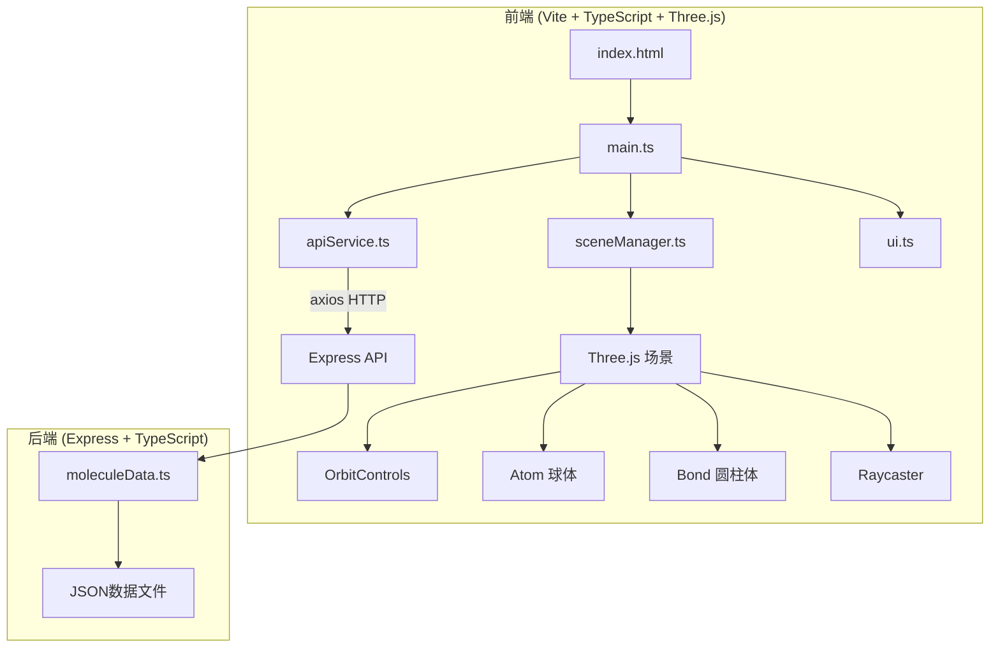
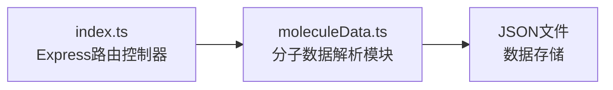
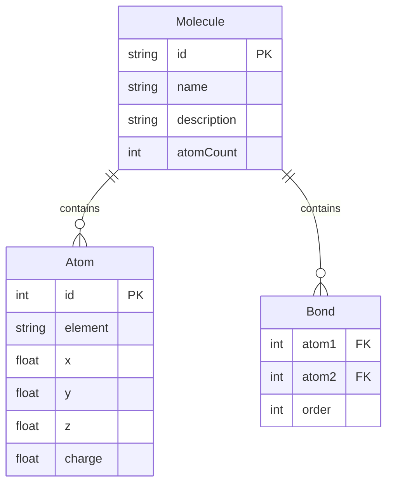

## 1. 架构设计



## 2. 技术说明

- **前端**：TypeScript + Three.js + Vite（无React/Vue，原生TS模块化）
- **构建工具**：Vite，开发代理到后端3001端口
- **后端**：Express + TypeScript + cors，监听3001端口
- **数据存储**：本地JSON文件存储分子数据与配色方案
- **依赖库**：three, @types/three, typescript, vite, axios, express, cors, uuid

## 3. 路由定义

| 路由 | 用途 |
|------|------|
| / | 主页面，加载Three.js分子可视化应用 |

## 4. API定义

### 4.1 获取分子列表

```
GET /api/molecules
Response: {
  molecules: Array<{
    id: string;
    name: string;
    description: string;
    atomCount: number;
  }>
}
```

### 4.2 获取分子详情

```
GET /api/molecules/:id
Response: {
  id: string;
  name: string;
  atoms: Array<{
    id: number;
    element: string;
    x: number;
    y: number;
    z: number;
    charge: number;
  }>;
  bonds: Array<{
    atom1: number;
    atom2: number;
    order: number;
  }>
}
```

### 4.3 更新分子配色方案

```
PUT /api/molecules/:id/colors
Body: {
  colorMode: "element" | "charge";
  customColors?: Record<string, string>;
}
Response: {
  success: boolean;
  colorMode: string;
}
```

## 5. 服务器架构图



## 6. 数据模型

### 6.1 数据模型定义



### 6.2 数据定义

分子数据存储在 `server/data/` 目录下的JSON文件中，每个分子一个文件：

- `insulin.json` — 胰岛素分子数据
- `dna.json` — DNA双螺旋分子数据
- `c60.json` — C60富勒烯分子数据

## 7. 文件结构与调用关系

```
分子视界/
├── package.json                    # 依赖与脚本
├── index.html                      # 入口页面
├── vite.config.js                  # Vite构建配置（代理3001）
├── tsconfig.json                   # TypeScript严格模式配置
├── server/
│   ├── src/
│   │   ├── index.ts               # Express服务器入口（API路由）
│   │   └── moleculeData.ts        # 分子数据解析模块
│   └── data/
│       ├── insulin.json            # 胰岛素分子数据
│       ├── dna.json               # DNA双螺旋分子数据
│       └── c60.json               # C60富勒烯分子数据
├── src/
│   ├── main.ts                    # 前端入口（初始化场景、加载数据）
│   ├── sceneManager.ts            # 3D场景管理（Controls、光照、原子/键、Raycaster）
│   ├── apiService.ts              # 网络请求模块（axios封装）
│   └── ui.ts                      # UI交互模块（工具栏、信息面板、Tooltip）
└── public/
    └── favicon.ico
```

**数据流向：**
1. `main.ts` → 调用 `apiService.ts` → axios请求 → Express `index.ts` → `moleculeData.ts` → 读取JSON文件
2. `apiService.ts` 返回格式化数据 → `main.ts` → 传入 `sceneManager.ts` → 创建Three.js对象
3. `ui.ts` 监听用户交互 → 触发 `sceneManager.ts` 方法（上色切换、视角切换）和 `apiService.ts`（保存配色方案）
4. `sceneManager.ts` Raycaster事件 → 通知 `ui.ts` 显示信息面板/Tooltip
