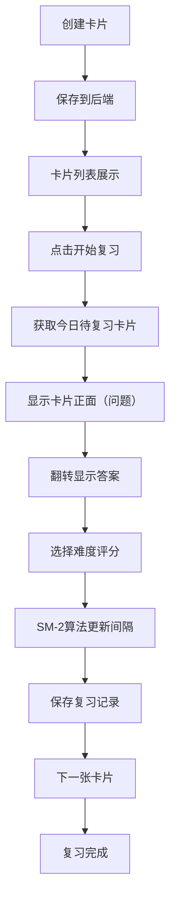

## 1. 产品概述

在线知识卡片闪卡学习应用，帮助用户通过间隔重复算法高效记忆和复习自定义知识卡片。基于SM-2算法智能调度复习计划，提升学习效率。

- 核心价值：通过科学的间隔重复算法，帮助用户在最佳时间点复习知识，大幅提升长期记忆效果
- 目标用户：学生、知识工作者、语言学习者等需要系统性记忆大量知识的人群

## 2. 核心功能

### 2.1 用户角色

| 角色 | 注册方式 | 核心权限 |
|------|----------|----------|
| 普通用户 | 无需注册（本地存储） | 创建、编辑、删除卡片，浏览卡片列表，进行复习会话 |

### 2.2 功能模块

1. **卡片列表页**：展示所有卡片网格、搜索功能、标签筛选、卡片编辑/删除
2. **创建/编辑卡片页**：表单输入标题、内容（支持Markdown）、标签管理
3. **复习会话页**：基于SM-2算法的卡片展示、3D翻转动画、难度评分、自动调度

### 2.3 页面详情

| 页面名称 | 模块名称 | 功能描述 |
|----------|----------|----------|
| 卡片列表页 | 搜索筛选模块 | 支持按标题搜索、按标签筛选卡片 |
| 卡片列表页 | 卡片网格模块 | 响应式网格布局展示卡片，显示标题、标签、内容摘要 |
| 卡片列表页 | 卡片操作模块 | 点击卡片查看详情，支持编辑和删除操作 |
| 创建/编辑卡片页 | 表单模块 | 标题输入（50字符限制）、内容输入（500字符Markdown）、标签管理（最多3个#标签） |
| 复习会话页 | 卡片展示模块 | 居中卡片显示问题面，支持点击或空格键翻转 |
| 复习会话页 | 3D翻转动画模块 | 0.4s CSS 3D翻转效果，流畅展示答案面 |
| 复习会话页 | 评分模块 | 太难/一般/容易三个评分按钮，记录反馈并调度下次复习时间 |

## 3. 核心流程

用户创建知识卡片 → 浏览管理所有卡片 → 启动复习会话 → 根据SM-2算法展示待复习卡片 → 翻转查看答案 → 评分反馈 → 更新复习计划 → 继续下一张卡片

## 4. 用户界面设计

### 4.1 设计风格

- **主题配色**：暗色顶部导航（#1E293B）+ 亮色内容区的对比设计
- **主色调**：蓝色系（#3B82F6）作为品牌色，红色（#EF4444）/黄色（#F59E0B）/绿色（#22C55E）作为评分按钮
- **卡片样式**：白色背景（#FFFFFF），圆角12px/16px，细微阴影（#CBD5E1 / #94A3B8）
- **按钮交互**：hover时scale(1.02)变换和阴影加深，0.15s过渡
- **表单控件**：高度40px，圆角8px，边框#CBD5E1，聚焦时边框变为#3B82F6，0.25s过渡
- **字体**：Inter系统字体栈，清晰易读

### 4.2 页面设计概述

| 页面名称 | 模块名称 | UI元素 |
|----------|----------|--------|
| 导航栏 | 固定顶部导航 | 高度60px，背景#1E293B，左侧应用名称（白色加粗20px），右侧三个导航链接（#94A3B8，高亮白色） |
| 卡片列表页 | 搜索筛选栏 | 搜索框、标签筛选按钮 |
| 卡片列表页 | 卡片网格 | 响应式三列/两列/单列布局，240px宽度卡片，彩色标签徽章（#EBF4FF背景，#3B82F6文字，圆角6px） |
| 创建/编辑卡片页 | 表单区域 | 标题输入、内容textarea、标签输入、提交按钮 |
| 复习会话页 | 居中卡片容器 | 最大宽度500px，圆角16px，阴影#94A3B8，字体18px行高1.6 |
| 复习会话页 | 评分按钮组 | 红/黄/绿三色按钮，hover动效 |

### 4.3 响应式设计

- 桌面端（>768px）：卡片列表三列网格布局
- 平板端（<=768px）：卡片列表两列网格布局
- 移动端（<=480px）：卡片列表单列布局
- 所有页面切换使用0.2s opacity淡入过渡动画
- 触控设备优化点击区域大小

### 4.4 动画与交互

- 页面切换：0.2s淡入动画（opacity过渡）
- 卡片翻转：0.4s CSS 3D翻转动画（transform-style: preserve-3d）
- 按钮/可点击卡片：hover时scale(1.02) + 阴影加深，0.15s过渡
- 表单聚焦：边框颜色变化 + 过渡动画0.25s ease-out
- 复习翻转动画帧率不低于50fps
