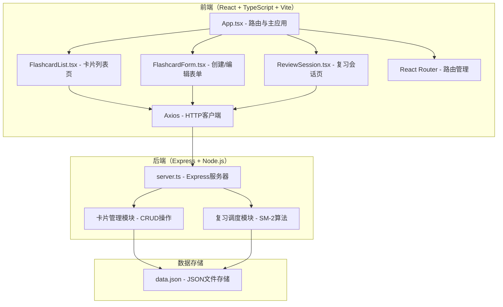
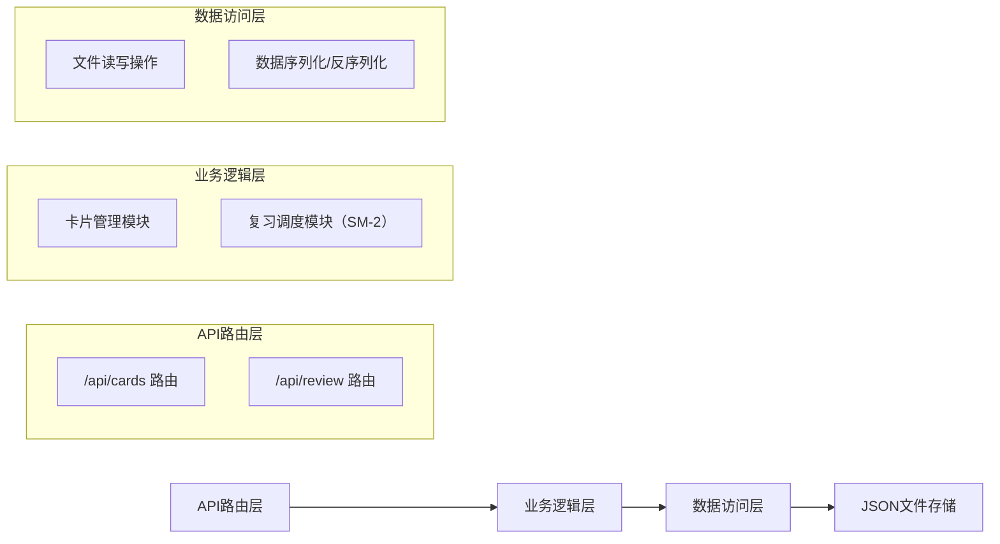
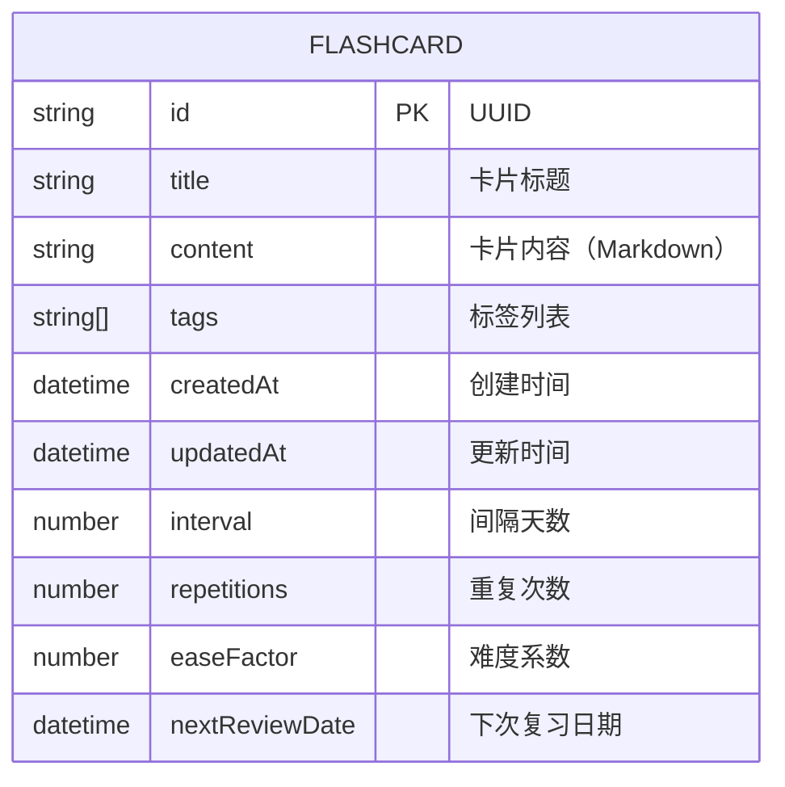

## 1. 架构设计



## 2. 技术描述

- **前端框架**：React 18 + TypeScript + Vite
- **状态管理**：React Hooks (useState, useEffect) 本地状态管理
- **路由**：React Router v6
- **HTTP客户端**：Axios
- **构建工具**：Vite
- **后端框架**：Express 4
- **数据存储**：本地JSON文件（data.json）
- **算法**：SM-2间隔重复算法

### 依赖包
- react, react-dom
- typescript
- vite, @vitejs/plugin-react
- axios
- express
- cors
- uuid
- react-router-dom

### 启动脚本
- `npm run dev` - 启动Vite开发服务器（代理/api到后端）
- 后端服务器与Vite开发服务器同时运行

## 3. 路由定义

| 前端路由 | 页面组件 | 功能描述 |
|----------|----------|----------|
| / | FlashcardList | 卡片列表首页，重定向到/cards |
| /cards | FlashcardList | 展示所有卡片，支持搜索和标签筛选 |
| /cards/new | FlashcardForm | 创建新卡片 |
| /cards/:id/edit | FlashcardForm | 编辑现有卡片 |
| /review | ReviewSession | 复习会话页面 |

| API路由 | 方法 | 功能描述 |
|---------|------|----------|
| /api/cards | GET | 获取所有卡片列表 |
| /api/cards | POST | 创建新卡片 |
| /api/cards/:id | GET | 获取单个卡片详情 |
| /api/cards/:id | PUT | 更新卡片 |
| /api/cards/:id | DELETE | 删除卡片 |
| /api/review/due | GET | 获取今日待复习卡片列表 |
| /api/review/rate | POST | 提交复习评分，更新间隔重复参数 |

## 4. API 定义

### TypeScript 类型定义

```typescript
interface Flashcard {
  id: string;
  title: string;
  content: string;
  tags: string[];
  createdAt: string;
  updatedAt: string;
  
  // SM-2 算法参数
  interval: number;      // 间隔天数
  repetitions: number;   // 重复次数
  easeFactor: number;    // 难度系数
  nextReviewDate: string; // 下次复习日期
}

interface ReviewRating {
  cardId: string;
  rating: 0 | 1 | 2;     // 0=太难, 1=一般, 2=容易
  reviewedAt: string;
}

interface ApiResponse<T> {
  success: boolean;
  data?: T;
  error?: string;
}
```

### 请求/响应示例

**GET /api/cards 响应**：
```json
{
  "success": true,
  "data": [
    {
      "id": "uuid-123",
      "title": "什么是SM-2算法？",
      "content": "SM-2是一种间隔重复算法...",
      "tags": ["#算法", "#记忆"],
      "createdAt": "2024-01-01T00:00:00Z",
      "updatedAt": "2024-01-01T00:00:00Z",
      "interval": 1,
      "repetitions": 0,
      "easeFactor": 2.5,
      "nextReviewDate": "2024-01-02T00:00:00Z"
    }
  ]
}
```

**POST /api/cards 请求**：
```json
{
  "title": "卡片标题",
  "content": "卡片内容（支持Markdown）",
  "tags": ["#标签1", "#标签2"]
}
```

**POST /api/review/rate 请求**：
```json
{
  "cardId": "uuid-123",
  "rating": 2
}
```

## 5. 服务器架构图



## 6. 数据模型

### 6.1 数据模型定义



### 6.2 初始数据结构

**data.json 初始内容**：
```json
{
  "cards": []
}
```

### 6.3 SM-2 算法实现说明

SM-2算法核心逻辑：
1. **初始参数**：interval=1, repetitions=0, easeFactor=2.5
2. **评分规则**：
   - 太难（rating=0）：repetitions重置为0，interval=1
   - 一般（rating=1）：repetitions++，interval = repetitions=1 ? 1 : repetitions=2 ? 6 : interval * easeFactor
   - 容易（rating=2）：repetitions++，interval = repetitions=1 ? 1 : repetitions=2 ? 6 : interval * easeFactor * 1.3
3. **easeFactor更新**：`easeFactor = easeFactor + (0.1 - (2 - rating) * (0.08 + (2 - rating) * 0.02))`
4. **easeFactor最小值**：1.3
5. **nextReviewDate**：当前日期 + interval天
