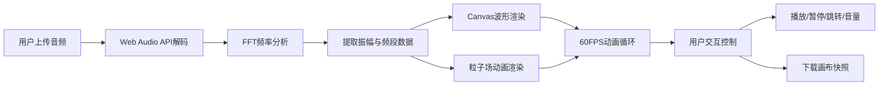

## 1. 产品概述
交互式音画图谱是一个基于浏览器的音频可视化工具，用户可以上传本地音乐或录音，系统实时分析音频频率与振幅数据，以动态波形和旋转粒子场形式呈现音乐的视觉效果。

- 核心目标：为音乐爱好者和创作者提供沉浸式的音频可视化体验
- 解决问题：让抽象的音频信号转化为直观绚丽的视觉表现
- 目标用户：音乐爱好者、视觉艺术家、内容创作者

## 2. 核心功能

### 2.1 功能模块
1. **主可视化界面**：Canvas画布、波形渲染、粒子场渲染
2. **音频上传与处理**：文件选择器、音频解码、实时频率分析
3. **播放控制**：播放/暂停、重置、进度条跳转、音量调节
4. **快照功能**：将当前画布状态保存为PNG图片

### 2.3 页面详情
| 页面名称 | 模块名称 | 功能描述 |
|-----------|-------------|---------------------|
| 主界面 | 上传模块 | 左上角UPLOAD按钮，点击弹出文件选择器，支持.mp3和.wav格式 |
| 主界面 | Canvas可视化区域 | 占屏幕80%宽高，渐变背景，实时渲染波形和粒子场 |
| 主界面 | 播放控制区 | 右上角四个控制按钮：播放/暂停、重置、下载快照、音量滑块 |
| 主界面 | 进度条 | 底部进度条，显示播放进度，支持拖拽跳转 |

## 3. 核心流程
用户上传音频文件 → 系统解码音频（采样率44100Hz，FFT 1024）→ 实时提取频率/振幅数据 → Canvas渲染绿色波形（随振幅波动）→ 渲染旋转粒子场（低频控制扩散半径，高频控制旋转速度）→ 用户可控制播放状态和进度 → 支持保存画布快照

## 4. 用户界面设计

### 4.1 设计风格
- 主色调：深色科技风，背景#0D1117，Canvas渐变#1E1E2E到#2D2D3F
- 强调色：蓝色#3B82F6（按钮/进度条）、绿色#22C55E（波形）、红色#EF4444（重置）、紫色#6366F1（播放）、黄色#F59E0B（音量滑块）
- 粒子色：#FF5252、#FFD740、#00E5FF
- 按钮样式：圆角8px，悬停放大1.05倍+0.2秒阴影淡入
- 字体：'Fira Code', monospace，14px，颜色#94A3B8
- 分割线：1px #334155

### 4.2 页面设计概述
| 页面名称 | 模块名称 | UI元素 |
|-----------|-------------|-------------|
| 主界面 | 整体布局 | 深色背景，Canvas居中，控件环绕，圆角设计，过渡动画0.2s ease |
| 主界面 | Canvas区域 | 80%宽高，20px内边距，渐变背景，分割线与控件隔开 |
| 主界面 | UPLOAD按钮 | 左上角，蓝色背景#3B82F6，白色文字，圆角8px |
| 主界面 | 控制按钮 | 右上角，四个按钮横排，各有不同背景色，图标切换 |
| 主界面 | 进度条 | 底部，80%宽，6px高，#374151背景，#3B82F6填充 |
| 主界面 | 音量滑块 | 120px宽，4px高，#374151背景，16px圆形滑块#F59E0B |

### 4.3 响应式
桌面优先，Canvas按比例缩放，控件布局在小屏幕上自适应调整。
