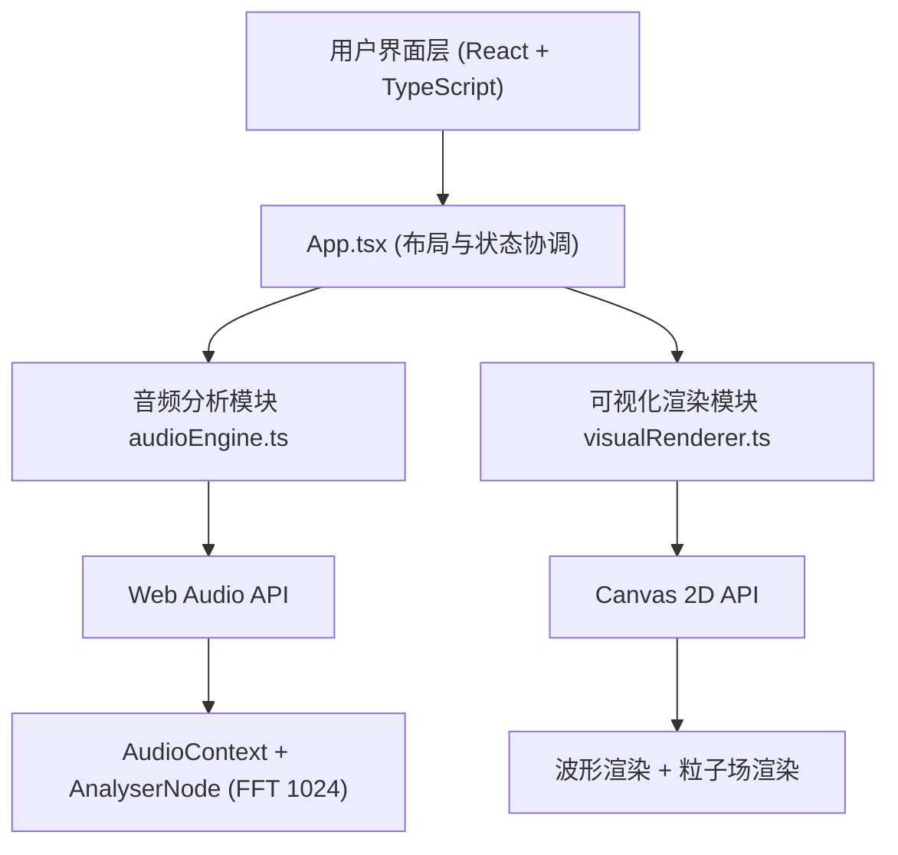

## 1. 架构设计

## 2. 技术描述
- 前端：React 18 + TypeScript + Vite
- 构建工具：Vite + @vitejs/plugin-react
- 音频处理：Web Audio API (AudioContext, AnalyserNode, AudioBufferSourceNode)
- 可视化：HTML5 Canvas 2D API
- 状态管理：React Hooks (useState, useRef, useEffect, useCallback)

## 3. 文件结构

| 文件 | 职责 |
|-------|---------|
| package.json | 项目依赖与脚本配置 |
| vite.config.js | Vite构建配置（React严格模式） |
| tsconfig.json | TypeScript配置（target ES2020, strict true） |
| index.html | 入口HTML页面 |
| src/App.tsx | 根组件：布局管理、状态协调、UI渲染 |
| src/audioEngine.ts | 音频分析：文件解码、FFT分析、频率/振幅数据提取 |
| src/visualRenderer.ts | 可视化渲染：波形绘制、粒子场渲染、动画循环 |

## 4. 核心模块设计

### 4.1 AudioEngine 模块
- **decodeAudioFile(file: File)**: Promise<AudioBuffer> - 使用AudioContext解码音频文件，采样率44100Hz
- **getFrequencyData(): Uint8Array** - 获取FFT频率数据（0-255）
- **getAmplitudeData(): Uint8Array** - 获取时域振幅数据
- **getBandEnergy(lowFreq: number, highFreq: number): number** - 获取指定频段的平均能量值
- **play(), pause(), stop()** - 播放控制
- **seek(time: number)** - 跳转到指定时间
- **setVolume(value: number)** - 设置音量（0-1）
- **getCurrentTime(): number** - 获取当前播放时间
- **getDuration(): number** - 获取音频总时长
- **isPlaying: boolean** - 播放状态

### 4.2 VisualRenderer 模块
- **setCanvas(canvas: HTMLCanvasElement)** - 设置画布
- **renderWaveform(amplitudeData: Uint8Array)** - 绘制绿色波形（线条+渐变填充）
- **renderParticles(frequencyData: Uint8Array, lowEnergy: number, highEnergy: number)** - 渲染200个旋转粒子
- **clear()** - 清除画布并绘制渐变背景
- **snapshot(): string** - 导出画布为PNG DataURL
- **animate()** - 主渲染循环（60FPS requestAnimationFrame）

### 4.3 粒子系统参数
- 粒子数量：200
- 粒子大小：6-12px 随机
- 粒子颜色：#FF5252, #FFD740, #00E5FF 随机
- 扩散半径：80-200px，由低频能量(0-200Hz)控制
- 旋转速度：由高频能量(2000-8000Hz)控制
- 缓动动画：0.3秒弹性过渡

## 5. 性能要求
- 动画帧率：稳定60FPS (requestAnimationFrame)
- 音频解码延迟：< 100ms
- FFT参数：size=1024，采样率44100Hz
- 内存：粒子对象复用，避免频繁GC
