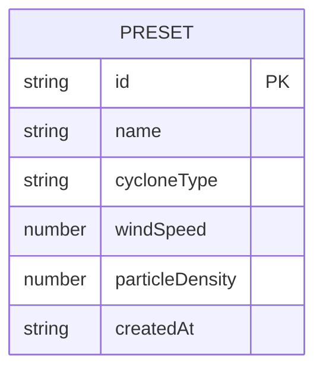

## 1. 架构设计

```mermaid
graph TD
    "用户浏览器" --> "React前端(Vite+TypeScript)"
    "React前端" --> "AppContext(共享状态)"
    "React前端" --> "SceneRenderer(Three.js渲染)"
    "React前端" --> "ParameterPanel(参数面板UI)"
    "AppContext" --> "ParticleSystem(粒子逻辑)"
    "ParticleSystem" --> "SceneRenderer"
    "ParameterPanel" --> "AppContext"
    "ParameterPanel" --> "axios HTTP客户端"
    "axios HTTP客户端" --> "Express后端API"
    "Express后端API" --> "presets.json(本地文件存储)"
```

## 2. 技术说明
- **前端框架**：React 18 + TypeScript
- **构建工具**：Vite（端口3000）
- **3D渲染**：Three.js + @types/three，OrbitControls轨道控制器
- **状态管理**：React Context（AppContext）
- **HTTP客户端**：axios
- **后端**：Express 4 + CORS中间件
- **数据存储**：本地JSON文件(presets.json)
- **样式方案**：原生CSS + CSS变量（深色主题）

## 3. 路由定义
| 路由 | 用途 |
|------|------|
| / | 主页面，3D场景+参数面板 |
| GET /presets | 获取所有参数预设列表 |
| POST /presets | 保存新的参数预设 |

## 4. API定义

### GET /presets
**响应**：
```typescript
interface Preset {
  id: string;
  name: string;
  cycloneType: 'cyclone' | 'anticyclone';
  windSpeed: number; // 1-10
  particleDensity: number; // 1000-5000
  createdAt: string;
}

type PresetsResponse = Preset[];
```

### POST /presets
**请求体**：
```typescript
interface SavePresetRequest {
  name: string;
  cycloneType: 'cyclone' | 'anticyclone';
  windSpeed: number;
  particleDensity: number;
}
```

**响应**：
```typescript
interface SavePresetResponse {
  success: boolean;
  preset: Preset;
}
```

## 5. 服务器架构图

```mermaid
graph TD
    "HTTP请求" --> "CORS中间件"
    "CORS中间件" --> "Express路由"
    "Express路由" --> "GET /presets"
    "Express路由" --> "POST /presets"
    "GET /presets" --> "读取presets.json"
    "POST /presets" --> "写入presets.json"
    "读取presets.json" --> "JSON响应"
    "写入presets.json" --> "JSON响应"
```

## 6. 数据模型

### 6.1 数据模型定义



### 6.2 presets.json 初始数据结构

```json
{
  "presets": [
    {
      "id": "default-cyclone",
      "name": "标准气旋",
      "cycloneType": "cyclone",
      "windSpeed": 5,
      "particleDensity": 2000,
      "createdAt": "2026-06-21T00:00:00.000Z"
    }
  ]
}
```

## 7. 前端模块与数据流向

### 模块文件结构
```
src/
├── context/
│   └── AppContext.tsx       # 共享状态：气旋类型、风速、密度
├── modules/
│   ├── ParticleSystem.ts    # 粒子生成与动画逻辑（纯TS，无React）
│   └── ParameterPanel.tsx   # 参数配置UI组件
├── renderer/
│   └── SceneRenderer.ts     # Three.js场景、相机、渲染循环
├── App.tsx                  # 根组件，组合各模块
└── main.tsx                 # 入口
```

### 数据流向
1. **ParameterPanel** 用户操作 → 更新 **AppContext** 状态
2. **AppContext** 状态变化 → 触发 **ParticleSystem** 参数更新
3. **ParticleSystem** 每帧计算粒子位置 → 传递给 **SceneRenderer**
4. **SceneRenderer** 更新Three.js几何体 → 渲染到canvas
5. **ParameterPanel** 保存/加载预设 → axios → **Express API** → presets.json
