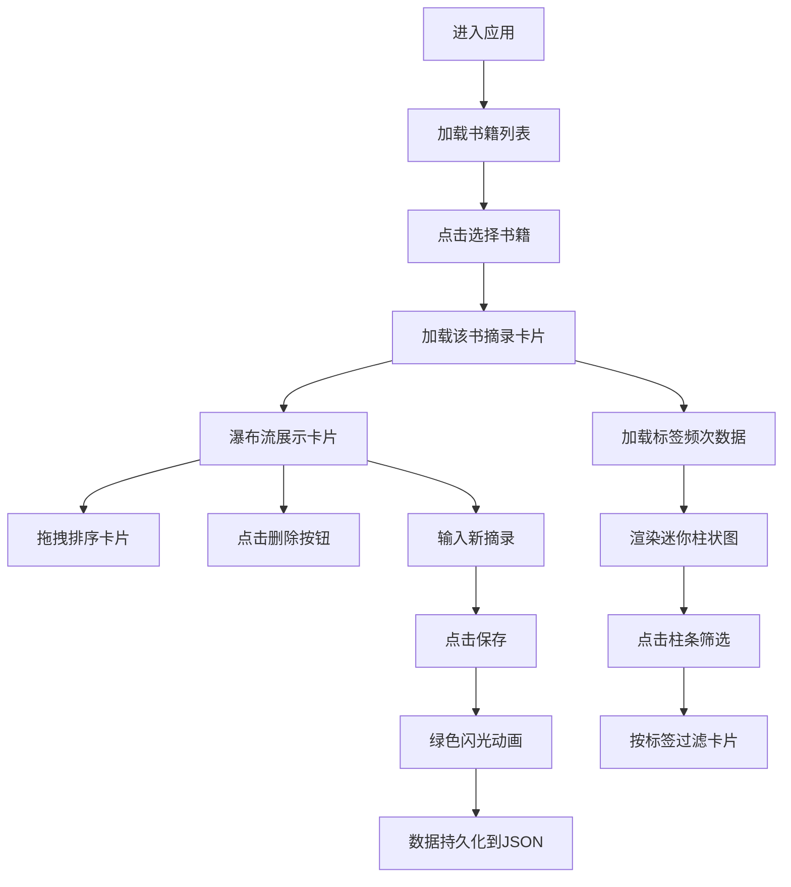

## 1. 产品概述

书虫脉动是一款面向读书爱好者的知识管理工具，帮助用户在阅读过程中随手摘录金句、记录感悟、整理标签，并生成个人知识图谱。解决读完书后核心观点容易遗忘的痛点。

- 目标用户：热爱阅读、有知识整理需求的读者
- 核心价值：让阅读沉淀可追溯、可关联、可复用

## 2. 核心功能

### 2.1 用户角色

| 角色 | 注册方式 | 核心权限 |
|------|----------|----------|
| 普通用户 | 无需注册，本地使用 | 完整使用所有功能，数据本地存储 |

### 2.2 功能模块

1. **主界面**：左侧书架列表 + 右侧摘录卡片流
2. **书架管理**：书籍列表展示、点击切换
3. **摘录卡片**：原文摘录、个人感悟、标签气泡展示
4. **卡片操作**：拖拽排序、悬停删除、新增摘录
5. **标签可视化**：标签频次柱状图、按标签筛选
6. **数据持久化**：本地 JSON 文件存储

### 2.3 页面详情

| 页面名称 | 模块名称 | 功能描述 |
|---------|----------|----------|
| 主界面 | 左侧书架列 | 宽 280px，背景 #F1F5F9，展示书籍列表 |
| 主界面 | 右侧工作区 | 背景 #FAFAFA 到 #F3F4F6 渐变，展示摘录卡片流 |
| 主界面 | 摘录卡片 | 宽 320px，2px 虚线边框 #CBD5E1，悬停阴影上浮 4px |
| 主界面 | 标签气泡 | 背景 #3B82F6，白色文字，圆角 12px，内边距 8px |
| 主界面 | 新增输入框 | 底部输入框，添加新摘录并保存 |
| 主界面 | 标签柱状图 | 左侧面板底部，柱条宽 20px 间距 4px 圆角 4px，颜色从 #3B82F6 渐变到 #8B5CF6 |

## 3. 核心流程

### 3.1 主流程
用户进入应用 → 选择书籍 → 浏览/添加/删除摘录卡片 → 拖拽排序 → 通过标签筛选 → 数据自动持久化

### 3.2 交互流程

## 4. 用户界面设计

### 4.1 设计风格
- **整体风格**：浅色极简风格，干净清爽
- **主色调**：#3B82F6（蓝色）、#8B5CF6（紫色渐变）
- **辅助色**：#22C55E（成功绿）、#CBD5E1（边框灰）
- **背景色**：左侧 #F1F5F9，右侧 #FAFAFA → #F3F4F6 渐变
- **字体**：现代无衬线字体，层次清晰
- **圆角**：卡片边框 2px 虚线，标签圆角 12px，柱条圆角 4px
- **动效**：所有交互 0.2s ease 平滑过渡，保存时 0.3s 绿色亮度脉冲

### 4.2 页面设计概览

| 页面名称 | 模块名称 | UI 元素 |
|---------|----------|---------|
| 主界面 | 书架列表 | 垂直列表，点击高亮，hover 效果 |
| 主界面 | 卡片流 | 瀑布流布局 2-4 列自适应，卡片 320px 宽 |
| 主界面 | 摘录卡片 | 原文摘录区、感悟区、标签气泡区、删除按钮（hover 显示） |
| 主界面 | 拖拽交互 | 拖拽时半透明，跟随鼠标，平滑过渡 |
| 主界面 | 新增表单 | 底部固定，输入框 + 保存按钮 |
| 主界面 | 标签柱状图 | 左侧底部，柱条按频次高度变化，点击筛选 |

### 4.3 响应式设计
- **桌面优先**：min-width 900px，宽高自适应
- **瀑布流列数**：根据窗口宽度自动调整 2-4 列
- **过渡动画**：所有状态变化 0.2s ease 平滑过渡
- **性能要求**：添加摘录更新 < 100ms，拖拽 FPS ≥ 50

### 4.4 性能指标
- 卡片列表更新：< 100ms
- 拖拽排序帧率：≥ 50 FPS
- 动画流畅度：transition duration 0.2s ease
