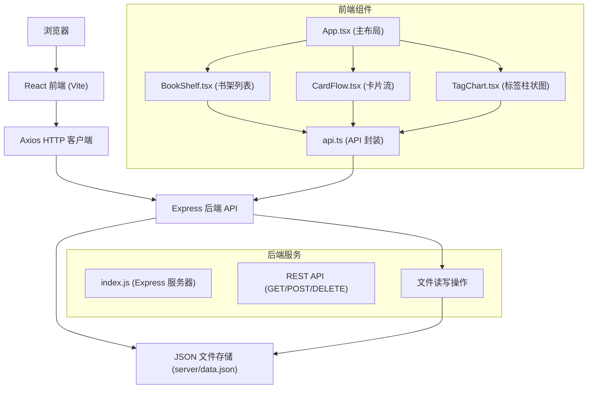
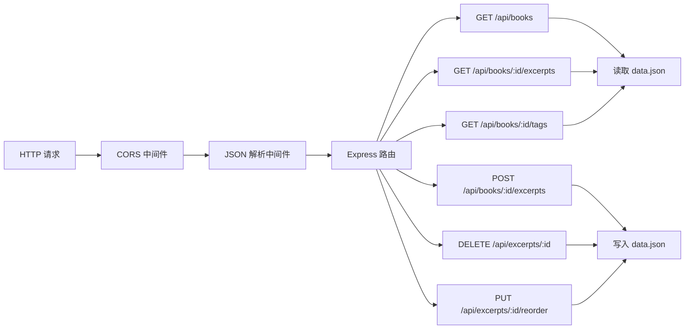
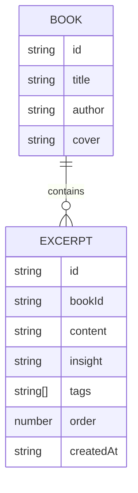

## 1. 架构设计



## 2. 技术描述

- **前端框架**：React 18 + TypeScript
- **构建工具**：Vite 5.x
- **前端路由**：单页面应用，无需路由
- **状态管理**：React Hooks (useState, useEffect, useCallback)
- **HTTP 客户端**：Axios
- **后端框架**：Express 4.x
- **数据存储**：本地 JSON 文件 (server/data.json)
- **UI 样式**：纯 CSS（通过 style 属性和 CSS-in-JS）
- **跨域处理**：cors 中间件
- **唯一 ID**：uuid 库

## 3. 项目结构

| 路径 | 说明 |
|------|------|
| `/` | 项目根目录 |
| `/package.json` | 项目依赖和脚本 |
| `/index.html` | 入口 HTML |
| `/vite.config.js` | Vite 构建配置 |
| `/tsconfig.json` | TypeScript 配置 |
| `/src/` | 前端源码目录 |
| `/src/App.tsx` | 主布局组件 |
| `/src/components/` | 组件目录 |
| `/src/components/BookShelf.tsx` | 书架列表组件 |
| `/src/components/CardFlow.tsx` | 摘录卡片流组件 |
| `/src/components/TagChart.tsx` | 标签柱状图组件 |
| `/src/utils/api.ts` | Axios 请求封装 |
| `/server/` | 后端服务目录 |
| `/server/index.js` | Express 服务器 |
| `/server/data.json` | 数据存储文件 |

## 4. API 定义

### 4.1 TypeScript 类型定义

```typescript
interface Book {
  id: string;
  title: string;
  author: string;
  cover?: string;
}

interface Excerpt {
  id: string;
  bookId: string;
  content: string;
  insight: string;
  tags: string[];
  order: number;
  createdAt: string;
}

interface TagFrequency {
  tag: string;
  count: number;
}

interface ApiResponse<T> {
  success: boolean;
  data?: T;
  error?: string;
}
```

### 4.2 REST API 接口

| 方法 | 路径 | 说明 | 请求体 | 响应 |
|------|------|------|--------|------|
| GET | `/api/books` | 获取所有书籍 | - | `{ success: true, data: Book[] }` |
| GET | `/api/books/:bookId/excerpts` | 获取指定书籍的摘录 | - | `{ success: true, data: Excerpt[] }` |
| POST | `/api/books/:bookId/excerpts` | 添加新摘录 | `{ content, insight, tags, order }` | `{ success: true, data: Excerpt }` |
| DELETE | `/api/excerpts/:id` | 删除摘录 | - | `{ success: true }` |
| PUT | `/api/excerpts/:id/reorder` | 更新摘录顺序 | `{ order }` | `{ success: true }` |
| GET | `/api/books/:bookId/tags` | 获取标签频次 | - | `{ success: true, data: TagFrequency[] }` |

## 5. 服务器架构



## 6. 数据模型

### 6.1 数据结构



### 6.2 data.json 初始格式

```json
{
  "books": [
    {
      "id": "1",
      "title": "原子习惯",
      "author": "詹姆斯·克利尔"
    },
    {
      "id": "2", 
      "title": "人类简史",
      "author": "尤瓦尔·赫拉利"
    }
  ],
  "excerpts": []
}
```

## 7. 性能优化策略

1. **React 性能**：
   - 使用 `useCallback` 缓存事件处理函数
   - 使用 `useMemo` 缓存计算结果（如过滤后的卡片列表）
   - 卡片组件使用 `React.memo` 避免不必要重渲染

2. **拖拽性能**：
   - 使用 CSS `transform` 而非 `top/left` 实现拖拽跟随
   - 使用 `requestAnimationFrame` 保证 60fps
   - 拖拽时减少 DOM 操作，仅更新必要状态

3. **列表更新**：
   - 添加摘录时使用不可变更新（immer 或展开运算符）
   - 避免全列表重渲染，使用 key 优化 diff

4. **动画性能**：
   - 所有过渡使用 CSS `transition`
   - 绿色闪光使用 CSS `@keyframes` 动画
   - 避免在动画期间触发重排（reflow）
