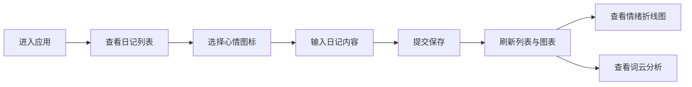

## 1. 产品概述

灵感星图是一款在线情绪日记应用，帮助用户通过可视化方式记录和分析每日情绪变化。用户可以选择心情图标并输入文字记录情绪，系统自动生成一周情绪变化折线图和词云分析。

- 核心价值：让用户直观了解自己的情绪模式，通过数据可视化促进心理健康自我觉察
- 目标用户：关注心理健康、希望记录和分析情绪变化的普通用户

## 2. 核心功能

### 2.1 功能模块

1. **日记管理模块**：心情选择器、富文本编辑器、日记列表展示、CRUD操作
2. **数据统计模块**：一周情绪折线图、词云可视化、数据趋势分析

### 2.2 页面详情

| 页面名称 | 模块名称 | 功能描述 |
|---------|---------|---------|
| 主页面 | 日记列表区域 | 左侧360px宽列表，按日期倒序展示日记卡片，包含日期、心情图标、内容预览 |
| 主页面 | 日记编辑器 | 右侧主区域，心情选择器（5种emoji）+ 富文本输入框，提交后自动刷新 |
| 主页面 | 情绪折线图 | Chart.js绘制一周情绪变化，X轴周一到周日，Y轴情绪分值1-5 |
| 主页面 | 词云组件 | 展示最近7天高频30词，随机排布、悬停放大效果 |

## 3. 核心流程

用户进入应用 → 查看历史日记列表 → 选择心情图标 → 输入日记内容 → 提交保存 → 列表和图表自动更新 → 查看情绪趋势和词云分析

## 4. 用户界面设计

### 4.1 设计风格

- **主色调**：#3B82F6（蓝色）作为主题色
- **情绪配色**：开心#22C55E、平静#3B82F6、难过#EF4444、焦虑#F59E0B、创意#A855F7
- **背景色**：#F0F4F8（主背景）、#FFFFFF（卡片）、#F8FAFC（左侧栏）
- **字体**：系统默认sans-serif，标题18px加粗#1E293B
- **圆角与阴影**：12px圆角，卡片阴影0 1px 3px rgba(0,0,0,0.06)
- **动效**：所有交互0.2s ease-out过渡，输入框焦点0.3s边框渐变

### 4.2 页面设计概述

| 页面名称 | 模块名称 | UI元素 |
|---------|---------|---------|
| 主页面 | 日记卡片 | 日期、心情emoji、内容预览（40字）、悬停#E2E8F0背景+上浮2px |
| 主页面 | 心情选择器 | 5个emoji横向排列，选中放大+2px实色边框，0.2s动画 |
| 主页面 | 富文本输入框 | 高度160px，字号15px，焦点边框#3B82F6 |
| 主页面 | 折线图 | 透明背景，渐变数据点，#3B82F6折线带透明度，隐藏图例 |
| 主页面 | 词云 | #FFFFFF背景+2px虚线#CBD5E1边框，12px圆角，词语大小12-36px，暖色随机 |

### 4.3 响应式设计

- **桌面端**：左右两栏布局，左侧360px固定宽度
- **移动端（<768px）**：上下滚动布局
  - 日记列表变为顶部胶囊选择器（显示最近5条，点击展开）
  - 折线图和词云变为全宽叠加卡片，间距12px
  - 按钮和输入框最小触控区域44px

### 4.4 空白状态

显示柔和提示文字"今天还没有记录，点击上方的表情开始吧"，颜色#94A3B8，居中显示。

## 5. 性能要求

- 日记列表100条卡片初始加载≤800ms（虚拟列表或限制加载数量）
- 图表更新响应时间≤300ms
