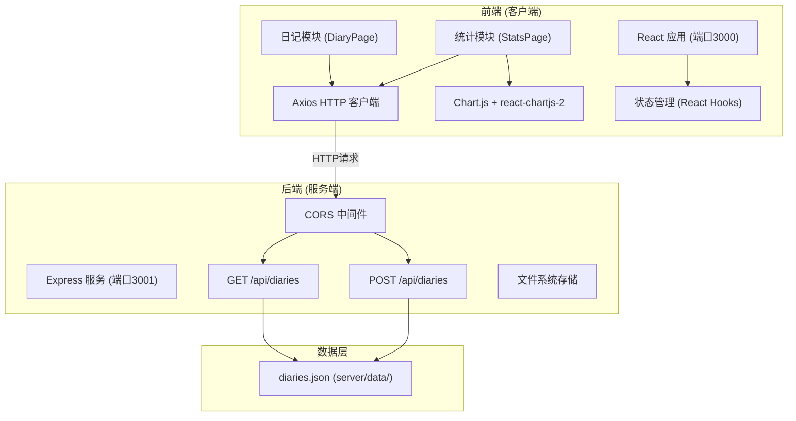
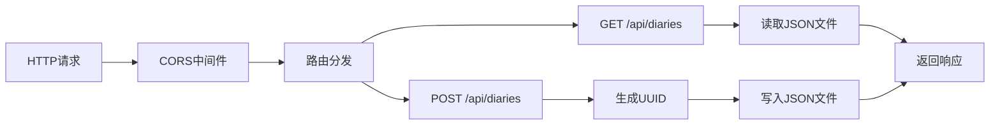
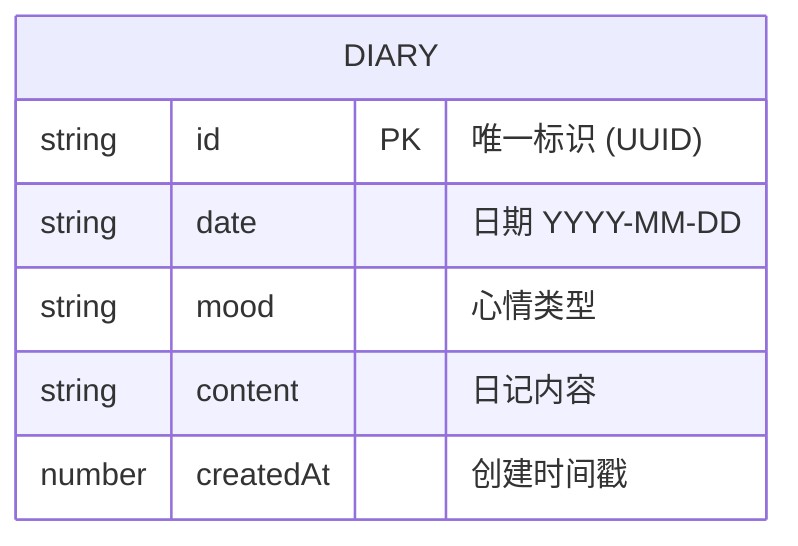

## 1. 架构设计



## 2. 技术描述

- **前端框架**: React 18 + TypeScript + Vite 5
- **路由**: React Router DOM 6
- **HTTP客户端**: Axios 1.6
- **图表库**: Chart.js 4 + react-chartjs-2 5
- **后端**: Express 4 + TypeScript
- **数据存储**: 本地JSON文件 (server/data/diaries.json)
- **跨域处理**: CORS 中间件，允许3000端口访问
- **代理配置**: Vite server.proxy 代理到后端3001端口

## 3. 文件结构

| 路径 | 说明 |
|------|------|
| `/package.json` | 项目依赖与脚本配置 |
| `/index.html` | 入口HTML页面 |
| `/vite.config.js` | Vite构建配置，代理设置 |
| `/tsconfig.json` | TypeScript配置，严格模式ES2020 |
| `/src/main.tsx` | React渲染入口 |
| `/src/App.tsx` | 主应用组件，路由配置 |
| `/src/diary/DiaryPage.tsx` | 日记管理模块 |
| `/src/stats/StatsPage.tsx` | 数据统计模块 |
| `/server/index.ts` | Express服务入口 |
| `/server/data/diaries.json` | 日记数据存储 |

## 4. API 定义

### 4.1 类型定义

```typescript
interface Diary {
  id: string;
  date: string;
  mood: 'happy' | 'calm' | 'sad' | 'anxious' | 'creative';
  content: string;
  createdAt: number;
}

interface MoodConfig {
  type: string;
  emoji: string;
  color: string;
  score: number;
  label: string;
}
```

### 4.2 接口定义

#### GET /api/diaries
- **描述**: 获取所有日记记录
- **响应**: `{ data: Diary[] }` 按日期降序排列
- **状态码**: 200 OK

#### POST /api/diaries
- **描述**: 创建新日记记录
- **请求体**:
  ```typescript
  {
    date: string;      // YYYY-MM-DD 格式
    mood: string;      // 心情类型
    content: string;   // 日记内容
  }
  ```
- **响应**: `{ success: boolean, data: Diary }`
- **状态码**: 201 Created

## 5. 服务端架构



### 服务端模块说明

| 模块 | 职责 |
|------|------|
| CORS中间件 | 配置跨域头，允许localhost:3000访问 |
| GET接口 | 读取diaries.json，按日期排序后返回 |
| POST接口 | 验证请求体，生成ID，追加到JSON文件 |
| 文件存储 | 使用fs模块读写JSON文件，uuid生成唯一ID |

## 6. 数据模型

### 6.1 Diary 数据模型



### 6.2 心情配置常量

```typescript
const MOOD_CONFIG: Record<string, MoodConfig> = {
  happy:    { type: 'happy',    emoji: '😊', color: '#22C55E', score: 5, label: '开心' },
  calm:     { type: 'calm',     emoji: '😌', color: '#3B82F6', score: 4, label: '平静' },
  creative: { type: 'creative', emoji: '✨', color: '#A855F7', score: 3, label: '创意' },
  anxious:  { type: 'anxious',  emoji: '😰', color: '#F59E0B', score: 2, label: '焦虑' },
  sad:      { type: 'sad',      emoji: '😢', color: '#EF4444', score: 1, label: '难过' },
};
```

### 6.3 初始数据文件 (diaries.json)

```json
{
  "diaries": []
}
```

## 7. 前端模块设计

### 7.1 日记模块 (DiaryPage)

| 功能 | 实现方式 |
|------|----------|
| 心情选择器 | 5个emoji按钮，useState管理选中状态 |
| 富文本输入 | textarea，高度160px，受控组件 |
| 日记列表 | 左侧360px，虚拟列表或分页加载 |
| 提交逻辑 | axios.post到/api/diaries，成功后刷新列表 |
| 日期处理 | new Date()获取当天日期，格式化为YYYY-MM-DD |

### 7.2 统计模块 (StatsPage)

| 功能 | 实现方式 |
|------|----------|
| 折线图 | Chart.js Line组件，周一到周日为X轴 |
| 数据计算 | 过滤最近7天数据，按心情分值映射Y轴 |
| 词云 | 分词统计（排除停用词），Top30词语，CSS随机定位 |
| 响应式 | CSS Media Query <768px切换布局 |

### 7.3 性能优化

- 日记列表：限制初始渲染数量，支持滚动加载或虚拟列表
- 图表更新：使用useMemo缓存计算结果，避免不必要重渲染
- API请求：防抖处理，批量更新状态
