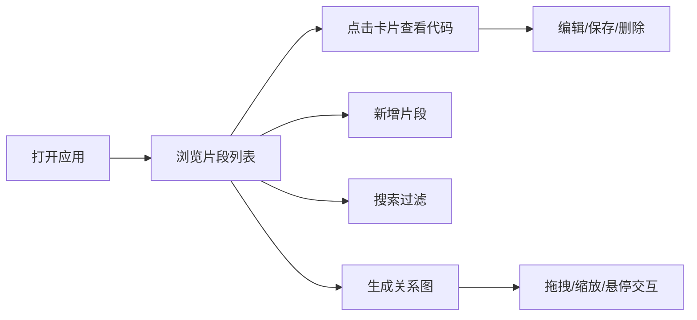

## 1. 产品概述

代码织网（CodeWeaver）是一款面向技术博客开发者的代码片段可视化工具，帮助用户将零散的代码片段组织成可交互的调用关系网络图，直观展示模块间的依赖和数据流动。

- **目标用户**：撰写技术博客的开发者、技术教育者、需要梳理代码结构的工程师
- **核心价值**：降低手动绘制代码关系图的成本，提供动态交互和代码高亮预览，提升技术内容的可读性

## 2. 核心功能

### 2.1 用户角色

| 角色 | 使用方式 | 核心权限 |
|------|----------|----------|
| 普通用户 | 直接使用（纯前端应用） | 管理代码片段、生成关系图、导出图片 |

### 2.2 功能模块

1. **代码片段管理面板**：搜索框、卡片列表、新增/删除片段、模块分类
2. **代码编辑器**：CodeMirror语法高亮、编辑保存、语言标签显示
3. **关系图可视化**：力导向图、节点拖拽、缩放、悬停提示、模块分组着色

### 2.3 页面详情

| 页面名称 | 模块名称 | 功能描述 |
|-----------|-------------|---------------------|
| 主界面 | 片段管理面板 | 320px宽侧边栏，搜索过滤，卡片列表展示，底部生成关系图按钮 |
| 主界面 | 代码编辑器 | 右侧主区域，CodeMirror实例，语法高亮，编辑/保存/删除操作 |
| 主界面 | 关系图视图 | 力导向图展示，节点拖拽，缩放，悬停显示详情 |

## 3. 核心流程

用户打开应用 → 浏览/搜索代码片段 → 点击卡片查看代码 → 编辑/新增/删除片段 → 点击生成关系图 → 拖拽/缩放查看依赖关系 → 悬停节点查看详情

## 4. 用户界面设计

### 4.1 设计风格

- **主题**：深色科技风格
- **主背景**：#0F172A 到 #1E293B 渐变
- **卡片背景**：#1E293B
- **强调色**：#3B82F6（蓝色）
- **文字颜色**：#E2E8F0（浅色），#94A3B8（灰色次要文字）
- **语言标签色**：TypeScript #3178C6，JavaScript #F7DF1E，CSS #2965F1，HTML #E34F26
- **过渡动画**：统一0.2秒ease-in-out过渡

### 4.2 页面设计概述

| 页面名称 | 模块名称 | UI元素 |
|-----------|-------------|-------------|
| 主界面 | 片段管理面板 | 搜索框（聚焦动画）、卡片列表（交错渐入动画）、生成按钮（悬停缩放）、圆角12px柔和阴影 |
| 主界面 | 代码编辑器 | CodeMirror编辑器、行号、语言标签、操作按钮栏、渐变背景 |
| 主界面 | 关系图视图 | SVG力导向图、圆形节点（大小按被引用次数）、有向箭头、悬停标签、缩放入场动画 |

### 4.3 响应式

- **桌面端**：左侧320px面板 + 右侧主区域的左右布局
- **移动端**（< 768px）：面板折叠为左侧抽屉（280px宽，毛玻璃效果backdrop-filter: blur(8px)），关系图全屏
- **触摸优化**：支持双指缩放、节点拖拽

### 4.4 动画与交互

- 卡片加载：交错渐入（每个延迟0.05秒，从透明度0上移20px到1）
- 按钮悬停：颜色变化 + 缩放1.02倍，0.15秒ease-out
- 搜索框聚焦：边框颜色从#475569变为#3B82F6，2px过渡动画
- 关系图节点：从小到大缩放入场（0.3秒ease-out）
- 节点悬停：放大 + 显示文件名和模块名标签
