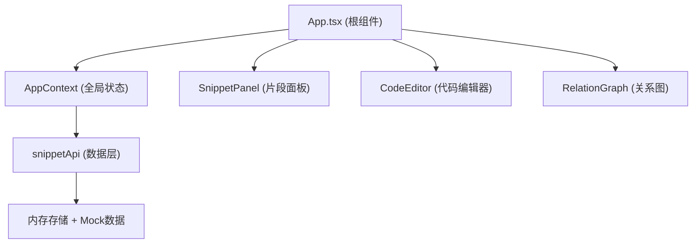

## 1. 架构设计



## 2. 技术描述

- **前端框架**：React 18 + TypeScript
- **构建工具**：Vite
- **代码编辑器**：CodeMirror 6 (@codemirror/view, @codemirror/state, @codemirror/lang-javascript, @codemirror/lang-css, @codemirror/lang-html)
- **图形可视化**：d3-force + d3-selection
- **状态管理**：React Context API
- **ID生成**：uuid
- **样式方案**：CSS Modules / 内联样式（无需CSS框架）

## 3. 项目结构

| 文件路径 | 职责描述 |
|----------|----------|
| `src/App.tsx` | 根组件，布局管理，Context Provider |
| `src/context/AppContext.tsx` | 全局状态：片段列表、选中ID、搜索词、引用关系 |
| `src/components/SnippetPanel.tsx` | 左侧面板：搜索、卡片列表、增删操作 |
| `src/components/CodeEditor.tsx` | 代码编辑器：CodeMirror实例、编辑保存 |
| `src/components/RelationGraph.tsx` | 关系图：d3-force力导向图、SVG渲染 |
| `src/api/snippetApi.ts` | 数据层：CRUD操作、生成关系图数据 |
| `src/types.ts` | 类型定义：Snippet、RelationGraph接口 |

## 4. 类型定义

### Snippet 接口

```typescript
interface Snippet {
  id: string;
  filename: string;
  language: 'TypeScript' | 'JavaScript' | 'CSS' | 'HTML';
  content: string;
  module: string;
  createdAt: string;
  updatedAt: string;
  dependencies: string[];
}
```

### RelationGraph 接口

```typescript
interface GraphNode {
  id: string;
  filename: string;
  module: string;
  language: string;
  referenceCount: number;
}

interface GraphEdge {
  source: string;
  target: string;
}

interface RelationGraph {
  nodes: GraphNode[];
  edges: GraphEdge[];
}
```

## 5. 状态管理

使用 React Context 管理全局状态：

- `snippets: Snippet[]` - 代码片段列表
- `selectedId: string | null` - 当前选中的片段ID
- `searchKeyword: string` - 搜索关键词
- `relationGraph: RelationGraph | null` - 关系图数据

提供方法：
- `addSnippet(snippet: Omit<Snippet, 'id' | 'createdAt' | 'updatedAt'>)`
- `updateSnippet(id: string, updates: Partial<Snippet>)`
- `deleteSnippet(id: string)`
- `setSelectedId(id: string | null)`
- `setSearchKeyword(keyword: string)`
- `generateGraph()` - 生成关系图数据

## 6. 性能指标

- 关系图节点数 ≤ 50 时，FPS ≥ 30
- 代码编辑器切换片段渲染延迟 ≤ 100ms
- 使用 requestAnimationFrame 优化动画性能
- 合理使用 React.memo 避免不必要重渲染
