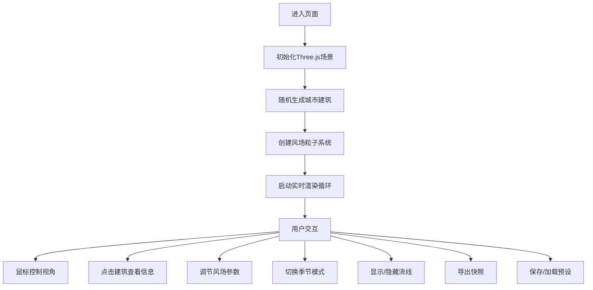

## 1. 产品概述

城市风场三维交互式模拟器，帮助城市规划师和气象爱好者直观理解高楼群对周围气流产生的涡旋、加速和遮挡效应。通过粒子系统和流线可视化，将抽象的风场数据转化为可交互的3D立体流动效果，解决传统二维风图无法表现空间立体流动细节的问题。

## 2. 核心功能

### 2.1 用户角色
| 角色 | 使用场景 | 核心需求 |
|------|----------|----------|
| 城市规划师 | 建筑设计评估、城市风道规划 | 观察建筑对风场的影响、导出分析截图 |
| 气象爱好者 | 气流研究、科普学习 | 调整风场参数、观察不同条件下的气流变化 |

### 2.2 功能模块
1. **3D城市场景模块**：随机生成城市街区、建筑模型、地面网格、光照阴影
2. **风场粒子系统模块**：数千粒子模拟风场、颜色随速度映射、大小动态变化
3. **流线可视化模块**：金色流线展示气流路径、实时扭曲变形
4. **交互控制模块**：视角控制、建筑选择高亮、参数调节面板
5. **季节模式模块**：季节风切换、背景渐变变化、暖色粒子
6. **快照导出模块**：1920x1080高清截图、自动下载PNG
7. **预设管理模块**：保存/加载视角和风场配置、后端API存储

### 2.3 页面详情
| 页面名称 | 模块名称 | 功能描述 |
|---------|----------|----------|
| 主场景页 | 3D渲染画布 | 城市建筑、粒子系统、流线效果的实时渲染 |
| 主场景页 | 左侧信息面板 | 显示选中建筑的高度、基底面积、平均风速 |
| 主场景页 | 右侧控制面板 | 风速缩放、风向角度、粒子密度、季节风按钮 |
| 主场景页 | 左下功能按钮 | 显示流线按钮、导出快照按钮 |

## 3. 核心流程

用户进入页面后，自动加载随机生成的城市街区和风场粒子系统。用户可通过鼠标交互旋转/平移/缩放视角，点击建筑查看详情，通过右侧面板调整风场参数，切换季节模式，显示流线，或导出当前视角的快照。用户还可以保存当前视角和配置为预设，或加载已保存的预设。

## 4. 用户界面设计

### 4.1 设计风格
- **主题风格**：深色科技感 + 霓虹蓝高亮，营造专业气象分析工具氛围
- **主色调**：霓虹蓝 #3B82F6（按钮、高亮）、深灰 #1E293B（控制面板背景）
- **辅助色**：金色 #FCD34D（流线、建筑高亮）、橙红 #FB923C（高速粒子）
- **建筑色**：灰蓝 #4A5A8A，顶部略带反光
- **地网格**：浅灰 #CBD5E1
- **背景渐变**：浅蓝 #87CEEB → 天际线 #E0F7FA
- **字体**：现代无衬线字体，清晰易读
- **动效**：所有交互附带200ms缓动动画，脉冲高亮效果

### 4.2 页面设计概述
| 区域 | 模块 | UI元素 |
|------|------|--------|
| 中央 | 3D场景 | 城市建筑群、粒子系统、流线、地面网格、阴影 |
| 左侧 | 信息面板 | 毛玻璃半透明背景、圆角12px、建筑参数信息 |
| 右侧 | 控制面板 | 深色背景 #1E293B、圆角8px、滑块、下拉、按钮 |
| 左下 | 功能按钮 | 蓝色按钮、白色文字、圆角6px、hover变深 |

### 4.3 交互设计
- **鼠标左键**：旋转视角
- **鼠标右键**：平移视角
- **滚轮**：缩放视角
- **点击建筑**：金色边框高亮 + 1.5秒脉冲动画 + 左侧显示信息
- **滑块拖动**：实时更新场景参数，带缓动过渡
- **按钮悬停**：颜色渐变过渡，200ms动画

### 4.4 3D场景指引
- **环境**：渐变天空背景，柔和雾效
- **光照**：方向光 + 环境光，开启阴影映射，阴影边缘柔和
- **相机**：45度俯视角，透视相机，可轨道控制
- **粒子**：加法混合模式，增强光效视觉冲击
- **性能**：2000粒子时帧率不低于50 FPS
