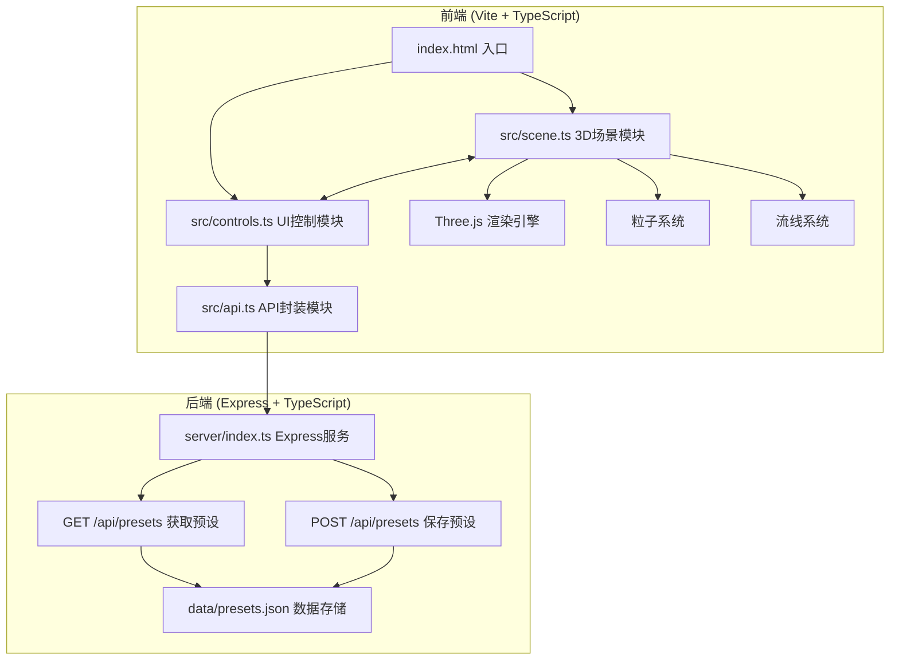

## 1. 架构设计



## 2. 技术描述

- **前端框架**：TypeScript + Three.js + Vite
- **构建工具**：Vite 5.x + @vitejs/plugin-react
- **3D引擎**：Three.js 最新版本
- **HTTP客户端**：Axios
- **后端框架**：Express 4.x + TypeScript
- **数据存储**：本地JSON文件 (data/presets.json)
- **开发端口**：前端5173，后端3001
- **跨域处理**：CORS中间件

## 3. 文件结构

| 文件路径 | 职责描述 |
|---------|----------|
| package.json | 项目依赖和脚本配置 |
| vite.config.js | Vite构建配置 |
| tsconfig.json | TypeScript编译配置 |
| index.html | 入口HTML页面 |
| src/scene.ts | Three.js场景初始化、建筑生成、粒子系统、流线渲染 |
| src/controls.ts | UI控制面板事件绑定、参数获取、回调通知 |
| src/api.ts | Axios请求封装、保存/加载预设 |
| server/index.ts | Express服务器、API路由、JSON文件存储 |
| data/presets.json | 预设数据持久化存储 |

## 4. API 定义

### 4.1 获取所有预设
- **路由**：`GET /api/presets`
- **响应**：
```typescript
interface Preset {
  id: string;
  name: string;
  createdAt: number;
  camera: {
    position: { x: number; y: number; z: number };
    target: { x: number; y: number; z: number };
  };
  controls: {
    windSpeed: number;
    windDirection: number;
    particleDensity: string;
    seasonMode: boolean;
  };
}

type PresetsResponse = Preset[];
```

### 4.2 保存新预设
- **路由**：`POST /api/presets`
- **请求体**：
```typescript
interface SavePresetRequest {
  name: string;
  camera: {
    position: { x: number; y: number; z: number };
    target: { x: number; y: number; z: number };
  };
  controls: {
    windSpeed: number;
    windDirection: number;
    particleDensity: string;
    seasonMode: boolean;
  };
}
```
- **响应**：
```typescript
interface SavePresetResponse {
  success: boolean;
  preset: Preset;
}
```

## 5. 核心数据模型

### 5.1 建筑数据
```typescript
interface Building {
  id: string;
  position: { x: number; z: number };
  width: number;
  depth: number;
  height: number;
  mesh: THREE.Mesh;
  outlineMesh?: THREE.LineSegments;
}
```

### 5.2 风场粒子
```typescript
interface ParticleData {
  position: THREE.Vector3;
  velocity: THREE.Vector3;
  speed: number;
}
```

### 5.3 控制参数
```typescript
interface ControlParams {
  windSpeed: number;      // 0.5 - 3.0 倍速
  windDirection: number;  // 0 - 360 度
  particleDensity: string; // low/medium/high
  showStreamlines: boolean;
  seasonMode: boolean;
}
```

## 6. 性能优化策略

- **粒子系统**：使用 BufferGeometry 而非单个 Mesh，减少Draw Call
- **材质复用**：相同类型建筑共享材质实例
- **动画优化**：使用 requestAnimationFrame，避免重排重绘
- **阴影优化**：调整阴影贴图分辨率，使用柔和阴影
- **粒子更新**：在CPU端批量计算，一次性更新BufferAttribute
