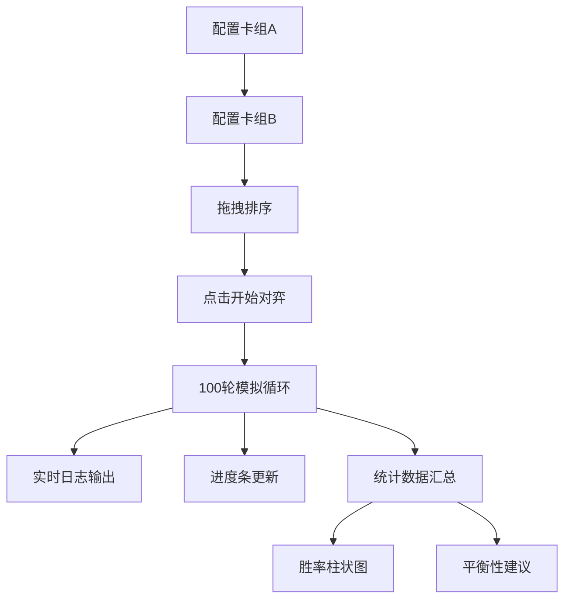

## 1. 产品概述

卡牌对战模拟器是一款面向卡牌游戏设计师的自动对弈与胜率统计工具，解决手动测试卡牌组合平衡性费时费力、数据样本不足的问题。通过模拟100轮自动对战，快速评估卡组强度并输出平衡性建议。

## 2. 核心功能

### 2.1 用户角色
| 角色 | 注册方式 | 核心权限 |
|------|----------|----------|
| 设计师用户 | 无需注册 | 配置卡组、运行模拟、查看统计结果 |

### 2.2 功能模块
1. **卡组配置模块**：12种预设卡牌库、双卡组配置、拖拽排序、稀有度展示
2. **对战引擎模块**：随机洗牌、自动出牌、特殊技能触发、100轮模拟循环
3. **结果展示模块**：实时对战日志、进度条、胜率统计、柱状图表、平衡性建议

### 2.3 页面详情
| 页面名称 | 模块名称 | 功能描述 |
|----------|----------|----------|
| 主页面 | 卡组配置区 | 可折叠面板，展示12张卡牌库，支持拖拽加入双方卡组（各最多8张），卡牌带稀有度边框和悬停动效 |
| 主页面 | 对战结果区 | 进度条显示模拟轮次，日志面板实时输出对战详情，统计图表展示胜率和伤害数据 |
| 主页面 | 控制按钮区 | 底部"开始对弈"按钮，触发100轮模拟对战 |

## 3. 核心流程

用户从卡牌库选择卡牌加入两个卡组 → 拖拽调整出牌顺序 → 点击开始对弈 → 系统自动运行100轮模拟 → 实时展示对战日志和进度 → 输出胜率统计和平衡性建议

## 4. 用户界面设计

### 4.1 设计风格
- **主色调**：深灰背景 #1E1E2E，紫色到蓝色渐变按钮 #7C4DFF → #448AFF
- **稀有度配色**：普通银灰 #C0C0C0、稀有金色 #FFD700、史诗紫罗兰 #8A2BE2
- **阵营配色**：蓝色 #2196F3（卡组A）、红色 #F44336（卡组B）
- **进度条**：绿色渐变 #00E676 → #00C853
- **按钮样式**：圆角20px，渐变色背景，hover时亮度提升10%并放大1.02倍
- **字体**：采用现代无衬线字体，亮色文字保证暗色背景下的可读性
- **布局风格**：左右分栏布局，左侧卡组配置（可折叠），右侧对战结果，底部控制按钮
- **动效风格**：卡片悬停上浮8px+放大1.05倍（0.2s ease-out），日志淡入（0.3s fadeIn），柱状图增长（0.5s）

### 4.2 页面设计概览
| 页面名称 | 模块名称 | UI元素 |
|----------|----------|--------|
| 主页面 | 卡牌卡片 | 160×220px、圆角12px、稀有度边框、悬停动效、费用/攻击/生命数值展示 |
| 主页面 | 卡组配置面板 | 可折叠设计、0.4s高度过渡动画、拖拽排序区域 |
| 主页面 | 进度条 | 顶部绿色渐变、宽度平滑过渡 |
| 主页面 | 日志面板 | 深色背景 #2D2D2D、白色文字、时间戳、底部淡入动画 |
| 主页面 | 统计图表 | 横向柱状图、蓝红阵营配色、底部增长动画 |
| 主页面 | 开始按钮 | 紫蓝渐变、圆角20px、悬停动效 |

### 4.3 响应式
- 桌面端优先设计，左右分栏布局
- 中等屏幕自适应调整卡片大小和间距
- 移动端自动切换为上下堆叠布局

### 4.4 性能要求
- 100轮模拟在1秒内完成
- 统计图表渲染在300ms以内
