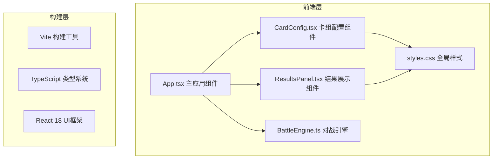

## 1. 架构设计



## 2. 技术描述
- **前端框架**：React 18 + TypeScript 5
- **构建工具**：Vite 5 + @vitejs/plugin-react
- **样式方案**：原生 CSS + CSS Variables
- **状态管理**：React useState/useEffect
- **拖拽实现**：原生 HTML5 Drag and Drop API
- **图表实现**：原生 DOM + CSS 动画实现柱状图

## 3. 项目文件结构
| 文件路径 | 用途 |
|----------|------|
| `package.json` | 项目依赖和脚本配置 |
| `vite.config.js` | Vite 构建配置 |
| `tsconfig.json` | TypeScript 严格模式配置 |
| `index.html` | 入口页面，根挂载点 |
| `src/App.tsx` | 主应用组件，布局和状态管理 |
| `src/components/CardConfig.tsx` | 卡组配置组件 |
| `src/components/BattleEngine.ts` | 对战引擎纯逻辑模块 |
| `src/components/ResultsPanel.tsx` | 结果展示组件 |
| `src/styles.css` | 全局样式和主题 |

## 4. 数据模型

### 4.1 卡牌数据模型
```typescript
interface Card {
  id: string;
  name: string;
  cost: number;
  attack: number;
  health: number;
  rarity: 'common' | 'rare' | 'epic';
  ability?: 'charge' | 'taunt' | 'divineShield' | null;
  abilityDesc: string;
}
```

### 4.2 对战状态模型
```typescript
interface BattleState {
  round: number;
  playerA: PlayerState;
  playerB: PlayerState;
  log: BattleLogEntry[];
  finished: boolean;
}

interface PlayerState {
  deck: Card[];
  hand: Card[];
  board: BattleCard[];
  health: number;
  mana: number;
}

interface BattleCard {
  instanceId: string;
  card: Card;
  currentHealth: number;
  currentAttack: number;
  hasDivineShield: boolean;
  hasAttacked: boolean;
}
```

### 4.3 统计结果模型
```typescript
interface BattleStats {
  totalRounds: number;
  winsA: number;
  winsB: number;
  avgHealthA: number;
  avgHealthB: number;
  cardUsageA: Record<string, number>;
  cardUsageB: Record<string, number>;
  cardDamageA: Record<string, number>;
  cardDamageB: Record<string, number>;
  balanceSuggestion: string;
}
```

## 5. 对战引擎核心逻辑

### 5.1 洗牌算法
Fisher-Yates 随机洗牌算法

### 5.2 出牌规则
- 按费用从低到高自动出牌
- 每回合开始增加1点法力值上限
- 优先打出费用最低且法力足够的卡牌

### 5.3 攻击目标选择
- 优先攻击对方嘲讽卡牌
- 若无嘲讽，优先选择最低生命值敌方卡牌
- 若敌方场上无卡牌则攻击英雄

### 5.4 特殊技能处理
- **冲锋（Charge）**：召唤当回合即可攻击
- **嘲讽（Taunt）**：敌方必须优先攻击此单位
- **圣盾（Divine Shield）**：免疫首次受到的伤害

### 5.5 100轮模拟
- 独立运行100场对战
- 每场对战统计胜负、剩余生命值、卡牌使用次数和伤害
- 汇总生成统计报告和平衡性建议
