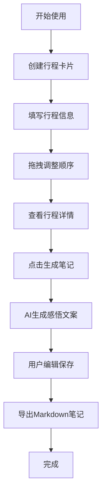

## 1. 产品概述
旅行行程规划与笔记生成应用，帮助旅行者统一管理每日行程、记录旅行记忆点，并自动生成高质量旅行笔记。
- 解决旅途中信息分散、缺乏统一视图和导出能力、体验碎片化的问题
- 面向热爱旅行、需要高效规划和记录行程的用户群体

## 2. 核心特性

### 2.1 用户角色
| 角色 | 注册方式 | 核心权限 |
|------|---------|---------|
| 普通用户 | 无需注册，本地存储 | 创建/编辑/删除行程、生成笔记、导出Markdown |

### 2.2 功能模块
1. **行程规划模块**：左侧时间轴、行程卡片、拖拽排序、星级评分
2. **笔记生成模块**：右侧行程详情、AI模拟感悟生成、笔记编辑保存
3. **数据导出模块**：Markdown格式导出、按日期排序整理

### 2.3 页面详情
| 页面名称 | 模块名称 | 功能描述 |
|---------|---------|---------|
| 主页面 | 左侧时间轴 | 展示每日行程卡片，支持拖拽排序、添加/删除行程 |
| 主页面 | 右侧详情区 | 展示选中日期的所有行程明细卡片 |
| 主页面 | 笔记模态窗 | 展示AI生成的旅行感悟，支持编辑保存 |
| 主页面 | 导出功能 | 将所有行程导出为Markdown格式旅行笔记 |

## 3. 核心流程
用户创建每日行程 → 填写行程详情（地点、时长、评分）→ 拖拽调整顺序 → 查看行程明细 → 点击生成笔记 → AI自动生成感悟文案 → 用户编辑并保存 → 导出Markdown旅行笔记

## 4. 用户界面设计

### 4.1 设计风格
- 主色调：#D97706（橙色）
- 辅助色：#2D1B00（深咖色）
- 背景色：#FFFAF0（米白色）
- 字体：系统无衬线字体
- 按钮风格：圆角设计，hover时颜色加深，点击时轻微缩放回弹
- 布局风格：左右两栏卡片式布局
- 阴影：柔和阴影 box-shadow: 0 4px 6px -1px rgba(45,27,0,0.1)

### 4.2 页面设计概览
| 页面名称 | 模块名称 | UI元素 |
|---------|---------|-------|
| 主页面 | 左侧时间轴 | 300px宽、#FFFAF0背景、8px圆角、细边框#E2E8F0、行程卡片列表 |
| 主页面 | 右侧主工作区 | 暖黄渐变背景(#FEF9EF到#FDE68A)、时间线卡片流、400px宽卡片 |
| 主页面 | 行程卡片 | 深咖色背景#2D1B00、浅咖文字#F5E6CA、标签气泡 |
| 主页面 | 星级评分 | 选中金色#FACC15、未选灰色#CBD5E1、点击切换 |
| 主页面 | 笔记模态窗 | 居中弹出、AI生成文案、编辑区域、保存按钮 |
| 主页面 | 导出按钮 | 左上角侧边栏顶部、触发下载 |

### 4.3 响应式设计
- 桌面端（≥1024px）：左侧时间轴固定300px，右侧自适应填充
- 移动端（＜1024px）：左侧折叠为汉堡菜单，点击后从左侧滑出覆盖层，0.3s cubic-bezier过渡动画

### 4.4 交互动效
- 卡片和按钮hover时0.2s缓动配色变化
- 按钮点击时0.95倍缩放再回弹效果
- 拖拽时半透明跟随，放置时有0.2s弹性过渡动画
- 移动端侧边栏滑入滑出0.3s cubic-bezier过渡
