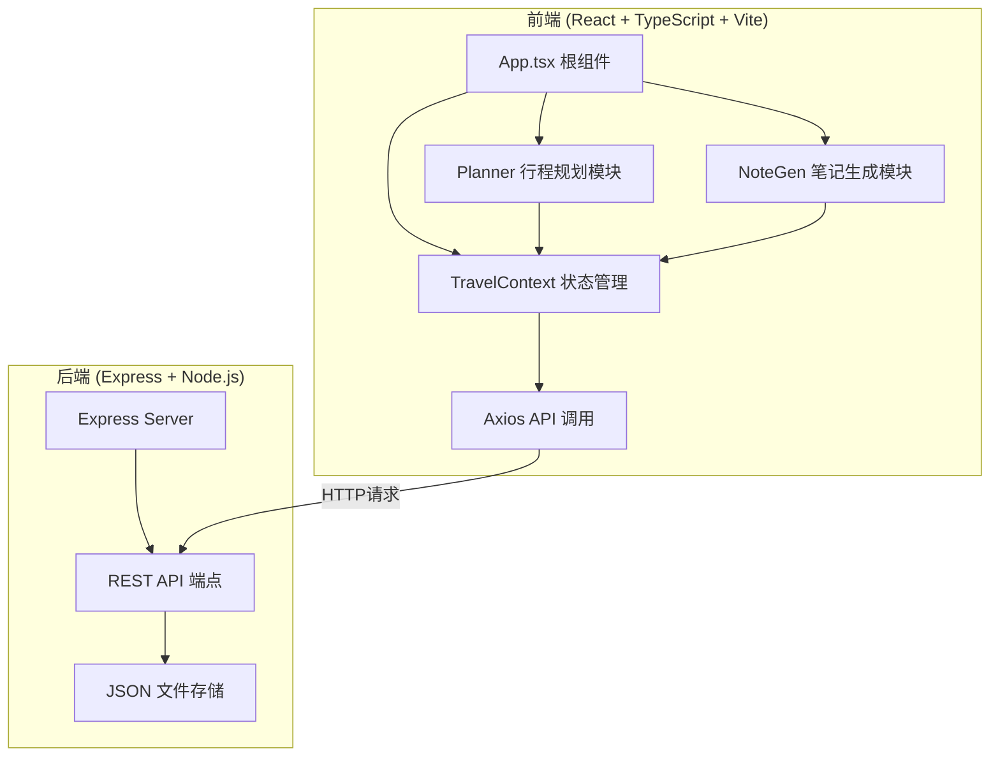
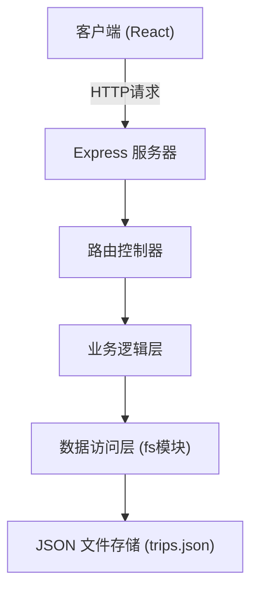
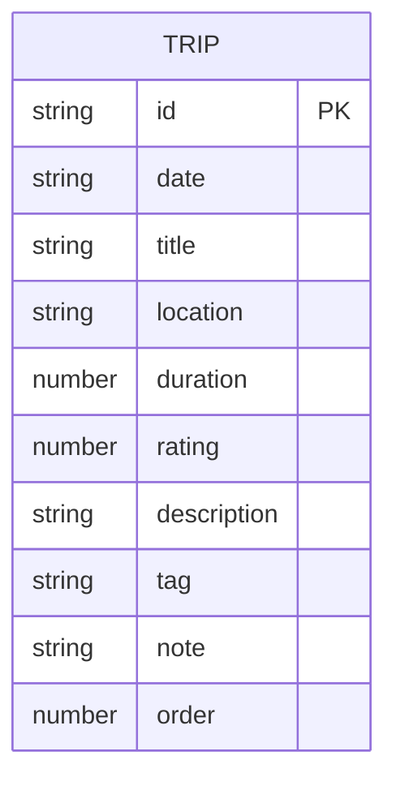

## 1. 架构设计



## 2. 技术说明
- 前端：React 18 + TypeScript + Vite
- 状态管理：React Context + useReducer
- HTTP客户端：Axios
- 后端：Express 4
- 数据存储：本地JSON文件（server/data/trips.json）
- 构建工具：Vite

## 3. 路由定义
| 路由 | 用途 |
|------|------|
| / | 主页面，行程规划与笔记生成 |

## 4. API 定义

### 4.1 数据类型定义
```typescript
interface Trip {
  id: string;
  date: string;           // YYYY-MM-DD 格式
  title: string;          // 行程标题
  location: string;       // 地点名称
  duration: number;       // 预计停留时长（分钟）
  rating: number;         // 满意度评分（1-5星）
  description: string;    // 详细描述
  tag: string;            // 自定义标签
  note: string;           // AI生成的旅行笔记
  order: number;          // 排序序号
}
```

### 4.2 API 端点
| 方法 | 路径 | 描述 | 请求体 | 响应 |
|------|------|------|--------|------|
| POST | /api/trips | 创建行程 | Trip | Trip |
| GET | /api/trips?date=YYYY-MM-DD | 按日期查询行程列表 | - | Trip[] |
| GET | /api/trips/all | 获取所有行程 | - | Trip[] |
| PUT | /api/trips/:id | 更新行程 | Partial<Trip> | Trip |
| DELETE | /api/trips/:id | 删除行程 | - | { success: boolean } |
| POST | /api/export | 导出Markdown笔记 | { startDate?, endDate? } | { content: string, filename: string } |

## 5. 服务器架构图



## 6. 数据模型

### 6.1 数据模型定义



### 6.2 数据存储格式
数据存储在 `server/data/trips.json` 文件中，格式如下：

```json
{
  "trips": [
    {
      "id": "uuid-string",
      "date": "2024-06-21",
      "title": "古城墙漫步",
      "location": "西安古城墙",
      "duration": 120,
      "rating": 5,
      "description": "从南门登上城墙，沿着城墙骑行一圈，俯瞰古城全貌。",
      "tag": "历史文化",
      "note": "在古老的城墙下静谧漫步，感受千年历史的沉淀...",
      "order": 1
    }
  ]
}
```

## 7. 项目文件结构

```
auto151/
├── package.json
├── vite.config.js
├── tsconfig.json
├── index.html
├── src/
│   ├── App.tsx
│   ├── context/
│   │   └── TravelContext.tsx
│   ├── modules/
│   │   ├── Planner/
│   │   │   └── Planner.tsx
│   │   └── NoteGen/
│   │       └── NoteGen.tsx
│   └── types/
│       └── index.ts
├── server/
│   ├── index.js
│   └── data/
│       └── trips.json
```

## 8. 性能指标
- 按钮点击响应时间：< 200ms
- 拖拽操作帧率：≥ 30FPS
- 导出Markdown操作：< 2秒
