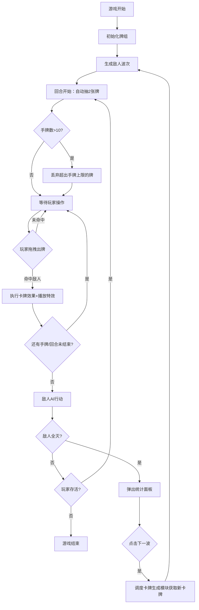
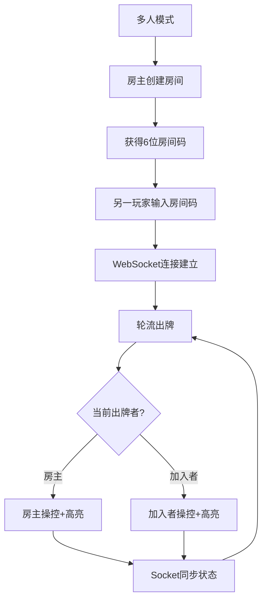

## 1. 产品概述

深渊回响是一款基于Roguelike元素的回合制卡牌战斗游戏，玩家使用由攻击、防御和技能卡组成的牌组，在随机生成的敌人序列中进行战斗。面向独立游戏开发者提供清晰的分模块可参考工程模板，解决复杂战斗逻辑、状态管理和流程控制的开发痛点。

- 目标用户：独立游戏开发者、卡牌游戏爱好者
- 核心价值：提供完整的模块化工程模板，展示战斗系统、卡牌生成、状态管理和多人房间系统的最佳实践

## 2. 核心功能

### 2.1 用户角色

| 角色 | 进入方式 | 核心权限 |
|------|----------|----------|
| 单人玩家 | 直接开始游戏 | 独立操控牌组进行战斗 |
| 房主玩家 | 创建房间 | 操控牌组、管理房间 |
| 加入玩家 | 输入房间码加入 | 轮流操控同一套牌组 |

### 2.2 功能模块

1. **战斗界面**：Canvas战斗场景、手牌扇形排列、敌人显示、拖拽出牌
2. **统计面板**：毛玻璃背景、战斗数据统计、下一波按钮
3. **房间系统**：创建房间、输入房间码加入、轮流出牌同步

### 2.3 页面详情

| 页面名称 | 模块名称 | 功能描述 |
|----------|----------|----------|
| 战斗界面 | 战斗Canvas | 俯视视角圆形石质地台、敌人光晕圆点、生命条、拖拽出牌轨迹线 |
| 战斗界面 | 手牌区域 | 扇形排列卡牌、悬停放大动画、拖拽交互 |
| 战斗界面 | 回合信息栏 | 当前回合数、玩家生命/护盾显示 |
| 统计面板 | 数据统计 | 回合数、总伤害、总护盾吸收、抽牌数 |
| 统计面板 | 操作按钮 | 下一波按钮、重新调度卡牌与敌人 |
| 房间界面 | 创建房间 | 生成6位房间码、等待对手加入 |
| 房间界面 | 加入房间 | 输入房间码、连接WebSocket同步 |

## 3. 核心流程

玩家进入游戏后，自动初始化牌组（6张攻击卡、4张防御卡、2张抽牌卡），每回合开始自动抽2张牌。玩家通过拖拽手牌到目标敌人来出牌，卡牌效果生效后播放命中特效。所有手牌出完或玩家选择结束后，敌人执行AI行动。击败当前波次所有敌人后弹出统计面板，点击"下一波"继续战斗。多人模式下通过WebSocket房间系统实现轮流出牌。

## 4. 用户界面设计

### 4.1 设计风格

- 主色调：深紫罗兰渐变（#1a0f2e → #2d1b4e）暗色调背景
- 霓虹色系：攻击红#FF4D4D、防御蓝#4D79FF、技能紫#9B59B6
- 按钮：微光浮动动画（box-shadow持续2s呼吸效果）
- 字体：标题使用粗体衬线风格，正文白色16px
- 布局：Canvas居中+手牌扇形底部排列，响应式最小宽度1024px

### 4.2 页面设计概览

| 页面名称 | 模块名称 | UI元素 |
|----------|----------|--------|
| 战斗界面 | 战斗Canvas | 深紫罗兰渐变背景、圆形石质地台(半径150px, #2a2a3a)、半透明环形纹理 |
| 战斗界面 | 敌人 | 半透明光晕圆点、头顶生命条(60px*6px, #4CAF50→#FF5252渐变)、白色14px生命值文字 |
| 战斗界面 | 手牌 | 扇形排列、120px*170px、圆角8px、底色#2d1b4e、边框#4a3075、悬停1.1倍放大0.3s过渡 |
| 战斗界面 | 攻击轨迹 | 线宽2px、颜色#FFD700、末端渐隐 |
| 战斗界面 | 命中特效 | 敌人抖动0.2s、闪烁红色0.1s |
| 战斗界面 | 死亡特效 | 10个粒子、颜色#FF4D4D、扩散半径30px、持续0.4s |
| 统计面板 | 背景 | 毛玻璃、背景模糊5px、全屏渐入 |
| 统计面板 | 内容 | 回合数/总伤害/总护盾/抽牌数、下一波按钮 |

### 4.3 响应式

- 桌面端优先设计，最小宽度1024px
- Canvas尺寸自适应容器，保持宽高比
- 手牌数量自适应排列密度

### 4.4 动效规格

| 动效类型 | 参数 |
|----------|------|
| 卡牌悬停 | scale(1.1), transition 0.3s |
| 按钮呼吸 | box-shadow 2s infinite |
| 命中抖动 | shake 0.2s |
| 命中闪烁 | red flash 0.1s |
| 死亡粒子 | 10粒子, #FF4D4D, 30px半径, 0.4s |
| 统计面板 | 毛玻璃渐入, blur 5px |
| 攻击轨迹 | 2px, #FFD700, 末端渐隐 |
