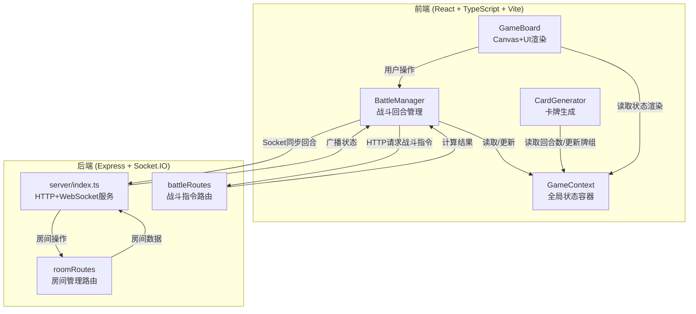
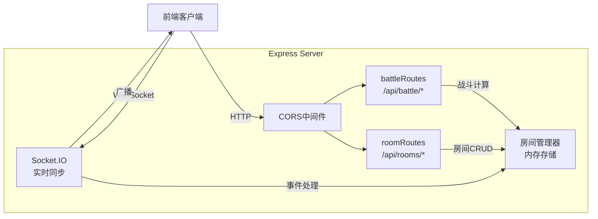
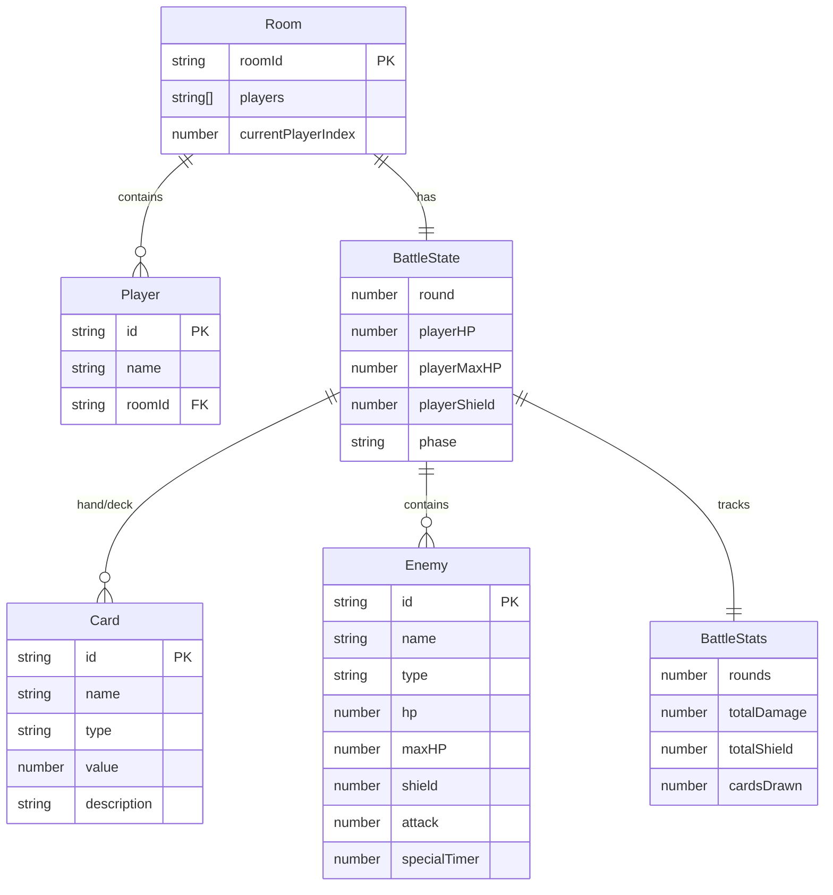

## 1. 架构设计



## 2. 技术说明

- 前端：React@18 + TypeScript + Vite
- 初始化工具：vite-init（react-express-ts模板）
- 后端：Express@4 + Socket.IO
- 状态管理：React Context（GameContext）
- 渲染：HTML5 Canvas 2D（战斗场景）+ React DOM（UI层）
- 实时通信：Socket.IO（房间状态同步）
- HTTP客户端：Axios

### 2.1 依赖列表

| 依赖 | 用途 |
|------|------|
| react | UI框架 |
| react-dom | React DOM渲染 |
| typescript | 类型安全 |
| vite | 构建工具 |
| @vitejs/plugin-react | Vite React插件 |
| axios | HTTP请求 |
| express | 后端HTTP服务 |
| cors | 跨域支持 |
| uuid | 房间码生成 |
| socket.io | 服务端WebSocket |
| socket.io-client | 客户端WebSocket |

## 3. 路由定义

| 路由 | 用途 |
|------|------|
| / | 主游戏界面 |
| /room | 房间创建/加入界面 |

## 4. API定义

### 4.1 REST API

```typescript
// 战斗指令
POST /api/battle/action
Request: {
  playerId: string;
  roomId?: string;
  action: {
    type: "playCard" | "endTurn";
    cardIndex?: number;
    targetEnemyIndex?: number;
  };
}
Response: {
  success: boolean;
  battleState: BattleState;
  damageDealt?: number;
  shieldGained?: number;
  cardsDrawn?: number;
}

// 查询战斗结果
GET /api/battle/result/:roomId
Response: {
  victory: boolean;
  stats: {
    rounds: number;
    totalDamage: number;
    totalShield: number;
    cardsDrawn: number;
  };
}

// 创建房间
POST /api/rooms
Request: {
  playerName: string;
}
Response: {
  roomId: string;
  players: string[];
}

// 加入房间
POST /api/rooms/:roomId/join
Request: {
  playerName: string;
}
Response: {
  success: boolean;
  roomId: string;
  players: string[];
}

// 查询房间状态
GET /api/rooms/:roomId
Response: {
  roomId: string;
  players: string[];
  currentPlayerIndex: number;
  battleState: BattleState;
}
```

### 4.2 WebSocket事件

```typescript
// 客户端 → 服务端
"join-room": { roomId: string; playerName: string }
"play-card": { roomId: string; playerId: string; cardIndex: number; targetIndex: number }
"end-turn": { roomId: string; playerId: string }

// 服务端 → 客户端
"room-updated": { roomId: string; players: string[]; currentPlayerIndex: number }
"battle-updated": { battleState: BattleState }
"player-highlight": { currentPlayerId: string }
```

### 4.3 核心类型定义

```typescript
interface BattleState {
  round: number;
  playerHP: number;
  playerMaxHP: number;
  playerShield: number;
  hand: Card[];
  deck: Card[];
  enemies: Enemy[];
  phase: "playerTurn" | "enemyTurn" | "victory" | "defeat";
  stats: BattleStats;
}

interface Card {
  id: string;
  name: string;
  type: "attack" | "defense" | "skill";
  value: number;
  description: string;
}

interface Enemy {
  id: string;
  name: string;
  type: "goblin" | "skeleton" | "darkMage";
  hp: number;
  maxHP: number;
  shield: number;
  attack: number;
  specialTimer?: number;
}

interface BattleStats {
  rounds: number;
  totalDamage: number;
  totalShield: number;
  cardsDrawn: number;
}
```

## 5. 服务端架构图



## 6. 数据模型

### 6.1 数据模型定义



### 6.2 初始数据

```sql
-- 初始牌组
INSERT INTO deck_templates (card_type, card_name, value, count) VALUES
  ('attack', '基础攻击', 10, 6),
  ('defense', '防御', 15, 4),
  ('skill', '抽牌', 2, 2);

-- 敌人模板
INSERT INTO enemy_templates (type, name, hp, attack, special) VALUES
  ('goblin', '哥布林', 50, 8, NULL),
  ('skeleton', '骷髅兵', 40, 12, NULL),
  ('darkMage', '黑暗法师', 30, 15, '每3回合群体攻击');
```

## 7. 文件结构与调用关系

```
项目根目录/
├── package.json                    # 依赖与脚本
├── vite.config.js                  # Vite配置，代理/api到后端
├── tsconfig.json                   # TypeScript严格模式
├── index.html                      # 入口HTML
├── src/
│   ├── main.tsx                    # React入口
│   ├── App.tsx                     # 根组件，路由
│   ├── modules/
│   │   ├── battle/
│   │   │   └── BattleManager.tsx   # 战斗回合管理 → 读/写GameContext
│   │   └── card/
│   │       └── CardGenerator.tsx   # 卡牌生成 → 读GameContext回合数/写牌组
│   ├── context/
│   │   └── GameContext.tsx         # 全局状态容器 → 被所有模块读写
│   ├── components/
│   │   ├── GameBoard.tsx           # Canvas+UI渲染 → 读GameContext
│   │   ├── StatsPanel.tsx          # 统计面板 → 读GameContext
│   │   └── RoomPanel.tsx           # 房间界面 → 调用API/Socket
│   ├── types/
│   │   └── game.ts                 # 类型定义
│   └── utils/
│       ├── canvasRenderer.ts       # Canvas渲染工具
│       └── animations.ts           # 动画效果工具
├── server/
│   ├── index.ts                    # Express+Socket.IO服务入口
│   └── routes/
│       ├── battleRoutes.ts         # 战斗指令路由 → 游戏规则引擎
│       └── roomRoutes.ts           # 房间管理路由 → 房间列表维护
└── shared/
    └── types.ts                    # 前后端共享类型
```

### 数据流向

1. **玩家操作流**：GameBoard(点击/拖拽) → BattleManager(处理逻辑) → GameContext(更新状态) → GameBoard(重绘)
2. **卡牌生成流**：GameContext(回合数变化) → CardGenerator(生成卡牌) → GameContext(更新牌组)
3. **多人同步流**：BattleManager(Socket事件) → server(广播) → 对手BattleManager(接收) → GameContext(同步状态)
4. **战斗指令流**：BattleManager(Axios请求) → battleRoutes(规则计算) → BattleManager(接收结果) → GameContext(更新)
