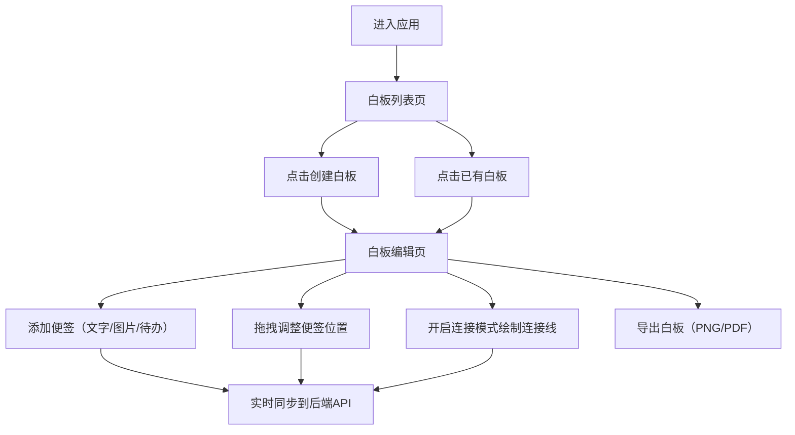

## 1. 产品概述

墨迹协作是一款在线团队协作白板与便签管理应用，旨在为远程团队提供可视化的头脑风暴和任务协作空间。用户可以创建多个白板页面，在白板上自由添加、拖拽和连接多种类型的便签，支持图片、文字和待办列表，实现高效的创意整理和项目管理。

- 核心价值：提供直观、灵活的可视化协作工具，降低团队沟通成本，提升创意工作效率
- 目标用户：产品团队、设计团队、开发团队、远程协作团队

## 2. 核心功能

### 2.1 用户角色

| 角色 | 注册方式 | 核心权限 |
|------|----------|----------|
| 普通用户 | 默认访问 | 创建、编辑、删除白板和便签，导出白板内容 |

### 2.2 功能模块

1. **白板列表页**：白板卡片网格展示、创建新白板、进入白板编辑页
2. **白板编辑页**：便签添加工具栏、便签画布渲染、便签拖拽交互、便签连接功能、导出功能

### 2.3 页面详情

| 页面名称 | 模块名称 | 功能描述 |
|-----------|-------------|---------------------|
| 白板列表页 | 顶部导航栏 | 应用标题展示、用户头像占位 |
| 白板列表页 | 白板卡片网格 | 响应式网格布局展示所有白板卡片，支持悬停效果和点击进入 |
| 白板列表页 | 创建白板按钮 | 点击创建新的空白白板 |
| 白板编辑页 | 顶部工具栏 | 添加三种类型便签按钮、连接模式开关、导出按钮 |
| 白板编辑页 | 便签画布 | 六边形网格背景、便签渲染和拖拽、连接线Canvas绘制 |
| 白板编辑页 | 文字便签 | 双击编辑、Markdown简单语法支持（加粗）、实时渲染 |
| 白板编辑页 | 图片便签 | URL输入、加载状态占位符、自动尺寸限制 |
| 白板编辑页 | 待办列表便签 | 复选框列表、勾选状态样式、行内编辑 |
| 白板编辑页 | 便签连接 | 连接模式切换、曲线连接线绘制、拖拽预览 |
| 白板编辑页 | 导出模态框 | 格式选择（PNG/PDF）、进度条显示、自动下载 |

## 3. 核心流程

用户打开应用后进入白板列表页，查看所有已创建的白板卡片。用户可以点击创建新白板，或点击已有白板进入编辑页面。在白板编辑页，用户通过顶部工具栏添加文字、图片或待办便签，拖拽调整便签位置，开启连接模式后可以在便签之间绘制连接线。编辑完成后，用户可以通过导出功能将白板保存为图片或PDF文件。所有数据通过后端API实时持久化存储。

## 4. 用户界面设计

### 4.1 设计风格

- **主色调**：深色主题背景 #1A1A2E，导航栏 #1E293B，便签黄色系 #FEF3C7
- **强调色**：蓝色 #3B82F6（按钮、边框、连接线），绿色 #10B981（导出按钮、复选框 #22C55E）
- **按钮风格**：圆角8px，悬停阴影加深，主按钮蓝色背景白色文字
- **字体**：标题粗体24px，正文常规字重，使用现代无衬线字体
- **布局风格**：卡片式布局，顶部固定导航栏，响应式网格
- **图标风格**：简洁线性图标，悬停时淡蓝色光晕效果

### 4.2 页面设计概览

| 页面名称 | 模块名称 | UI元素 |
|-----------|-------------|-------------|
| 白板列表页 | 顶部导航栏 | 固定高度60px，深色背景#1E293B，白色标题，右侧圆形头像占位 |
| 白板列表页 | 白板卡片 | 320x200px，圆角12px，阴影2px，悬停阴影4px+蓝色边框，黄色渐变背景，显示白板名称和最后编辑时间 |
| 白板列表页 | 创建按钮 | 蓝色#3B82F6背景，白色文字，圆角8px |
| 白板编辑页 | 工具栏 | 顶部固定，水平排列三种便签按钮、连接开关、导出按钮，悬停淡蓝色光晕 |
| 白板编辑页 | 画布 | 深色背景#1A1A2E，六边形网格图案，便签自由定位 |
| 白板编辑页 | 便签卡片 | 黄色背景#FEF3C7，圆角12px，2px虚线边框#EAB308，最小宽度200px最大400px，高度自适应 |
| 白板编辑页 | 连接线 | 蓝色#3B82F6，线宽2px，两端白色小圆点，Canvas曲线绘制 |
| 白板编辑页 | 导出模态框 | 居中弹窗，格式选项，进度条蓝色#3B82F6圆角4px |

### 4.3 响应式设计

- 桌面端优先设计
- 白板列表页：768px以上3列，480px以上2列，480px以下1列
- 白板编辑页：768px以下工具栏折叠为汉堡菜单，便签宽度自适应
- 触摸设备优化拖拽和点击操作

### 4.4 动画与交互

- 便签添加：从中心淡入+缩放动画，0.2s cubic-bezier
- 便签拖拽：光标grab，半透明效果，弹性缓动过渡，释放后6px网格吸附
- 连接线添加：渐变绘制动画
- 工具栏图标：悬停淡蓝色光晕
- 导出进度：0-100%蓝色进度条动画
