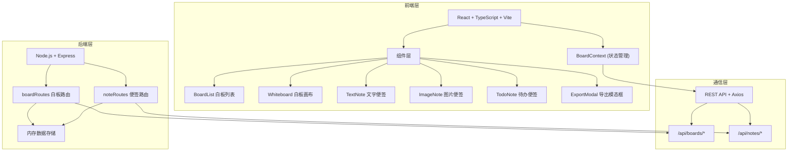
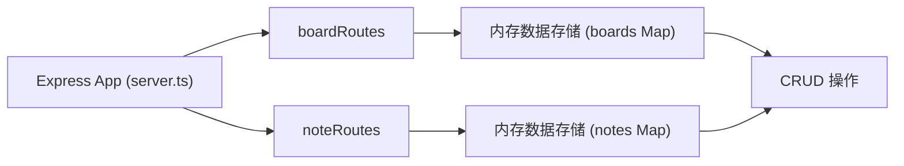
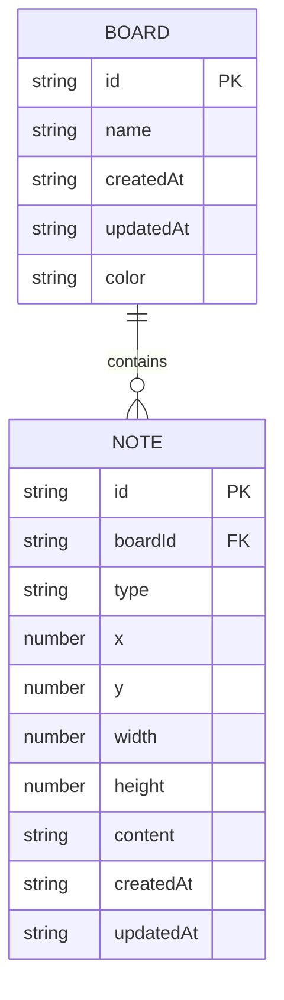

## 1. 架构设计



## 2. 技术栈说明

- **前端框架**: React 18 + TypeScript
- **构建工具**: Vite
- **状态管理**: React Context (BoardContext)
- **路由**: React Router DOM
- **HTTP客户端**: Axios
- **图片导出**: html2canvas
- **PDF导出**: jsPDF
- **UI样式**: 原生CSS (CSS Modules / 内联样式)
- **图标**: Lucide React

- **后端框架**: Express 4
- **后端语言**: TypeScript
- **跨域支持**: CORS
- **数据存储**: 内存存储 (开发阶段，使用Map存储)
- **ID生成**: UUID

## 3. 路由定义

### 前端路由

| 路由 | 用途 |
|-------|---------|
| / | 白板列表页，展示所有白板卡片 |
| /board/:id | 白板编辑页，展示便签编辑区域 |

### 后端API路由

| 方法 | 路由 | 用途 |
|-------|-------|---------|
| GET | /api/boards | 获取所有白板列表 |
| POST | /api/boards | 创建新白板 |
| GET | /api/boards/:id | 获取单个白板及便签详情 |
| PUT | /api/boards/:id | 更新白板名称 |
| DELETE | /api/boards/:id | 删除白板 |
| POST | /api/boards/:boardId/notes | 创建便签 |
| PUT | /api/notes/:id | 更新便签（位置、大小、内容） |
| DELETE | /api/notes/:id | 删除便签 |

## 4. API数据定义

### 类型定义

```typescript
interface Board {
  id: string;
  name: string;
  createdAt: string;
  updatedAt: string;
  color?: string;
}

interface Note {
  id: string;
  boardId: string;
  type: 'text' | 'image' | 'todo';
  x: number;
  y: number;
  width: number;
  height: number;
  content: TextNoteContent | ImageNoteContent | TodoNoteContent;
  createdAt: string;
  updatedAt: string;
}

interface TextNoteContent {
  text: string;
}

interface ImageNoteContent {
  url: string;
}

interface TodoNoteContent {
  items: { id: string; text: string; checked: boolean }[];
}

interface Connection {
  id: string;
  sourceId: string;
  targetId: string;
}

interface User {
  id: string;
  name: string;
  avatar?: string;
}
```

## 5. 服务端架构



### 模块职责

- **server/server.ts**: Express实例化，中间件配置（CORS、JSON解析），路由挂载，端口监听3001
- **server/boardRoutes.ts**: 白板资源的增删改查API路由处理
- **server/noteRoutes.ts**: 便签资源的增删改查API路由处理

## 6. 数据模型

### 6.1 ER图



### 6.2 数据存储结构

内存使用两个Map分别存储：

```typescript
// 白板存储
Map<string, Board>

// 便签存储（按boardId索引）
Map<string, Note[]>
```

## 7. 项目文件结构

```
├── package.json
├── vite.config.js
├── tsconfig.json
├── index.html
├── src/
│   ├── App.tsx
│   ├── context/
│   │   └── BoardContext.tsx
│   ├── components/
│   │   ├── BoardList.tsx
│   │   └── Whiteboard.tsx
└── server/
    ├── server.ts
    ├── boardRoutes.ts
    └── noteRoutes.ts
```

## 8. 性能优化

- Canvas绘制连接线，避免DOM频繁重绘
- 便签拖拽使用requestAnimationFrame保证60fps
- 便签组件使用memo优化重渲染
- 支持同时显示50+便签和20+连接线
