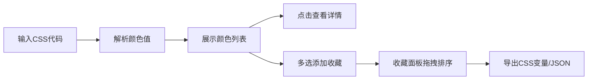

## 1. 产品概述

CSS颜色提取与配色方案导出工具，帮助前端开发者快速从网页CSS代码中提取并整理颜色变量，生成可导出的配色方案。解决开发者在设计系统搭建或主题换色时，需要手动从多个样式文件中查找和复制颜色值、缺乏直观预览和批量导出手段的痛点。

## 2. 核心功能

### 2.1 用户角色
| 角色 | 注册方式 | 核心权限 |
|------|----------|----------|
| 前端开发者 | 无需注册 | 使用全部颜色提取、预览、收藏和导出功能 |

### 2.2 功能模块
1. **颜色输入模块**：CSS代码粘贴输入、文件拖拽上传
2. **颜色展示模块**：颜色圆点列表、颜色详情卡片、收藏面板
3. **主题切换模块**：浅色/深色/高对比三态主题切换
4. **导出模块**：CSS变量导出、JSON文件导出

### 2.3 页面详情
| 页面名称 | 模块名称 | 功能描述 |
|----------|----------|----------|
| 主页面 | 导航栏 | 应用标题、主题切换按钮 |
| 主页面 | 颜色输入区 | CSS代码文本框、拖拽上传区域 |
| 主页面 | 颜色预览区 | 颜色圆点列表、颜色详情弹窗 |
| 主页面 | 收藏面板 | 收藏颜色列表、拖拽排序、导出按钮 |

## 3. 核心流程

用户粘贴或拖拽上传CSS代码 → 系统自动解析提取所有颜色值 → 右侧预览区按顺序展示颜色圆点 → 点击圆点查看颜色详情 → 多选颜色添加到收藏面板 → 收藏面板内拖拽排序 → 一键导出为CSS变量或JSON文件

## 4. 用户界面设计

### 4.1 设计风格
- **主色调**：蓝灰色系（#1E293B、#475569、#3B82F6）
- **辅助色**：白色（#FFFFFF）、极浅灰（#F8FAFC）
- **按钮风格**：圆角、悬停平滑过渡（0.2s ease）
- **字体**：正文使用系统无衬线字体，颜色值使用Fira Code等宽字体
- **布局风格**：卡片式布局，顶部导航栏，左右分栏主区域
- **图标风格**：简洁线性图标

### 4.2 页面设计概览
| 页面名称 | 模块名称 | UI元素 |
|----------|----------|--------|
| 主页面 | 导航栏 | 高度56px，白底，底部1px边框，右侧主题切换按钮 |
| 主页面 | 输入区 | 宽度320px，深色背景#1E293B，圆角8px，内边距16px |
| 主页面 | 预览区 | 浅灰背景#F8FAFC，颜色圆点直径24px，间距12px |
| 主页面 | 详情卡片 | 固定宽度240px，白色背景，圆角8px，2px边框，4px阴影 |
| 主页面 | 收藏面板 | 微透明背景#F8FAFC，圆角4px，高度自适应 |

### 4.3 响应式
- 桌面端：左右分栏布局（1:2比例），最大宽度1200px居中
- 移动端（<768px）：上下排列，输入区在上预览区在下，颜色列表改为每行两列网格布局
- 触控优化：增大点击区域，适配触摸操作

### 4.4 动效设计
- 拖拽上传：拖入时边框变蓝并显示上浮阴影过渡
- 悬停效果：卡片和按钮悬停0.2s平滑过渡
- 主题切换：0.3s切换动画
- 拖拽排序：拖拽时半透明跟随鼠标，放置后0.15s弹性动画
- 复制反馈：点击复制后显示"已复制"文案0.5s后恢复
