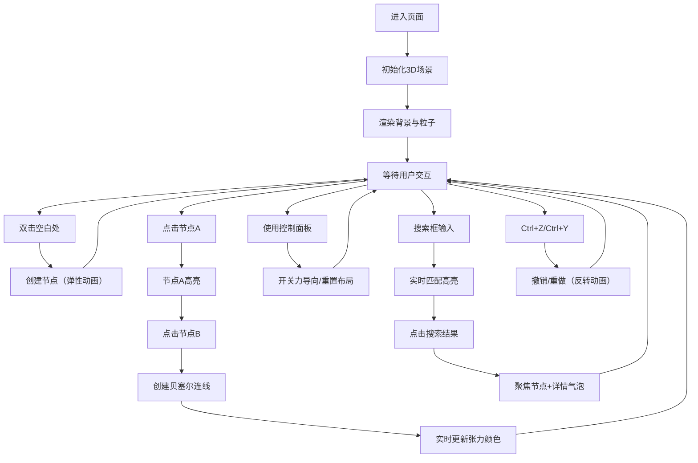

## 1. 产品概述

拓扑幻境是一个基于Three.js的3D交互式力导向拓扑网络图可视化应用，让用户在三维空间中通过点击创建节点、拖拽连线，实时生成并操纵动态的力导向网络。

- **主要用途**：数据关系可视化、交互式艺术装置、网络结构探索
- **目标用户**：数据分析师、设计师、艺术创作者、教育工作者
- **市场价值**：提供沉浸式的3D网络可视化体验，将抽象的数据关系转化为可交互的视觉艺术

## 2. 核心功能

### 2.1 用户角色

| 角色 | 注册方式 | 核心权限 |
|------|----------|----------|
| 普通用户 | 无需注册，直接使用 | 创建/删除节点、连接节点、控制模拟、搜索节点、撤销重做 |

### 2.2 功能模块

1. **3D场景渲染**：全屏Three.js场景、径向渐变背景、极光粒子效果、半透明正二十面体框架
2. **节点管理**：双击创建节点、弹性缩放动画、标签显示、高亮选择、HSL随机着色
3. **连线管理**：贝塞尔曲线连线、张力驱动颜色渐变、弹性振动反馈
4. **力导向物理模拟**：弹簧力、斥力、中心引力、暂停/恢复控制
5. **控制面板**：力导向开关、重置布局、节点数量统计
6. **搜索功能**：全局搜索框、实时高亮匹配、节点详情气泡
7. **撤销重做**：Ctrl+Z/Ctrl+Y、30步历史记录、反转动画

### 2.3 页面详情

| 页面名称 | 模块名称 | 功能描述 |
|----------|----------|----------|
| 主界面 | 3D场景 | 全屏Three.js渲染，支持鼠标拖拽旋转、滚轮缩放 |
| 主界面 | 节点交互 | 双击创建节点，点击高亮，节点间创建连线 |
| 主界面 | 控制面板 | 右侧悬浮面板，控制物理模拟和布局重置 |
| 主界面 | 搜索框 | 顶部居中搜索框，实时匹配节点标签 |

## 3. 核心流程

### 用户操作流程

用户进入页面后看到全屏3D场景，中心有缓慢自转的正二十面体框架。用户可以：
1. 双击空白处创建彩色节点，节点带弹性动画和标签
2. 点击一个节点使其高亮，再点击另一个节点创建贝塞尔曲线连线
3. 连线颜色根据节点间距离实时变化，超阈值时产生振动反馈
4. 使用右侧控制面板开关力导向模拟或重置布局
5. 通过顶部搜索框搜索节点，点击结果聚焦并查看详情
6. 使用Ctrl+Z/Ctrl+Y撤销重做操作，最多30步

## 4. 用户界面设计

### 4.1 设计风格

- **主色调**：深空蓝 #0F172A → #1E293B 径向渐变背景
- **强调色**：亮蓝色 #3B82F6（框架、边框）、热橙色 #FF6B35、暖黄色 #FFD166、冷蓝色 #4ECDC4
- **节点颜色**：HSL色环随机选取，饱和度70%-90%，亮度60%-80%
- **按钮风格**：圆角、毛玻璃效果、悬停过渡0.2s
- **字体**：现代无衬线字体，白色文字，半透明毛玻璃标签背景
- **布局风格**：全屏沉浸式3D场景，右侧悬浮控制面板，顶部居中搜索框
- **动画风格**：弹性缩放、呼吸光晕、颜色渐变、平滑过渡

### 4.2 页面设计概述

| 页面名称 | 模块名称 | UI元素 |
|----------|----------|--------|
| 主界面 | 3D场景 | 径向渐变背景、旋转极光粒子、自转正二十面体线框、OrbitControls相机控制 |
| 主界面 | 节点 | 半径0.4彩色球体、金属光泽、1.5px发光光晕、0.8s弹性缩放动画、毛玻璃标签 |
| 主界面 | 连线 | 贝塞尔曲线、3px线宽、张力驱动三色渐变、0.1s弹性振动反馈 |
| 主界面 | 控制面板 | 260px宽、#1E293B半透明(alpha=0.85)、毛玻璃blur(6px)、圆角10px |
| 主界面 | 搜索框 | 280px宽、居中、#0F172A背景、聚焦边框#3B82F6、过渡0.2s |
| 主界面 | 详情气泡 | 显示标签、连接数、创建时间 |

### 4.3 响应式设计

- **桌面优先**：针对大屏幕优化，全屏3D场景
- **自适应**：控制面板和搜索框使用固定定位，随窗口大小调整位置
- **触摸优化**：支持触摸设备的手势操作（需要OrbitControls触摸支持）

### 4.4 3D场景指导

- **环境/氛围**：深空科技感，暗色调背景配合彩色节点和发光效果
- **光照设置**：环境光 + 方向光，突出节点金属质感和光晕
- **相机设置**：正上方45度俯视原点，支持OrbitControls拖拽旋转和滚轮缩放
- **构图与焦点**：场景中心为自转正二十面体框架，节点围绕中心分布
- **交互与动画**：节点弹性生成、高亮呼吸光晕、连线张力振动、粒子缓慢旋转
- **后处理效果**：发光光晕效果（Bloom），增强视觉冲击力
- **性能预算**：100节点+300连线时保持50FPS以上，优化渲染循环和几何更新

## 5. 性能要求

- **交互帧率**：稳定60FPS
- **负载性能**：100个节点，每个节点平均3条连线时，渲染帧率≥50FPS
- **动画流畅度**：所有过渡动画≥30FPS，弹性动画曲线自然
