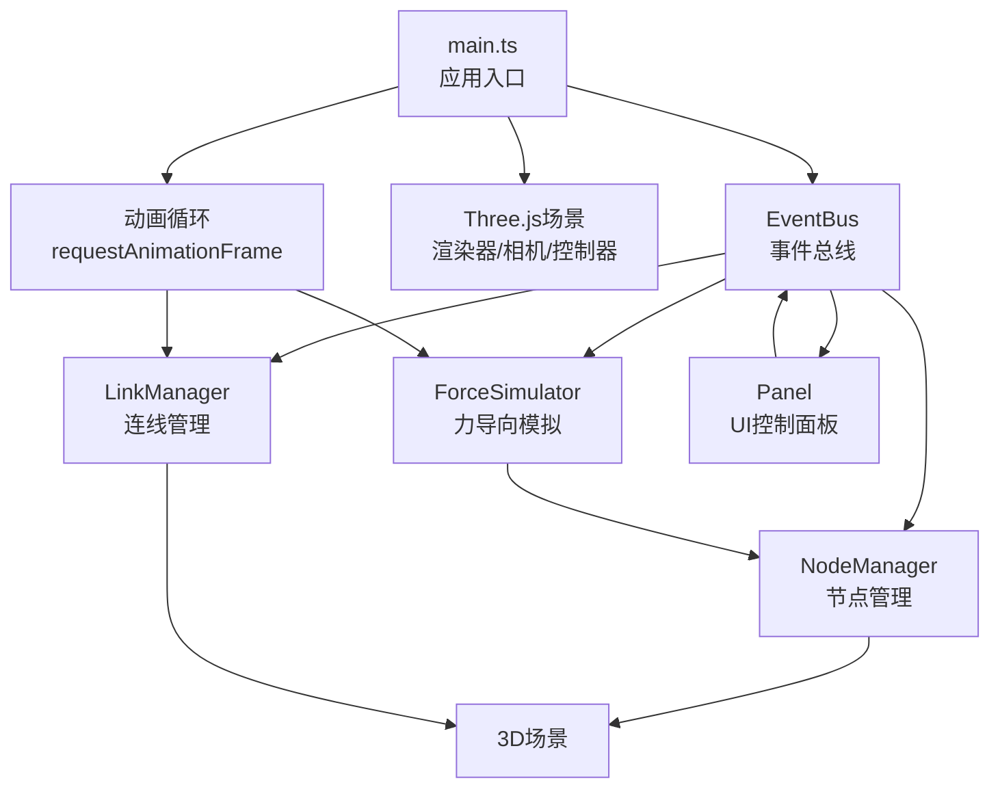

## 1. 架构设计

本项目为纯前端3D可视化应用，采用模块化架构，通过事件总线实现各模块间的松耦合通信。



## 2. 技术描述

- **前端核心**：Three.js @0.160.0 + TypeScript @5.3.0
- **构建工具**：Vite @5.0.0
- **类型定义**：@types/three @0.160.0
- **三维控制**：OrbitControls（Three.js内置）
- **模块通信**：自定义EventBus事件总线
- **物理模拟**：自定义力导向算法（弹簧力+斥力+中心引力）

## 3. 项目结构

```
auto158/
├── package.json
├── vite.config.js
├── tsconfig.json
├── index.html
└── src/
    ├── main.ts                 # 应用入口，场景初始化，动画循环
    ├── network/
    │   ├── NodeManager.ts      # 节点创建、删除、高亮、标签
    │   └── LinkManager.ts      # 连线创建、更新、张力动画
    ├── physics/
    │   └── ForceSimulator.ts   # 力导向物理模拟
    ├── ui/
    │   └── Panel.ts            # 控制面板、搜索框、气泡
    └── utils/
        └── EventBus.ts         # 事件发布订阅
```

## 4. 核心模块设计

### 4.1 数据模型定义

#### 节点数据结构
```typescript
interface NodeData {
  id: string;
  position: THREE.Vector3;
  velocity: THREE.Vector3;
  color: THREE.Color;
  label: string;
  createdAt: number;
  isHighlighted: boolean;
}
```

#### 连线数据结构
```typescript
interface LinkData {
  id: string;
  sourceId: string;
  targetId: string;
  restLength: number;
  tension: number;
  curve: THREE.QuadraticBezierCurve3;
  vibrationOffset: number;
}
```

#### 历史记录结构
```typescript
interface HistoryAction {
  type: 'node:add' | 'node:remove' | 'link:add' | 'link:remove';
  data: NodeData | LinkData;
  timestamp: number;
}
```

### 4.2 EventBus 事件定义

| 事件名称 | 载荷类型 | 触发时机 |
|----------|----------|----------|
| `node:add` | `NodeData` | 节点创建时 |
| `node:remove` | `string` (nodeId) | 节点删除时 |
| `node:highlight` | `string` (nodeId) | 节点高亮时 |
| `link:add` | `LinkData` | 连线创建时 |
| `link:remove` | `string` (linkId) | 连线删除时 |
| `simulation:toggle` | `boolean` | 模拟开关切换时 |
| `simulation:reset` | - | 重置布局时 |
| `search:query` | `string` | 搜索输入时 |
| `search:focus` | `string` (nodeId) | 搜索结果点击时 |
| `history:undo` | - | 撤销操作时 |
| `history:redo` | - | 重做操作时 |

### 4.3 核心类设计

#### NodeManager
```typescript
class NodeManager {
  nodes: Map<string, NodeData>;
  addNode(position: Vector3, label?: string): NodeData;
  removeNode(id: string): void;
  highlightNode(id: string): void;
  getNodeById(id: string): NodeData | undefined;
  updatePositions(dt: number): void;
  renderLabels(camera: Camera): void;
}
```

#### LinkManager
```typescript
class LinkManager {
  links: Map<string, LinkData>;
  addLink(sourceId: string, targetId: string): LinkData;
  removeLinksForNode(nodeId: string): void;
  updateCurves(nodePositions: Map<string, Vector3>): void;
  updateTensionColors(averageDistance: number): void;
  triggerVibration(linkId: string): void;
}
```

#### ForceSimulator
```typescript
class ForceSimulator {
  isRunning: boolean;
  springStrength: number;
  repulsionStrength: number;
  centerStrength: number;
  step(dt: number, nodes: Map<string, NodeData>, links: Map<string, LinkData>): void;
  toggle(): boolean;
  reset(nodes: Map<string, NodeData>): void;
  getAverageDistance(): number;
}
```

#### EventBus
```typescript
class EventBus {
  on(event: string, callback: Function): void;
  off(event: string, callback: Function): void;
  emit(event: string, ...args: any[]): void;
  once(event: string, callback: Function): void;
}
```

## 5. 力导向算法

### 5.1 受力计算
1. **弹簧力（胡克定律）**：`F_spring = k * (currentLength - restLength)`
2. **斥力（库仑定律）**：`F_repulsion = k / distance²`
3. **中心引力**：`F_center = -k * position`

### 5.2 积分更新
```typescript
velocity += acceleration * dt;
velocity *= damping;  // 阻尼系数 0.95
position += velocity * dt;
```

## 6. 性能优化策略

1. **对象池复用**：连线几何体复用，避免频繁创建销毁
2. **批量更新**：使用BufferGeometry批量更新顶点数据
3. **矩阵更新优化**：设置matrixAutoUpdate = false，手动控制更新
4. **层次细节**：远处节点降低细分面数
5. **帧率控制**：物理模拟与渲染分离，模拟固定60Hz，渲染自适应
6. **射线检测优化**：使用BVH加速空间查询

## 7. 动画曲线

### 7.1 弹性缩放动画（节点生成）
使用弹性缓动函数：
```
elasticOut(t) = sin(13π/2 * t) * 2^(-10t)
```
持续时间：0.8s

### 7.2 呼吸光晕动画（高亮节点）
正弦波动画：
```
scale = 1.2 + 0.1 * sin(2π * t / 1.5)
```
周期：1.5s

### 7.3 连线振动反馈
衰减正弦波：
```
offset = amplitude * sin(2π * t / 0.1) * e^(-t/0.1)
```
持续时间：0.1s，振幅≤位移的5%
