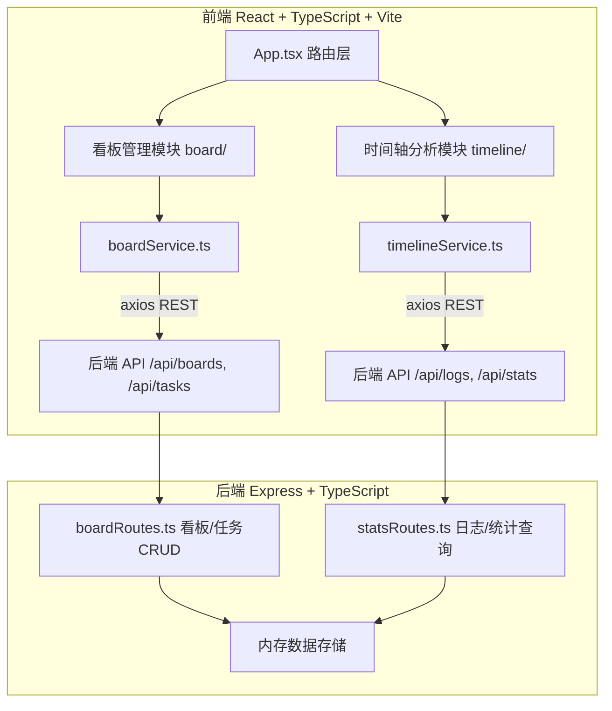
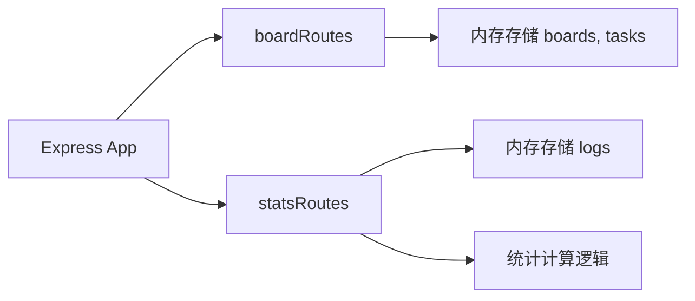
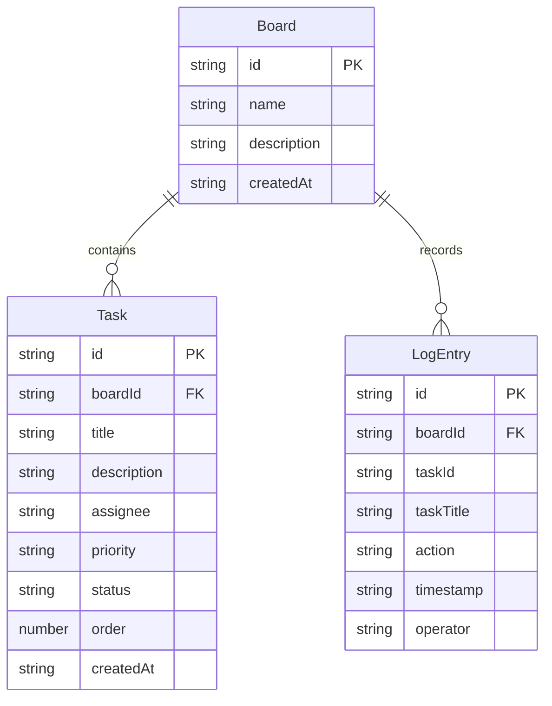

## 1. 架构设计



## 2. 技术说明

- **前端**：React@18 + TypeScript + Vite + TailwindCSS + zustand（状态管理）+ axios（HTTP客户端）+ Recharts（图表）+ react-beautiful-dnd（拖拽）
- **初始化工具**：vite-init（react-express-ts模板）
- **后端**：Express@4 + TypeScript + cors + uuid
- **数据库**：内存数据存储（JSON对象），无需外部数据库

## 3. 路由定义

| 路由路径 | 用途 |
|----------|------|
| / | 看板管理页面（默认页） |
| /timeline | 时间轴分析页面 |

## 4. API定义

### 看板与任务API（boardRoutes）

| 方法 | 路径 | 描述 | 请求体 | 响应 |
|------|------|------|--------|------|
| GET | /api/boards | 获取所有看板 | - | Board[] |
| POST | /api/boards | 创建看板 | {name, description} | Board |
| GET | /api/boards/:id | 获取单个看板 | - | Board |
| DELETE | /api/boards/:id | 删除看板 | - | {success: boolean} |
| GET | /api/boards/:id/tasks | 获取看板下所有任务 | - | Task[] |
| POST | /api/boards/:id/tasks | 创建任务 | {title, description, assignee, priority} | Task |
| PUT | /api/tasks/:id | 更新任务（含状态/排序） | {status?, order?, ...} | Task |
| DELETE | /api/tasks/:id | 删除任务 | - | {success: boolean} |

### 日志与统计API（statsRoutes）

| 方法 | 路径 | 描述 | 请求体 | 响应 |
|------|------|------|--------|------|
| GET | /api/logs/:boardId | 获取看板操作日志 | - | LogEntry[] |
| GET | /api/stats/:boardId/load | 获取成员负载统计 | - | MemberLoad[] |

### 类型定义

```typescript
interface Board {
  id: string;
  name: string;
  description: string;
  createdAt: string;
}

type TaskStatus = "todo" | "inProgress" | "done";
type TaskPriority = "high" | "medium" | "low";

interface Task {
  id: string;
  boardId: string;
  title: string;
  description: string;
  assignee: string;
  priority: TaskPriority;
  status: TaskStatus;
  order: number;
  createdAt: string;
}

type LogAction = "created" | "moved" | "deleted";

interface LogEntry {
  id: string;
  boardId: string;
  taskId: string;
  taskTitle: string;
  action: LogAction;
  timestamp: string;
  operator: string;
}

interface MemberLoad {
  date: string;
  member: string;
  todo: number;
  inProgress: number;
  done: number;
}
```

## 5. 服务端架构图



## 6. 数据模型

### 6.1 数据模型定义



### 6.2 数据定义语言

使用内存数据存储，初始化种子数据：

- 2个预设看板（"产品迭代" 和 "设计冲刺"）
- 每个看板预设6-8个任务分布在三个状态列
- 预设成员列表：["张三", "李四", "王五", "赵六"]
- 预设操作日志记录
