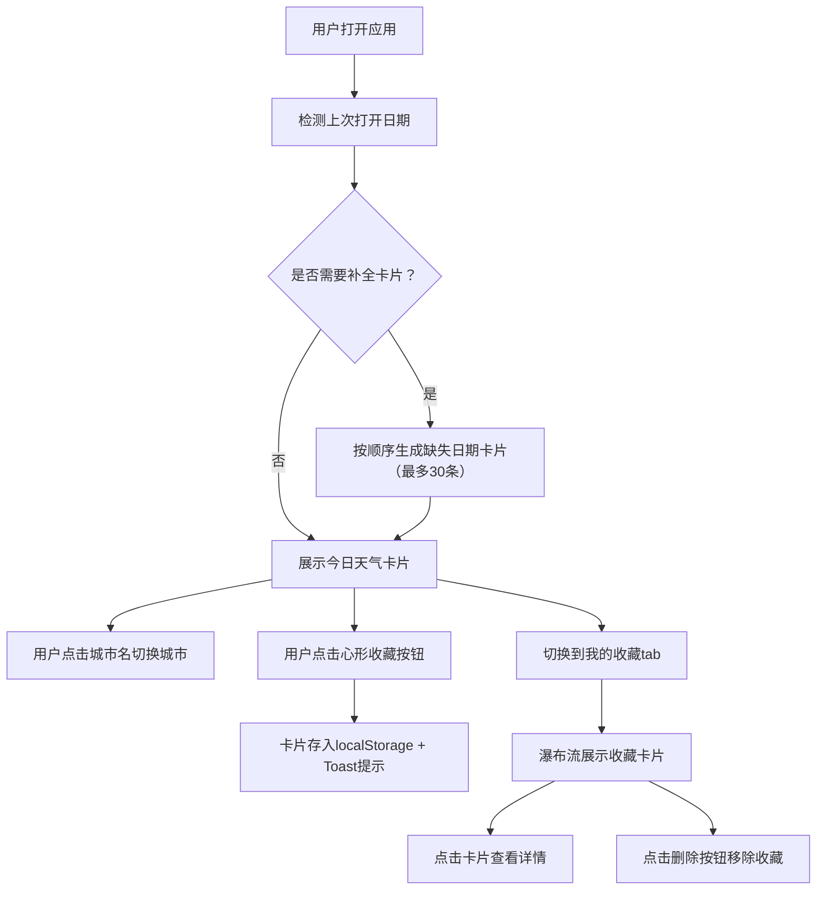

## 1. 产品概述

城市天气预报卡片收集是一款将每日天气信息转化为可收藏艺术卡片的Web应用。它通过动态生成的天气插画卡片，让用户在查看天气的同时获得视觉享受，并可收藏喜欢的卡片形成个人时间线。

- 核心价值：将冷冰冰的天气数据转化为具有艺术美感的收藏体验
- 目标用户：每日关注天气、追求生活美学、喜欢收集分享的年轻用户

## 2. 核心功能

### 2.1 功能模块

1. **今日天气页**：动态天气卡片、城市切换、卡片收藏
2. **我的收藏页**：瀑布流卡片墙、卡片详情查看、卡片删除

### 2.2 页面详情

| 页面名称 | 模块名称 | 功能描述 |
|---------|---------|---------|
| 今日天气页 | 天气卡片 | 根据天气类型（晴/雨/雪/风）生成动态渐变背景和粒子动画 |
| 今日天气页 | 城市切换 | 点击城市名切换5个预设城市（北京、上海、东京、纽约、伦敦），带半翻转动画 |
| 今日天气页 | 收藏按钮 | 心形图标切换收藏状态，数据持久化到localStorage，Toast提示 |
| 我的收藏页 | 瀑布流展示 | 已收藏卡片按瀑布流布局展示，支持悬停上浮效果 |
| 我的收藏页 | 卡片详情 | 点击卡片重新查看当天完整天气信息 |
| 我的收藏页 | 卡片删除 | 长按或点击删除按钮移除收藏，带动画效果 |
| 应用初始化 | 日期补全 | 每日首次打开自动生成当日卡片，连续多日未打开则按顺序补全（最多30条） |

## 3. 核心流程

用户打开应用 → 检测上次打开日期 → 补全缺失日期的天气卡片 → 展示今日天气卡片 → 切换城市查看不同天气 → 收藏喜欢的卡片 → 切换到收藏页浏览卡片墙 → 查看/删除收藏卡片

## 4. 用户界面设计

### 4.1 设计风格

- **主色调**：深色渐变背景（#1A1A2E 到 #16213E），低饱和度蓝紫与暖橙点缀
- **毛玻璃材质**：`background: rgba(255,255,255,0.08)`，`backdrop-filter: blur(12px)`，`border: 1px solid rgba(255,255,255,0.12)`
- **按钮风格**：圆形/圆角，微弱hover亮度提升反馈
- **字体**：系统默认sans-serif无衬线字体
- **动画风格**：流畅的CSS过渡与动画，弹性缓动效果

### 4.2 页面设计概述

| 页面名称 | 模块名称 | UI元素 |
|---------|---------|--------|
| 今日天气页 | 天气卡片 | 宽100%最大600px高420px圆角24px，动态渐变背景，粒子动画（晴天太阳光晕+漂浮云朵/雨天雨线/雪天雪花/风天流动线条），城市名24px，温度粗体64px，天气文字18px带渐变下划线 |
| 今日天气页 | 收藏按钮 | 24x24px心形图标，未收藏灰色描边(#9E9E9E)，收藏后红色填充(#E53935)，点击弹性缩放动画 |
| 今日天气页 | Toast提示 | 白底圆角8px浅灰色边框(#E0E0E0)，底部滑入滑出 |
| 我的收藏页 | 瀑布流卡片 | 宽180px高自适应最小240px，间距16px，悬停上浮4px+深度阴影，删除按钮缩放消失动画 |
| 全局 | 底部导航 | 两个tab（今日天气/我的收藏），淡入淡出切换(0.4s opacity) |

### 4.3 响应式

桌面端优先设计，移动端自适应卡片宽度和布局。天气卡片在小屏幕上保持最大宽度600px限制并水平居中。

## 5. 性能要求

- 目标帧率：不低于45fps
- 卡片收藏与列表渲染：500ms内完成
- 目标设备：4GB内存，2GHz双核处理器可流畅运行
