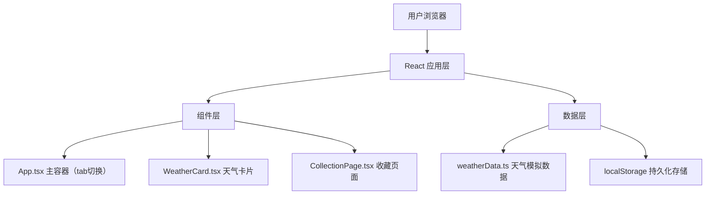

## 1. 架构设计



## 2. 技术描述

- **前端**：React 18 + TypeScript 5 + Vite 5
- **初始化工具**：Vite
- **后端**：无（纯前端应用，使用localStorage进行数据持久化）
- **状态管理**：React useState/useEffect（轻量状态，无需额外状态库）

## 3. 项目结构

```
├── package.json
├── index.html
├── tsconfig.json
├── vite.config.js
└── src/
    ├── App.tsx              # 主组件，tab切换与路由分发
    ├── WeatherCard.tsx      # 天气卡片组件，动态背景与粒子动画
    ├── CollectionPage.tsx   # 收藏页面，瀑布流布局
    └── weatherData.ts       # 天气数据模拟模块
```

## 4. 数据模型

### 4.1 天气数据类型定义

```typescript
interface WeatherCardData {
  id: string;
  city: string;
  date: string;        // YYYY-MM-DD
  temperature: number; // 摄氏度
  condition: 'sunny' | 'rainy' | 'snowy' | 'windy' | 'cloudy';
  conditionText: string;  // 中文描述
}
```

### 4.2 存储结构

- **localStorage key**: `weather_collections`
- **存储格式**: JSON数组 `WeatherCardData[]`
- **localStorage key**: `last_open_date` - 记录上次打开日期，用于补全卡片

## 5. 核心逻辑设计

### 5.1 城市数据模块（weatherData.ts）

- 预设5个城市：北京、上海、东京、纽约、伦敦
- 每个城市根据日期（伪随机）生成天气类型和温度
- 提供 `generateWeatherCard(city: string, date: Date): WeatherCardData` 函数

### 5.2 天气卡片组件（WeatherCard.tsx）

- 使用CSS变量和渐变实现不同天气的背景效果
- 使用CSS动画实现粒子效果（太阳光晕旋转、云朵漂浮、雨线下落、雪花飘落旋转）
- 城市切换：0.5s rotateY 3D翻转效果
- 收藏按钮：弹性缩放动画

### 5.3 收藏页面（CollectionPage.tsx）

- CSS columns 实现瀑布流布局
- 卡片悬停：transform translateY + box-shadow
- 删除动画：scale 缩小至0.5倍后移除DOM

### 5.4 主应用（App.tsx）

- 管理当前tab状态（今日天气/我的收藏）
- 管理当前选中城市
- 初始化时检测日期并补全缺失卡片
- tab切换淡入淡出动画

## 6. 性能优化策略

- 使用CSS transform和opacity动画（GPU加速）
- 粒子效果使用CSS动画而非Canvas重绘，减少CPU占用
- 收藏列表渲染使用React.memo优化
- localStorage读写操作使用异步方式避免阻塞主线程
