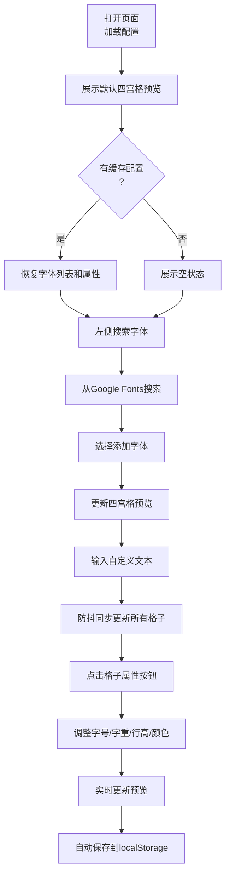

## 1. 产品概述

字体对比预览工具，帮助前端开发者快速对比和预览不同字体在网页中的真实渲染效果，解决设计选型过程中需在多个选项卡或编辑器切换才能比较字体差异、缺乏实时并排预览和自定义文本输入的问题。

- **目标用户**：前端开发者、UI设计师、前端架构师

- **产品价值**：提供高效直观的字体对比体验，通过并排预览、实时调整属性、本地持久化配置，大幅提升字体选型效率。

## 2. 核心功能

### 2.1 用户角色

| 角色 | 注册方式 | 核心权限 |
|------|----------|----------|
| 开发者/设计师 | 无需注册，直接使用 | 搜索添加字体、对比预览、调整属性、保存配置 |

### 2.2 功能模块

1. **字体管理面板**：搜索字体、添加字体、删除字体、字体列表展示

2. **四宫格预览工作区**：并排预览、文本同步、字体格聚焦、响应式布局

3. **预览文本输入**：自定义文本输入、防抖更新、中英文混合示例

4. **字体属性调节面板**：字号调节、字重调节、行高调节、颜色选择

5. **配置持久化**：localStorage自动保存、清空配置、24小时字体缓存

### 2.3 页面详情

| 页面名称 | 模块名称 | 功能描述 |
|---------|---------|-----------|
| 主页面 | 字体管理面板 | 宽度320px，背景#1E293B，圆角12px，内边距16px，Google Fonts搜索，字体列表（字体名、样例字符、删除按钮 |
| 主页面 | 预览工作区 | 渐变背景，四宫格布局，亮蓝色发光分割线，格子聚焦高亮金色放大110% |
| 主页面 | 文本输入区 | 70%宽度居中，背景#1E293B，圆角8px，边框聚焦变蓝，防抖300ms同步更新 |
| 主页面 | 属性面板模态框 | 背景#1E293B，圆角12px，字号12-72px滑块，字重100-900，行高1.0-2.0，颜色选择器 |
| 主页面 | 清空配置按钮 | 右上角，灰色变红色hover，0.2s过渡 |

## 3. 核心流程

用户从Google Fonts搜索添加字体，在四宫格中并排预览对比，
通过自定义文本和属性调整观察效果，配置自动保存本地持久化。

## 4. 用户界面设计

### 4.1 设计风格

- **主色调**：深色主题
  - 背景主色：#0F172A（深蓝黑）
  - 卡片背景：#1E293B（深蓝灰）
  - 主文字：#E2E8F0（浅灰白）
  - 辅助文字：#94A3B8（中灰色）
  - 强调色：#3B82F6（亮蓝色）
  - 高亮色：#FACC15（金黄色）
  - 删除色：#EF4444（红色）

- **按钮样式**：圆角设计，带0.3s过渡动画，hover有颜色变化、阴影放大、缩放效果

- **字体**：使用Google Fonts动态加载，默认系统无衬线字体

- **布局风格**：左右分栏布局，左侧字体管理面板 + 右侧四宫格预览区

- **图标风格**：lucide-react图标库，统一线性风格

### 4.2 页面设计概述

| 页面名称 | 模块名称 | UI元素 |
|---------|---------|--------|
| 主页面 | 字体管理面板 | 宽度320px固定宽，背景#1E293B，圆角12px，内边距16px，搜索框带边框过渡动画，列表项白色加粗16px字体名，灰色12px样例字符，红色圆形删除按钮缩放动画 |
| 主页面 | 预览工作区 | 渐变背景，2x2网格，2px亮蓝色发光分割线（box-shadow: 0 0 8px #3B82F6），格子点击高亮金色边框，放大110%，0.3s ease-out过渡 |
| 主页面 | 文本输入框 | 70%宽度居中，背景#1E293B，圆角8px，边框#475569变#3B82F6，0.3s过渡，默认中英文混合文本 |
| 主页面 | 属性模态面板 | 背景#1E293B，圆角12px，阴影遮罩，宽度340px，滑块步长滑块，颜色选择器，齿轮图标悬浮变白 |
| 主页面 | 清空配置 | 右上角按钮灰色变红色hover，0.2s过渡动画 |

### 4.3 响应式设计

- **桌面端（≥768px

桌面端优先，响应式：

- 桌面端：左右分栏，四宫格2x2布局

- 移动端（<768px：<768px：隐藏字体管理面板，改为顶部汉堡菜单按钮（#3B82F6圆形图标，点击左侧滑出面板，四宫格改为2列布局（45%宽度

- 触摸优化：增大点击区域

### 4.4 性能要求

- Google Fonts字体列表加载≤2秒（CDN并发，localStorage缓存24小时

- 字体属性调整响应≤100ms

- 帧率≥55fps以上
