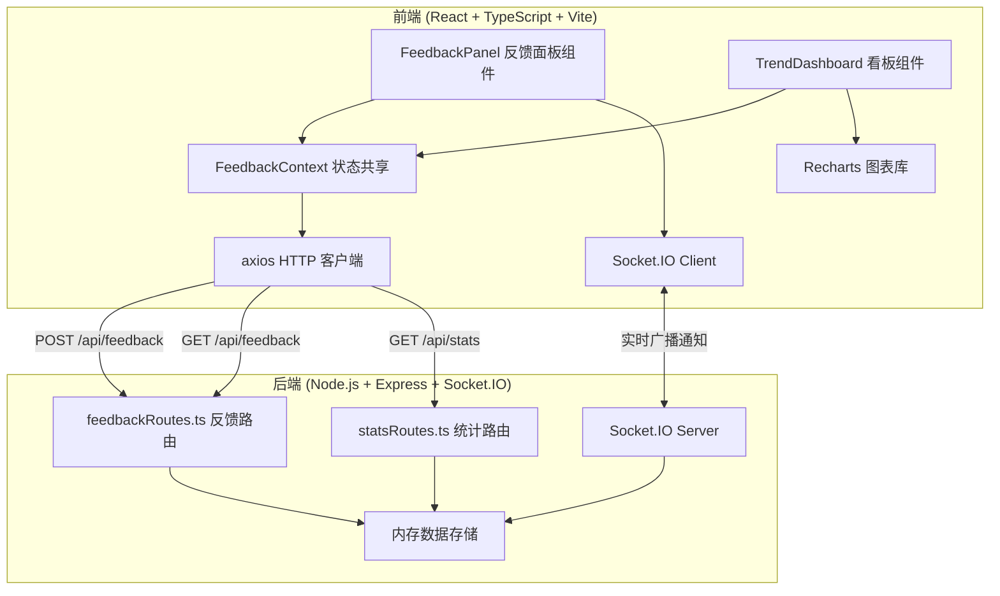
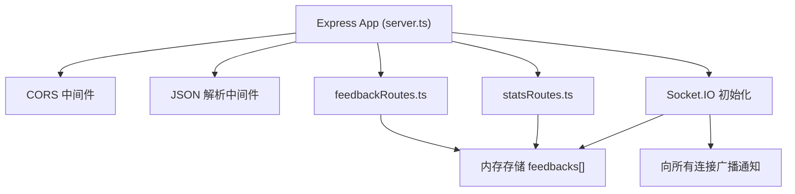
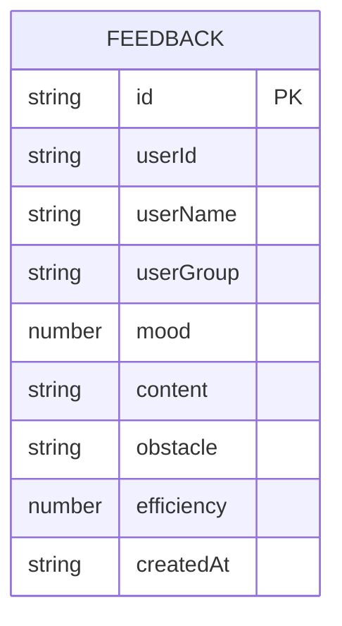

## 1. 架构设计



## 2. 技术描述
- 前端框架：React 18 + TypeScript
- 构建工具：Vite（含React插件和路径别名配置）
- 状态管理：React Context API
- HTTP客户端：axios
- 实时通信：Socket.IO Client
- 图表库：Recharts
- 唯一标识：uuid
- 后端框架：Express 4 + TypeScript
- 实时通信：Socket.IO
- 跨域处理：cors
- 数据存储：内存数组（模拟数据）
- 端口：前端3000，后端3001，Vite代理跨域

## 3. 路由定义
| 路由路径 | 用途 |
|---------|------|
| / | 主页面（反馈面板 + 趋势看板） |
| POST /api/feedback | 提交新的反馈记录 |
| GET /api/feedback | 获取全部反馈列表 |
| GET /api/stats | 获取聚合趋势数据（支持group和range查询参数） |

## 4. API 定义

### 4.1 类型定义
```typescript
interface Feedback {
  id: string;
  userId: string;
  userName: string;
  userGroup: 'frontend' | 'backend' | 'design';
  mood: 1 | 2 | 3 | 4 | 5;
  content: string;
  obstacle?: 'dependency' | 'technical' | 'resource' | null;
  efficiency: 3 | 4 | 5;
  createdAt: string;
}

interface StatsPoint {
  date: string;
  avgMood: number;
  avgEfficiency: number;
}
```

### 4.2 请求与响应
- **POST /api/feedback**
  - Request Body: `{ userName, userGroup, mood, content, obstacle?, efficiency }`
  - Response: `{ success: true, data: Feedback }`
  - Socket广播事件: `new-feedback` → `{ message: string, userName: string }`

- **GET /api/feedback**
  - Response: `{ success: true, data: Feedback[] }`

- **GET /api/stats?group=all&range=7**
  - Query参数: group (all/frontend/backend/design), range (7/14/30)
  - Response: `{ success: true, data: StatsPoint[] }`

## 5. 服务器架构图



## 6. 数据模型

### 6.1 数据模型定义



### 6.2 文件结构
```
.
├── package.json
├── vite.config.js
├── tsconfig.json
├── index.html
├── src/
│   ├── context/
│   │   └── FeedbackContext.tsx
│   ├── components/
│   │   ├── FeedbackPanel.tsx
│   │   └── TrendDashboard.tsx
│   └── main.tsx
└── server/
    ├── server.ts
    └── routes/
        ├── feedbackRoutes.ts
        └── statsRoutes.ts
```
