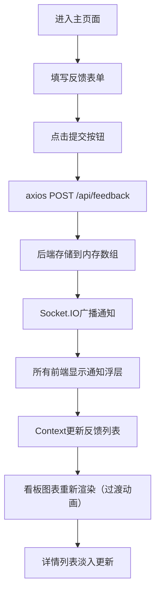

## 1. 产品概述

团队反馈看板是一款面向远程协作小团队的日常工作反馈收集与情绪趋势分析工具，帮助管理者实时感知团队成员的心情状态、工作效率和遇到的阻碍，及时发现问题并调整团队士气。

- 核心价值：解决远程团队每日反馈分散、士气变化感知滞后、问题发现不及时的痛点
- 目标用户：分布式远程协作的小团队（10-30人），包含团队成员和团队管理者

## 2. 核心功能

### 2.1 用户角色
| 角色 | 登录方式 | 核心权限 |
|------|---------|---------|
| 团队成员 | 默认模拟用户 | 提交每日反馈、查看团队趋势看板、浏览反馈详情 |
| 团队管理者 | 默认模拟用户 | 全部成员权限 + 筛选分组分析、按类型查看反馈 |

### 2.2 功能模块
1. **反馈面板模块**：每日站会记录填写（心情选择、工作摘要、阻碍选择、效率评分）
2. **情绪趋势看板模块**：双折线图（心情指数+效率评分）、分组筛选、时间范围筛选
3. **反馈详情列表模块**：反馈列表展示、展开详情、类型筛选、实时通知

### 2.3 页面详情
| 页面名称 | 模块名称 | 功能描述 |
|---------|---------|---------|
| 主页面 | 反馈面板 | 5级心情表情选择（苦脸到笑脸，选中放大弹跳）、工作内容摘要（200字限制，字数统计，接近上限变红）、阻碍类型下拉选择、3-5星效率评分（渐变过渡）、提交按钮 |
| 主页面 | 趋势看板 | 双折线图（Recharts）、团队分组下拉筛选、时间范围（7/14/30天）筛选、悬停提示框 |
| 主页面 | 反馈详情列表 | 300px高度可滚动、行背景间隔斑马纹、点击展开（高度过渡动画）、头像（首字母+随机色）、类型筛选（有阻碍/高评分/低评分） |
| 主页面 | 实时通知 | Socket.IO广播、右下角浮层、2秒自动消失、右平移淡出动画 |

## 3. 核心流程

团队成员进入主页面，在左侧反馈面板依次选择当日心情、填写工作摘要、选择阻碍类型（如有）、进行效率自评，点击提交后通过axios发送POST请求到后端，后端存储数据并通过Socket.IO向所有在线用户广播通知，通知浮层在右下角短暂显示后自动消失。右侧看板实时从Context获取更新后的反馈数据，结合后端统计API聚合计算后自动重新渲染趋势图表和详情列表，筛选条件变化时触发数据过渡动画。

## 4. 用户界面设计

### 4.1 设计风格
- 主色调：紫色 #8B5CF6
- 强调色：暖金 #F59E0B / #FBBF24
- 背景色：灰白 #F1F5F9 / #F8FAFC
- 文字色：深灰 #1E293B
- 辅助灰：#CBD5E1
- 按钮风格：圆角8px，悬停0.2s背景过渡+轻微上移
- 图标风格：Emoji表情图标 + Lucide图标
- 布局：桌面端两栏Flex布局（左320px固定，右自适应），移动端抽屉式

### 4.2 页面设计概述
| 页面名称 | 模块名称 | UI元素 |
|---------|---------|--------|
| 主页面 | 页面头部 | 应用名称"团队反馈看板"、当前用户头像与姓名 |
| 主页面 | 反馈面板 | 宽度320px、背景#F8FAFC、圆角12px、内边距20px、心情表情弹跳动画、字数统计、星形渐变 |
| 主页面 | 趋势看板 | 双折线（紫色心情+绿色效率）、筛选下拉、图表0.5s过渡动画、悬停半透明提示框 |
| 主页面 | 反馈列表 | 300px滚动区、斑马纹背景、点击展开0.3s高度过渡、头像首字母随机色 |
| 主页面 | 通知浮层 | 右下角、背景#1E293B半透明、圆角8px、2秒后右平移0.5s淡出 |

### 4.3 响应式
- 桌面端（≥768px）：左右两栏布局，左侧320px固定宽度反馈面板，右侧自适应趋势看板
- 移动端（<768px）：左侧面板折叠为抽屉式，从左侧滑出（半透明遮罩背景），右侧看板全宽显示
- 所有可点击元素支持触摸操作，按钮最小触控区域44px

### 4.4 性能指标
- 首次加载前端渲染时间 ≤ 1秒（基于150条模拟数据）
- 图表交互和滚动帧率 ≥ 45fps
- 动画过渡流畅（0.2s-0.5s）
